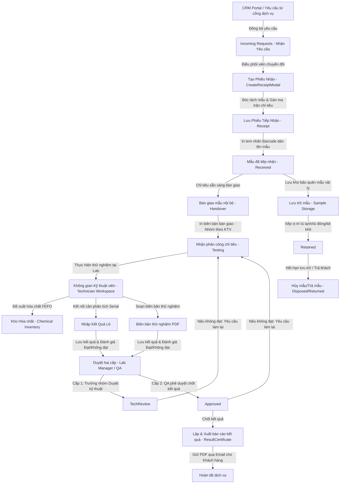

# TÀI LIỆU CẤU TRÚC PHẦN MỀM FRONTEND LIMS (FE_STRUCTURE)

Tài liệu này tổng hợp toàn bộ cấu trúc thư mục, nghiệp vụ tổng thể và thông tin chi tiết về các phân hệ (modules) của hệ thống LIMS Frontend. Đây là cẩm nang hướng dẫn đầy đủ nhất dành cho các lập trình viên và tác nhân AI để phát triển, bảo trì và mở rộng hệ thống.

---

## 1. Nghiệp Vụ Tổng Thể & Luồng Dữ Liệu (Overall Business Flow)

Hệ thống LIMS Frontend điều hành toàn bộ quy trình vòng đời của mẫu thử nghiệm tại phòng Lab, từ lúc nhận yêu cầu dịch vụ đến khi trả kết quả ISO 17025 cho khách hàng và lưu kho/hủy mẫu vật lý:



### Các Giai Đoạn Nghiệp Vụ Chính:
1. **Quản lý Danh mục (Library Master Data)**: Cấu hình ma trận kết hợp 3 bên `Loại mẫu` + `Chỉ tiêu` + `Phương pháp thử` kèm theo Đơn giá và cam kết SLA.
2. **Tiếp nhận mẫu (Reception)**: Tiếp nhận đơn hàng từ cổng CRM, kiểm tra tình trạng mẫu vật lý, lập Phiếu tiếp nhận (`Receipt`), bóc tách lô mẫu (`Samples`) và in nhãn Barcode/QR định danh.
3. **Bàn giao & Phân công (Handover & Assignment)**: Gom nhóm các chỉ tiêu sẵn sàng theo Kỹ thuật viên (KTV) để sinh biên bản bàn giao văn bản, chuyển giao mẫu sang các phòng Lab chuyên môn.
4. **Thực thi kỹ thuật (Technician Workspace)**: KTV thực hiện đo đạc, nhập kết quả lô tự động từ Cân phân tích (Web Serial API), chạy định mức hóa chất FEFO trừ kho, lập biên bản điện tử TinyMCE và tính toán Excel HyperFormula.
5. **Kiểm soát chất lượng (QA & Lab Manager)**: Soát xét kỹ thuật cấp Trưởng nhóm và phê duyệt chốt kết quả cấp QA theo quy chuẩn ISO/IEC 17025.
6. **Lưu trữ & Tiêu hủy (Inventory & Storage)**: Theo dõi vị trí lưu trữ mẫu vật lý trong các tủ bảo quản, tiến hành tiêu hủy hoặc trả mẫu khi hết hạn lưu trữ.

---

## 2. Bản Đồ Thư Mục Mã Nguồn (Directory Structure Map)

Dưới đây là cấu trúc thư mục chi tiết của thư mục `src/` để định vị nhanh các thành phần hệ thống:

```
src/
├── api/                        # Khớp nối API Client (Axios + React Query Hooks)
│   ├── analyses.ts             # API liên quan đến phép thử/chỉ tiêu
│   ├── chemical.ts             # API quản lý kho hóa chất (SKU, chai lọ, giao dịch)
│   ├── identities.ts           # API quản lý nhân sự và xác thực
│   ├── library.ts              # API Master Data danh mục
│   ├── receipts.ts             # API quản lý phiếu tiếp nhận và in ấn kết quả
│   └── samples.ts              # API quản lý mẫu thử nghiệm độc lập
│
├── config/                     # Cấu hình hệ thống và ngôn ngữ
│   ├── i18n/                   # Hệ thống đa ngôn ngữ (LANGUAGE_SYSTEM.md)
│   ├── theme/                  # Hệ thống giao diện (THEME_SYSTEM.md)
│   └── navigation.ts           # Cấu hình Menu Sidebar điều hướng
│
├── types/                      # Định nghĩa kiểu dữ liệu (Single Source of Truth)
│   ├── 0_TYPES_STRUCTURE.md    # Tài liệu cấu trúc Types
│   ├── common.ts               # Các base types dùng chung (BaseEntity, LabelValue)
│   ├── receipt.ts              # Types chuyên biệt cho Tiếp nhận mẫu
│   ├── sample.ts               # Types chuyên biệt cho Mẫu thử độc lập
│   ├── analysis.ts             # Types chuyên biệt cho Phép thử/Chỉ tiêu
│   ├── library.ts              # Types chuyên biệt cho Master Data Danh mục
│   └── identity.ts             # Types chuyên biệt cho Nhân sự & Vai trò
│
├── pages/                      # Thin wrapper views - Đích đến của router
│   ├── 0_PAGES_STRUCTURE.md    # Tài liệu cấu trúc Pages
│   ├── DashboardPage.tsx       # Dashboard tổng quan hệ thống
│   ├── LoginPage.tsx           # Trang đăng nhập hệ thống (chứa Auth logic)
│   ├── ReceptionPage.tsx       # Trang Tiếp nhận mẫu (renders SampleReception)
│   ├── TechnicianPage.tsx      # Trang Kỹ thuật viên (renders TechnicianWorkspace)
│   └── ...                     # Các thin pages khác liên kết trực tiếp với components
│
├── components/                 # Thành phần giao diện & Logic nghiệp vụ
│   ├── common/                 # Components dùng chung toàn hệ thống (SearchableSelect, ...)
│   ├── ui/                     # Nguyên tử giao diện cơ bản (Radix / Shadcn primitives)
│   ├── layout/                 # Cấu trúc khung trang (Sidebar, Header, AppLayout)
│   │
│   ├── library/                # PHÂN HỆ DANH MỤC THƯ VIỆN (0_LIBRARY_STRUCTURE.md)
│   │   ├── matrices/           # Quản lý Ma trận Loại mẫu + Chỉ tiêu + Phương pháp
│   │   ├── parameters/         # Quản lý Chỉ tiêu phân tích và KTV mặc định
│   │   ├── protocols/          # Quản lý Phương pháp thử nghiệm và chứng chỉ công nhận
│   │   ├── sampleTypes/        # Quản lý Loại mẫu/Nền mẫu
│   │   └── parameterGroups/    # Quản lý Gói/Nhóm chỉ tiêu gom sẵn
│   │
│   ├── reception/              # PHÂN HỆ TIẾP NHẬN MẪU (0_RECEPTION_STRUCTURE.md)
│   │   ├── CreateReceiptModal.tsx  # Modal tạo phiếu tiếp nhận quy mô lớn
│   │   ├── ReceiptDetailModal.tsx  # Quản lý 360 độ phiếu tiếp nhận và file đính kèm
│   │   ├── SampleDetailModal.tsx   # Modal quản lý chi tiết một mẫu thử
│   │   └── ResultCertificateModal.tsx # Soạn thảo và kết xuất PDF kết quả ISO 17025
│   │
│   ├── samples/                # PHÂN HỆ MẪU THỬ ĐỘC LẬP (0_SAMPLES_STRUCTURE.md)
│   │   ├── SamplesTable.tsx    # Danh sách mẫu liên phiếu tiếp nhận
│   │   └── SampleDetailModal.tsx   # Chi tiết mẫu, cập nhật status và gán chỉ tiêu tùy chỉnh
│   │
│   ├── technician/             # PHÂN HỆ KỸ THUẬT VIÊN (0_TECHNICIAN_STRUCTURE.md)
│   │   ├── TechnicianWorkspace.tsx  # Không gian làm việc chính của KTV
│   │   ├── TestProtocolEditor.tsx   # Soạn thảo biên bản, nhập Word/Excel thô
│   │   ├── ExcelProcessorModal.tsx  # Bảng tính Excel ảo HyperFormula
│   │   ├── AnalyticalBalanceStreamer.tsx # Kết nối Serial Balance và trạm cân chuyên dụng
│   │   └── TechnicianBulkEntryModal.tsx # Nhập kết quả lô tự động fill-down
│   │
│   ├── handover/               # PHÂN HỆ BÀN GIAO MẪU NỘI BỘ (0_HANDOVER_STRUCTURE.md)
│   │   ├── HandoverManagement.tsx   # Quản lý danh sách chỉ tiêu sẵn sàng bàn giao
│   │   └── HandoverDocumentModal.tsx # Tạo biên bản A4 in/PDF nhóm theo KTV
│   │
│   ├── lab-manager/            # PHÂN HỆ QUẢN LÝ PHÒNG LAB (0_LAB_MANAGER_STRUCTURE.md)
│   │   ├── LabManagerDashboard.tsx  # Điểm điều phối Router views con
│   │   ├── views/                  # Các view: Phê duyệt cấp 2, Mẫu đang chạy, Exceptions
│   │   └── modals/                 # Modal duyệt kết quả soát xét/từ chối làm lại
│   │
│   ├── inventory/              # PHÂN HỆ QUẢN LÝ KHO TỔNG (0_INVENTORY_STRUCTURE.md)
│   │   ├── InventoryDashboard.tsx  # Dashboard chung cảnh báo hạn dùng và tra cứu nhanh
│   │   │
│   │   ├── chemical/           # PHÂN HỆ KHO HÓA CHẤT (0_CHEMICAL_INVENTORY_STRUCTURE.md)
│   │   │   ├── InventoriesTab.tsx  # Quản lý chai lọ, quét QR camera & barcode toàn cục
│   │   │   ├── ChemicalStorageMap.tsx # Kéo thả chai lọ vào kệ tủ (Dnd-kit)
│   │   │   └── TransactionBlocksTab.tsx # Phiếu xuất/nhập/điều chỉnh chi tiết
│   │   │
│   │   └── samples/            # PHÂN HỆ LƯU MẪU VẬT LÝ (0_SAMPLE_STORAGE_STRUCTURE.md)
│   │       ├── StorageLocationMap.tsx # Bản đồ kéo thả mẫu vào tủ bảo quản
│   │       └── SamplePendingList.tsx # Danh sách mẫu chờ cất kho
│   │
│   └── hr/                     # PHÂN HỆ NHÂN SỰ & PHÂN QUYỀN (0_HR_STRUCTURE.md)
│       ├── IdentityContainer.tsx   # Sidebar trượt 2 cột xem hồ sơ nhân viên
│       └── IdentityCreateModal.tsx # Form tạo tài khoản, phân quyền ROLE_*
```

---

## 3. Đặc Tả Nghiệp Vụ & Thiết Kế Các Phân Hệ (Module Specifications)

### 3.1 Library — Master Data Danh Mục
Phân hệ quản lý toàn bộ dữ liệu nền tảng làm tiền đề cho hoạt động báo giá và phân phối chỉ tiêu phân tích.
* **Ma trận Cấu hình (Matrices)**:
  - Mối liên kết 3 chiều: [Matrix](src/types/library.ts) (`Loại mẫu` + `Chỉ tiêu` + `Phương pháp`).
  - Định hình giá dịch vụ (`feeBeforeTax`, `feeAfterTax`) và thời gian thực hiện cam kết SLA (`turnaroundTime`).
  - Phục vụ cơ chế tự động điền đơn giá khi lập phiếu nhận.
* **Chứng nhận & Phương pháp (Protocols)**:
  - Form [ProtocolFormModal.tsx](src/components/library/protocols/ProtocolFormModal.tsx) quản lý ngày đăng ký, ngày hết hạn chứng nhận ISO.
  - Sử dụng [AccreditationTagInput.tsx](src/components/library/shared/AccreditationTagInput.tsx) để lưu trữ cấu trúc JSONB chứng chỉ công nhận (ví dụ: `VILAS 997`, `TDC`).
* **Định mức hóa chất BOM**:
  - Gán danh sách hóa chất tối thiểu cần tiêu hao cho từng phương pháp phân tích, kết nối trực tiếp với SKU kho thông qua [LabSkuSearchDropdown.tsx](src/components/library/shared/LabSkuSearchDropdown.tsx).

### 3.2 Reception — Tiếp Nhận Mẫu
Cửa ngõ tiếp nhận yêu cầu từ cổng CRM và khởi tạo hồ sơ mẫu.
* **Tạo phiếu nhận mẫu (`CreateReceiptModal`)**:
  - Form quy mô lớn hỗ trợ chế độ Cơ bản và Đầy đủ (thuế VAT, người liên hệ, tài liệu đính kèm).
  - Tự động hóa tính toán tài chính (tổng chi phí, thuế suất, làm tròn float tránh sai số tiền tệ).
* **Kết xuất Báo cáo Kết quả (`ResultCertificateModal`)**:
  - Soạn thảo báo cáo kết quả tích hợp TinyMCE editor.
  - Sử dụng font chữ sans-serif cao cấp **Wix Madefor Display** đảm bảo mỹ thuật.
  - Định dạng in ấn lặp lại header/footer bảng trên nhiều trang nhờ cấu trúc `.print-wrapper` sử dụng thẻ `<thead>` và `<tfoot>`.
  - Tích hợp API chuyển đổi HTML sang PDF và gửi email trực tiếp đính kèm tệp cho khách hàng.

### 3.3 Samples Standalone — Mẫu Thử Độc Lập
Quản lý vòng đời lưu trữ và xử lý của mẫu độc lập trên toàn hệ thống.
* **Chi tiết mẫu & Gán chỉ tiêu tùy chỉnh (`SampleDetailModal`)**:
  - Xem chi tiết 360 độ thông tin mẫu, vị trí lưu trữ và lịch sử bàn giao.
  - **Cập nhật Trạng thái trực tiếp**: Thay đổi trạng thái mẫu (`sampleStatus`) thông qua `<Select>` dropdown liên kết API.
  - **Gán chỉ tiêu tùy chỉnh nâng cao**: Form gán chỉ tiêu động cho phép nhập chỉ tiêu (autocomplete qua `libraryApi.parameters.list`, bắt buộc chọn), nền mẫu (prefill nền hiện tại, cho phép thay đổi tự do), phương pháp (autocomplete qua `libraryApi.protocols.list`, hỗ trợ nhập tay giá trị ngoài danh mục).
  - **Quản lý Công nhận**: Hai checkbox **VILAS997** và **TDC**. Giá trị được ghi nhận vào đối tượng JSONB `protocolAccreditation` chỉ chứa các nhãn được chọn, hoặc `null` nếu cả hai đều trống.

### 3.4 Technician Workspace — Không Gian Kỹ Thuật Viên
Trung tâm xử lý công việc thực nghiệm của KTV phòng Lab.
* **Quét chuột chọn dòng (Drag-to-Select)**:
  - Tính năng quét giữ chuột trái trên bảng danh sách chỉ tiêu tại [TechnicianWorkspace.tsx](src/components/technician/TechnicianWorkspace.tsx) để chọn nhanh hàng loạt dòng.
  - Thuật toán xác định va chạm sử dụng `document.elementFromPoint()` tìm phần tử `.closest("tr")` và lấy ID chỉ tiêu.
* **Nhập kết quả lô & Web Serial API (`TechnicianBulkEntryModal`)**:
  - Bảng nhập kết quả dạng lưới Excel hỗ trợ phím tắt điều hướng nhanh.
  - Tích hợp context kết nối **Cân Phân Tích (Analytical Balance)** qua Web Serial API. Khi số liệu cân ổn định (`isStable`), hệ thống tự động điền vào ô kết quả và nhảy con trỏ xuống dòng tiếp theo.
* **Dedicated Balance Mode (Trạm cân chuyên dụng)**:
  - Khi bật chế độ này, trình duyệt chỉ hiển thị màn hình LED cân và khóa toàn bộ chức năng khác.
  - Tích hợp cơ chế bảo mật tự động đăng xuất sau 5 phút không hoạt động dựa trên cookie `lastActivityAt` (tự động reset bộ đếm khi có tín hiệu cân mới).
* **Soạn thảo biên bản nâng cao (`TestProtocolEditor`)**:
  - Trình soạn thảo TinyMCE tích hợp tải Word (.docx) bằng cách giải nén tệp zip thô, phân tích thẻ XML `<w:pPr>` để bảo toàn lề, thụt đầu dòng (indentation) và giãn dòng (spacing).
  - Tích hợp **ExcelProcessorModal** chạy engine **HyperFormula** để tính toán công thức thực nghiệm trước khi kết xuất bảng HTML chèn vào biên bản.
* **Đề xuất cấp phát hóa chất FEFO**:
  - Tính toán nhu cầu hóa chất định mức (BOM).
  - Thuật toán **FEFO (First Expired, First Out)** tự động đề xuất bốc các chai lọ hóa chất trong kho sắp hết hạn hoặc đang mở nắp, tạo phiếu xuất kho EXPORT và trừ trực tiếp dung tích tồn.

### 3.5 Handover — Bàn Giao Mẫu Nội Bộ
Quy trình phân công và bàn giao mẫu vật lý từ kho tiếp nhận sang phòng Lab chuyên môn.
* **Nhóm KTV tự động**:
  - Khi người dùng chọn nhiều chỉ tiêu và bấm bàn giao hàng loạt, hệ thống tự động trích xuất `technicianId` và chia thành các Tab biên bản riêng biệt theo từng KTV nhận mẫu để ký biên bản.
* **Soạn thảo & In biên bản**:
  - Nạp biên bản vào TinyMCE dạng văn bản khổ A4 portrait.
  - Hỗ trợ in ấn trình duyệt thông qua CSS `@media print` ẩn hoàn toàn các nút chức năng modal và căn lề tiêu chuẩn văn bản hành chính Việt Nam.

### 3.6 Lab Manager — Quản Lý Phòng Lab
Bộ công cụ phê duyệt kết quả thử nghiệm và kiểm soát chất lượng.
* **Duyệt kết quả hai cấp**:
  - **Cấp 1 - Leader Review**: Soát xét kỹ thuật các phép đo của KTV (`DataEntered` -> `TechReview`).
  - **Cấp 2 - QA Review**: Soát xét tính tuân thủ quy chuẩn ISO 17025 (`TechReview` -> `Approved`).
  - Nếu từ chối, **bắt buộc nhập lý do từ chối** vào ô textarea để chuyển trạng thái về `ReTest`, yêu cầu KTV chạy lại mẫu.
* **Quản lý Ngoại lệ (Exceptions)**:
  - Giám sát các mẫu khẩn (`Fast`), mẫu làm lại (`ReTest`), mẫu khiếu nại (`Complained`) và thầu phụ (`EX` / Subcontract).
  - Tự động thay đổi layout hiển thị bảng linh hoạt dựa trên tab đối tượng là Mẫu hay Chỉ tiêu.

### 3.7 Inventory — Quản Lý Kho
* **Dashboard Tổng Quan**:
  - Banner tự động hiển thị cảnh báo đỏ (`critical` - hết hạn trong 7 ngày), cảnh báo cam (`warning` - hết hạn trong 30 ngày) và cảnh báo thiết bị quá hạn hiệu chuẩn (`overdue`).
* **Kho Hóa chất**:
  - **Quét Barcode toàn cục**: Lắng nghe sự kiện `keydown` trên `window` để bắt tín hiệu từ máy quét mã vạch vật lý và mở ngay panel chi tiết chai hóa chất tương ứng.
  - **Sắp xếp vị trí Kéo thả (Dnd Map)**: Giao diện sắp xếp chai lọ vào kệ tủ sử dụng `@dnd-kit/core` kết hợp thuật toán va chạm tùy chỉnh đo đạc bounding rect để sửa lỗi lệch tọa độ do thanh cuộn dọc container.
* **Lưu trữ mẫu vật lý**:
  - Theo dõi mẫu chưa có vị trí (chờ lưu) bảo quản ở các chế độ: mát (`cold`), đông (`frozen`), kệ khô (`dry`).
  - Giao diện kéo thả cất mẫu vào tủ và cập nhật trạng thái hàng loạt sang Đã hủy (`Disposed`) hoặc Trả lại (`Returned`).

### 3.8 HR — Quản Lý Nhân Sự & Vai Trò
* **Sơ đồ phòng ban & Hồ sơ**:
  - Giao diện 2 cột side-panel trượt hiển thị hồ sơ năng lực chi tiết và danh bạ liên lạc của nhân viên.
  - Quản lý văn bằng chứng chỉ chuyên môn của KTV dưới dạng file đính kèm với `documentType = "PERSONNEL_RECORD"`.
* **Phân quyền hệ thống**:
  - Vai trò được cấu hình qua mảng các quyền hạn hệ thống `ROLE_*` (Admin, QC, Technician, LabManager,...).

---

## 4. Các API Hooks Quan Trọng (Core React Query Hooks)

Hệ thống sử dụng React Query để quản lý state bất đồng bộ từ API. Dưới đây là các hooks cốt lõi của các phân hệ:

| Phân hệ | Tên Hook | Endpoint API | Mô tả chức năng |
| :--- | :--- | :--- | :--- |
| **Receipts** | `useReceiptsList` | `/v2/receipts/get/list` | Tải danh sách phiếu tiếp nhận mẫu phân trang |
| | `useReceiptsUpdate` | `/v2/receipts/update` | Cập nhật thông tin phiếu tiếp nhận mẫu |
| **Samples** | `useSamplesList` | `/v2/samples/get/list` | Tải danh sách mẫu phân trang server |
| | `useUpdateSample` | `/v2/samples/update` | Cập nhật thông số mẫu (trạng thái, vị trí lưu) |
| | `useBulkUpdateSamples` | `/v2/samples/update/bulk` | Cập nhật vị trí lưu kho hoặc hủy mẫu hàng loạt |
| **Analyses** | `useAnalysesList` | `/v2/analyses/get/list` | Lấy danh sách chỉ tiêu phân tích |
| | `useCreateAnalysis` | `/v2/analyses/create` | Gán chỉ tiêu phân tích mới cho mẫu |
| | `useUpdateAnalysis` | `/v2/analyses/update` | Cập nhật kết quả thô, trạng thái phê duyệt |
| **Chemical** | `useChemicalSkusList` | `/v2/chemicalskus/get/list` | Truy vấn danh mục SKU hóa chất |
| | `useChemicalInventoriesList`| `/v2/chemicalinventories/get/list`| Truy vấn danh sách chai lọ vật lý trong kho |
| | `useChemicalEstimate` | `/v2/chemical/estimate` | Tính toán nhu cầu định mức hóa chất (BOM) |
| | `useChemicalAllocate` | `/v2/chemical/allocate-stock`| Thuật toán FEFO bốc chai lọ hóa chất tự động |
| | `useChemicalCreateBlock` | `/v2/chemicaltransactionblocks/createfull`| Tạo phiếu nhập/xuất kho hóa chất |

---

## 5. Quy Chuẩn Thiết Kế & Lập Trình (Design & Coding Standards)

Để duy trì tính nhất quán và chất lượng mã nguồn cao cho LIMS Frontend, tất cả các thành phần mới phải tuân thủ nghiêm ngặt các quy tắc sau:

### 5.1 Xử Lý Giá Trị Rỗng (Null Safety)
> [!IMPORTANT]
> - Tuyệt đối không để xảy ra lỗi crash giao diện do thuộc tính undefined/null từ API.
> - Tất cả các trường dữ liệu tùy chọn khi hiển thị lên bảng phải được bọc kiểm tra an toàn hoặc toán tử fallback:
>   `{data.lotNumber ?? "-"}` hoặc `{data.technicianName || "N/A"}`.

### 5.2 Căn Lề Dữ Liệu Bảng (Table Alignment)
Để tối ưu hóa trải nghiệm đọc và quét dữ liệu của người dùng, việc căn lề các ô trong bảng dữ liệu phải tuân thủ:
- **Căn Lề Trái (`text-left`, `justify-start`)**: Áp dụng cho tất cả tiêu đề cột và nội dung ô của các cột văn bản (Tên chỉ tiêu, tên hóa chất, loại mẫu, người thực hiện).
- **Căn Lề Giữa (`text-center`)**: Áp dụng cho các cột trạng thái, badge, số thứ tự (STT), ngày tháng nhận/trả.
- **Căn Lề Phải (`text-right`, `justify-end`)**: Áp dụng cho các cột số lượng, đơn giá trước/sau thuế và phần trăm tiến độ.

### 5.3 Font Chữ Mono cho Mã Số Định Danh
- Các mã số định danh dài (Mã mẫu `sampleId`, Mã phiếu `receiptId`, Số CAS hóa chất `casNumber`) bắt buộc phải hiển thị bằng font chữ Monospace để hỗ trợ đối chiếu ký tự và kiểm soát chữ số nhanh:
  `<span className="font-mono text-xs">{sampleId}</span>`.

### 5.4 Sử Dụng URL-Driven State cho Bộ Lọc và Phân Trang
- Hạn chế lưu trữ trang hiện tại hoặc bộ lọc hoạt động trong `useState` cục bộ nếu trang đó cần hỗ trợ chia sẻ liên kết hoặc lưu trạng thái khi F5.
- Nên ưu tiên đồng bộ hóa trang và bộ lọc lên URL Search Params bằng hook `useSearchParams` từ `react-router-dom`.

### 5.5 Ràng Buộc Clickable File Links trong Tài Liệu
- Để đảm bảo tính di động cao của các tài liệu cấu trúc, tất cả liên kết trỏ đến file nguồn trong dự án bắt buộc sử dụng định dạng link relative sạch sẽ, không bao quanh bằng dấu backticks:
  - **Đúng**: `[SamplesTable.tsx](src/components/samples/SamplesTable.tsx)`
  - **Sai**: `[\`SamplesTable.tsx\`](src/components/samples/SamplesTable.tsx)`

### 5.6 Tối Ưu Hóa Hiệu Năng
- Các thư viện soạn thảo rich text TinyMCE hoặc engine HyperFormula có dung lượng tải lớn phải được lazy load và chỉ khởi tạo khi modal chứa tương ứng thực sự ở trạng thái mở.
- Bảng hiển thị danh sách lớn phải tích hợp phân trang server-side hoặc lọc tối ưu để hạn chế số lượng phần tử DOM hiển thị đồng thời dưới 100 dòng.
