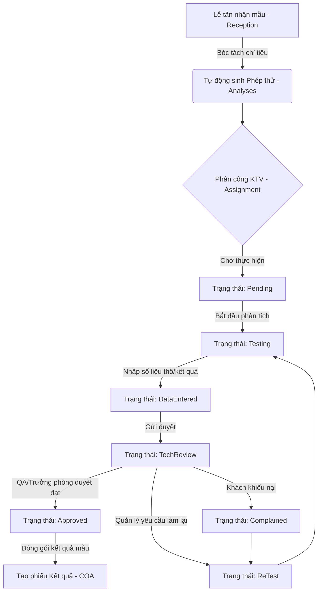

# 0_ANALYSES_STRUCTURE - TÀI LIỆU CẤU TRÚC PHÂN TÍCH CHỈ TIÊU (ANALYSES)

Tài liệu này cung cấp mô tả chi tiết về nghiệp vụ, giao diện, cấu trúc logic và mã nguồn của module **Phép thử / Phân tích (Analyses)** trong hệ thống LIMS Frontend.

---

## 1. Luồng Nghiệp Vụ & Chức Năng (Business Flow & Features)

Module `Analyses` là thành phần trung tâm trong hoạt động kỹ thuật của phòng thí nghiệm (Lab), chịu trách nhiệm quản lý kết quả đo đạc thực tế của từng chỉ tiêu phân tích trên các mẫu thử.



### Chi tiết các bước nghiệp vụ:
1. **Khởi tạo tự động**: Khi phiếu tiếp nhận được tạo tại bộ phận lễ tân (`Receipt`), các chỉ tiêu đăng ký sẽ tự động bóc tách thành các bản ghi phép thử tương ứng trong bảng `lab.analyses`.
2. **Quản lý Vòng đời Trạng thái (`AnalysisStatusDb`)**:
   - `Pending`: Phép thử mới được tạo, chưa được phân công hoặc chưa tiến hành.
   - `Testing`: Kỹ thuật viên (KTV) đang tiến hành đo đạc hoặc chuẩn bị mẫu.
   - `DataEntered`: KTV đã điền kết quả đo đạc tạm thời vào hệ thống.
   - `TechReview`: Hồ sơ phép thử được gửi lên Trưởng phòng thí nghiệm/Tech Lead soát xét.
   - `Approved`: Kết quả chính thức được duyệt, khóa chỉnh sửa để chuẩn bị xuất COA.
   - `ReTest`: Yêu cầu thử nghiệm lại do sai số kỹ thuật hoặc nghi ngờ chất lượng.
   - `Complained`: Khách hàng khiếu nại về kết quả đo đạc, cần phân tích đối chứng.
   - `Cancelled`: Phép thử bị hủy do mẫu hỏng hoặc yêu cầu rút chỉ tiêu từ khách.
3. **Đánh giá Đạt/Không Đạt (`AnalysisResultStatusDb`)**:
   - `Pass`: Kết quả nằm trong khoảng quy chuẩn/giới hạn cho phép.
   - `Fail`: Kết quả vượt ngưỡng, không đạt chuẩn chất lượng.
   - `NotEvaluated`: Chưa được đánh giá (mặc định ban đầu).
4. **Tiêu hao Vật tư hóa chất (Consumables)**:
   - Mỗi phép thử sử dụng các lô (Lot) hóa chất từ module Kho (`Inventory`).
   - Việc ghi nhận vật tư tiêu hao gắn liền với `analysisId` nhằm phục vụ việc truy vết nguồn gốc và tuân thủ tiêu chuẩn chất lượng **ISO 17025**.

---

## 2. Quy trình & Thao tác Sử dụng (User Operations & Flow)

- **Theo dõi khối lượng công việc**: KTV hoặc Quản lý truy cập màn hình để giám sát số lượng chỉ tiêu thông qua bộ đếm nhanh **Tổng số phép thử** và số lượng phép thử đang ở trạng thái **Chờ xử lý (Pending)**.
- **Sử dụng Bộ lọc Excel trên Cột**: Trên các cột dữ liệu chính như Mã mẫu, Phương pháp, Tên chỉ tiêu, Trạng thái phân tích, Kết quả phân tích, người dùng click vào nút Filter để mở popover chọn nhanh (multi-select checkbox) kèm số lượng đếm dữ liệu trực quan.
- **Thêm mới chỉ tiêu thủ công**: Bấm nút **"Thêm mới"** để mở Modal, chọn mã mẫu thử có sẵn và liên kết phương pháp từ thư viện Matrix.
- **Cập nhật kết quả phân tích**: Nhấp đúp vào dòng chỉ tiêu cần báo cáo, điền giá trị kết quả (`analysisResult`), dán nhãn kết quả (`Pass`, `Fail`, `NotEvaluated`), điền thời gian hoàn thành thực tế và nơi thực hiện phân tích, sau đó chuyển trạng thái sang `TechReview` để Trưởng phòng kiểm duyệt.
- **Xóa chỉ tiêu**: Sử dụng biểu tượng Thùng rác để xóa những chỉ tiêu bị trùng hoặc bị hủy theo yêu cầu.

---

## 3. Cấu Trúc File & Phân Rã Component (File Map & Component Decomposition)

### 3.1 Bản đồ File (File Map)

| Đường dẫn File | Loại | Trách nhiệm chính trong Module |
| :--- | :--- | :--- |
| [AnalysesMainPanel.tsx](./AnalysesMainPanel.tsx) | Panel Component | Container chính quản lý luồng dữ liệu, trạng thái modal và tham số tìm kiếm/lọc/phân trang. |
| [AnalysesTable.tsx](./AnalysesTable.tsx) | Presentational Table | Render bảng dữ liệu danh sách phép thử, liên kết badge trạng thái màu sắc và tích hợp popover lọc. |
| [AnalysisCreateModal.tsx](./AnalysisCreateModal.tsx) | Dialogue Form | Modal tạo mới phép thử thủ công kèm tìm kiếm nhanh mẫu thử và nền mẫu phương pháp. |
| [AnalysisUpdateModal.tsx](./AnalysisUpdateModal.tsx) | Dialogue Form | Modal cập nhật thông số kết quả đo đạc, ngày hoàn thành thực tế và trạng thái của phép thử. |
| [AnalysisDeleteModal.tsx](./AnalysisDeleteModal.tsx) | Confirm Modal | Cảnh báo xác nhận trước khi thực hiện hành động xóa bản ghi khỏi cơ sở dữ liệu. |
| [guide/HDSD_PhepThu_Analyses.md](./guide/HDSD_PhepThu_Analyses.md) | Document Guide | Hướng dẫn sử dụng chi tiết các nghiệp vụ cho Kỹ thuật viên phòng thí nghiệm. |

### 3.2 Chi tiết mã nguồn từng File (File-by-File Details)

#### 1. [AnalysesMainPanel.tsx](./AnalysesMainPanel.tsx)
- **Mục đích**: Đóng vai trò là điểm điều phối trung tâm của module Phép thử.
- **Giao diện/Render**:
  - Thanh công cụ tìm kiếm tự động Debounce kết hợp nút thêm mới chỉ tiêu.
  - Các ô chỉ số thống kê (Tổng số phép thử, số phép thử đang Pending).
  - Tích hợp Component `AnalysesTable` ở vùng trung tâm và Component `Pagination` ở chân trang.
  - Chứa 3 modal: `AnalysisCreateModal`, `AnalysisUpdateModal`, và `AnalysisDeleteModal`.
- **Logic / State chính**:
  - `searchTerm`: Lưu từ khóa tìm kiếm của người dùng và đồng bộ qua hook `useDebouncedValue` để tránh spam request.
  - `excelFilters`: State đối tượng chứa mảng bộ lọc Excel cho từng thuộc tính.
  - `listInput`: Object tính toán memoized nạp tham số gửi xuống backend.
  - `mCreate`, `mUpdate`, `mDelete`: Các react-query mutation để thao tác dữ liệu, kèm hàm callback `onSuccess` để tự động invalidate cache và cập nhật danh sách.

#### 2. [AnalysesTable.tsx](./AnalysesTable.tsx)
- **Mục đích**: Hiển thị danh sách phép thử và cung cấp bộ lọc cột động kiểu Excel.
- **Giao diện/Render**:
  - Cấu trúc thẻ `<table>` HTML chuẩn với các cột chứa icon Filter Popover.
  - Badge trạng thái `AnalysisStatusBadge` (màu sắc phân biệt cho Approved, Testing, v.v.).
  - Badge đánh giá đạt/không đạt `AnalysisResultStatusBadge`.
  - Cột hành động chứa `RowActionIcons` để chỉnh sửa hoặc xóa dòng.
- **Logic / State chính**:
  - Component con `ExcelFilterPopover`:
    - Quản lý state mở/đóng popover (`open`) và ô tìm kiếm cục bộ (`search`).
    - Gọi API filter `useAnalysesFilter` để lấy danh sách các tùy chọn và đếm số lượng bản ghi tương ứng.
    - Cập nhật state chọn nhiều thông qua `localSelected`.

#### 3. [AnalysisCreateModal.tsx](./AnalysisCreateModal.tsx)
- **Mục đích**: Cung cấp form tạo mới phép thử thủ công.
- **Giao diện/Render**:
  - Dialogue Dialog của Radix UI với form 2 cột.
  - Component `SearchableSelect` cho phép tìm kiếm nhanh Sample ID và Matrix ID.
  - Các trường nhập liệu text và select option cho trạng thái phân tích, kết quả đánh giá.
- **Logic / State chính**:
  - `qSamples` & `qMatrices`: Các React Query lấy danh sách mẫu thử và phương pháp để làm tùy chọn nạp vào SearchableSelect.
  - `matrixId`: Khi Matrix thay đổi, form tự động tìm kiếm đối tượng tương ứng để auto-fill trường `parameterId` và `parameterName` ở chế độ chỉ đọc (Read-only), ngăn chặn sai lệch dữ liệu.
  - Hàm `resetForm`: Dọn dẹp toàn bộ dữ liệu form khi modal đóng/mở nhờ state `resetKey`.

#### 4. [AnalysisUpdateModal.tsx](./AnalysisUpdateModal.tsx)
- **Mục đích**: Cho phép sửa đổi thông tin kết quả và tiến độ phép thử.
- **Giao diện/Render**:
  - Bố cục tương tự form tạo mới nhưng nạp sẵn dữ liệu hiện tại từ đối tượng `target`.
  - ID của phép thử được hiển thị ở phần mô tả tiêu đề để KTV dễ theo dõi.
- **Logic / State chính**:
  - Hook `useEffect` lắng nghe thay đổi của `target` để tự động gán dữ liệu cũ vào các state form tương ứng.
  - Xử lý định dạng ngày tháng: Chuyển đổi định dạng ISO từ Database sang định dạng ngày thuần (`yyyy-MM-dd`) để hiển thị lên thẻ `<input type="date">` và ngược lại khi submit (`toIsoMidnightZ`).

#### 5. [AnalysisDeleteModal.tsx](./AnalysisDeleteModal.tsx)
- **Mục đích**: Xác nhận an toàn trước khi xóa dữ liệu chỉ tiêu.
- **Giao diện/Render**:
  - Hộp thoại cảnh báo màu đỏ với nút Xác nhận và Hủy bỏ.
- **Logic / State chính**:
  - Lắng nghe trạng thái `submitting` từ mutation để disable nút bấm, tránh click đúp sinh nhiều request trùng lặp.

---

## 4. Cấu Trúc Logic & Kết Nối API (Logic Structure & API Integration)

- **React Query Hooks**:
  - `useAnalysesList`: Lấy danh sách phép thử phân trang, tìm kiếm và lọc.
  - `useAnalysesFilter`: Tìm kiếm và đếm số lượng thống kê theo từng điều kiện lọc phụ thuộc (cross-filtering).
- **Cấu trúc Query Key**:
  - `analysesKeys.all`: Key gốc quản lý cache của module analyses.
  - Đồng bộ invalidation:
    ```typescript
    onSuccess: async () => {
        await qc.invalidateQueries({ queryKey: analysesKeys.all, exact: false });
    }
    ```
- **Hàm xử lý dữ liệu đặc biệt**:
  - `toIsoMidnightZ(dateOnly)`: Định dạng ngày từ lịch chọn về ISO chuẩn hóa múi giờ Z (`YYYY-MM-DDT00:00:00.000Z`).
  - `pickSingle(arr)`: Lấy ra phần tử duy nhất của mảng bộ lọc Excel nếu mảng đó chỉ có 1 phần tử để nạp vào API query tham số đơn lẻ.

---

## 5. Các Quy Chuẩn Thiết Kế & Best Practices (Design Guidelines & Best Practices)

- **Theming (Không hardcode màu)**:
  - Màu nền của modal và table sử dụng biến token: `bg-card`, `bg-background`, `border-border`.
  - Trạng thái phép thử dùng màu semantic: Approved -> `bg-success`, TechReview -> `bg-warning`, Cancelled -> `bg-destructive`.
- **i18n (Đa ngôn ngữ)**:
  - Nạp ngôn ngữ bằng `t()` với namespace `lab.analyses.*` và `common.*`.
  - Các chuỗi động hỗ trợ dịch: `t("lab.analyses.status.Pending", { defaultValue: "Chờ xử lý" })`.
- **TypeScript Types**:
  - Sử dụng nghiêm ngặt các kiểu dữ liệu khai báo từ [src/types/analysis.ts](../../types/analysis.ts) như `AnalysisListItem`, `AnalysisStatusDb`, `AnalysisResultStatusDb`.
  - Tuyệt đối không sử dụng kiểu `any` trong việc khai báo biến form và kết quả API.
- **Safety & Null Handling**:
  - Hàm `toDash()` chuyển đổi các dữ liệu null, undefined hoặc chuỗi rỗng thành dấu `"-"` tránh vỡ layout.
  - Kiểm tra điều kiện nạp `enabled` cho các React Query để tránh gọi API lãng phí khi modal chưa được mở ra.
