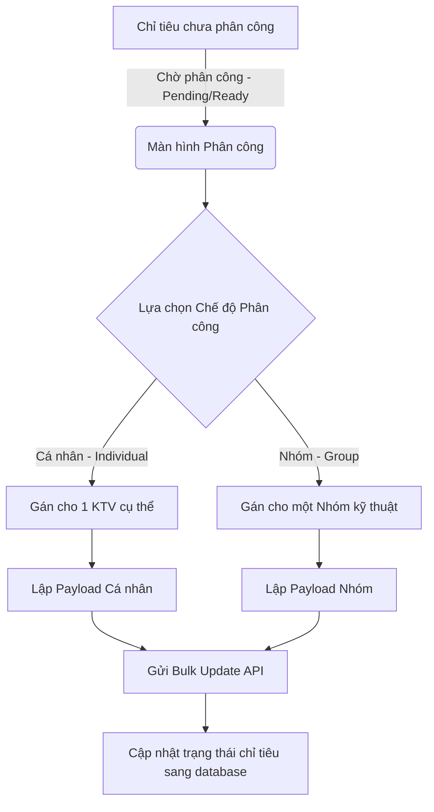

# 0_ASSIGNMENT_STRUCTURE - TÀI LIỆU CẤU TRÚC PHÂN CÔNG KỸ THUẬT VIÊN (ASSIGNMENT)

Tài liệu này cung cấp mô tả chi tiết về nghiệp vụ, giao diện, cấu trúc logic và mã nguồn của module **Phân công Kỹ thuật viên (Technician Assignment)** trong hệ thống LIMS Frontend.

---

## 1. Luồng Nghiệp Vụ & Chức Năng (Business Flow & Features)

Module Phân công Kỹ thuật viên giúp Quản lý phòng thí nghiệm hoặc Phụ trách Kỹ thuật (Tech Lead) phân bổ các chỉ tiêu phân tích (Analyses) đang chờ (`Pending` hoặc `Ready`) cho các nhân sự phù hợp.

### Chi tiết nghiệp vụ & Quy tắc ánh xạ dữ liệu (Data Mapping Rules):
1. **Phân công theo Cá nhân (Individual Assignment)**:
   - Giao việc trực tiếp cho một Kỹ thuật viên (KTV) cụ thể chịu trách nhiệm.
   - Trường dữ liệu cập nhật:
     - `technicianId`: ID của KTV được chọn.
     - `technicianIds`: Mảng chỉ chứa duy nhất ID của KTV đó (`[technicianId]`).
     - `technicianGroupId` và `technicianGroupName`: Được đặt về `null` để xóa bỏ thông tin nhóm cũ (nếu có).
2. **Phân công theo Nhóm (Group Assignment)**:
   - Giao việc cho một Nhóm chuyên môn (như Nhóm Vi Sinh, Nhóm Hóa Lý).
   - Hệ thống thực hiện bóc tách Snapshot từ cấu trúc của Nhóm:
     - `technicianGroupId`: ID của nhóm kỹ thuật.
     - `technicianGroupName`: Tên nhóm kỹ thuật (ví dụ: "Nhóm Hóa lý 1").
     - `technicianId`: ID của Trưởng nhóm (Leader) - đóng vai trò người chịu trách nhiệm chính (`identityGroupInChargeId`).
     - `technicianIds`: Mảng chứa danh sách ID của tất cả thành viên trong nhóm (`identityIds`) nhằm chia sẻ quyền xem và nhập số liệu thô.
3. **Cơ chế Cập nhật Hàng loạt (Bulk Update)**:
   - Để tối ưu hóa hiệu năng mạng và tránh phân mảnh giao dịch trên Database, hệ thống sử dụng API cập nhật hàng loạt nguyên tử (Atomic Bulk Update) qua endpoint `/v2/analyses/update/bulk`.
   - Client gửi lên một mảng các đối tượng chứa `analysisId` cùng thông tin phân công mới.

---

## 2. Quy trình & Thao tác Sử dụng (User Operations & Flow)

- **Quét chọn nhanh nhiều chỉ tiêu (Drag-to-select)**: Người dùng nhấn giữ chuột trái trên bất kỳ dòng chỉ tiêu nào và kéo quét chuột dọc theo bảng. Một khung chọn mờ màu xanh (`selectionBox`) xuất hiện hiển thị phạm vi quét. Các checkbox tương ứng tự động được bật/tắt hàng loạt.
- **Lọc chỉ tiêu theo nhân sự và nhóm**: Người quản lý click vào filter trên các tiêu đề cột (KTV phụ trách, Nhóm phụ trách, KTV liên quan) để lọc nhanh những chỉ tiêu đã được phân công hoặc chưa phân công (`IS NULL` / `IS NOT NULL`).
- **Chọn nhân sự giao việc**: Sau khi tích chọn các dòng chỉ tiêu, người dùng click nút **"Phân công"** để mở Modal. Người dùng chọn tab Cá nhân hoặc Nhóm để gán người thực hiện thích hợp và xem trước danh sách thành viên nhóm.

---

## 3. Cấu Trúc File & Phân Rã Component (File Map & Component Decomposition)

### 3.1 Bản đồ File (File Map)

| Đường dẫn File | Loại | Trách nhiệm chính trong Module |
| :--- | :--- | :--- |
| [TechnicianAssignmentManagement.tsx](./TechnicianAssignmentManagement.tsx) | View Component | Quản lý bảng phân công, bộ lọc cột, sắp xếp tiêu đề, phân trang và xử lý toán học thuật toán Drag-to-select. |
| [TechnicianAssignmentModal.tsx](./TechnicianAssignmentModal.tsx) | Action Modal | Quản lý form chọn KTV/Nhóm, truy vấn thông tin chi tiết của Nhóm và thực hiện mutation gửi API Bulk Update. |

### 3.2 Chi tiết mã nguồn từng File (File-by-File Details)

#### 1. [TechnicianAssignmentManagement.tsx](./TechnicianAssignmentManagement.tsx)
- **Mục đích**: Giao diện quản lý chính để chọn lựa và lọc danh sách phép thử chờ phân công.
- **Giao diện/Render**:
  - Tiêu đề màn hình và nút hành động Phân công kèm đếm số chỉ tiêu đang chọn.
  - Ô tìm kiếm mẫu thử kết hợp với các thẻ Badge lọc hiện hoạt.
  - Bảng dữ liệu chính với các cột lọc: STT, Mã mẫu, Tên chỉ tiêu, KTV phụ trách, Nhóm phụ trách, KTV liên quan, Trạng thái.
  - Hộp chọn ảo `selectionBox` render động theo tọa độ chuột tuyệt đối khi người dùng đang kéo chuột.
- **Logic / State chính**:
  - **Thuật toán quét chọn (Drag-to-select)**:
    - Khi `onMouseDown`: Ghi nhận tọa độ client (`startX`, `startY`) và ID bắt đầu `dragStartId`. Đặt `isSelecting = true` và xác định chế độ là `select` hay `deselect`.
    - Khi `mousemove` (được lắng nghe toàn cục ở window): Tính toán tọa độ kết thúc (`endX`, `endY`) để hiển thị khung chọn mờ. Đồng thời dùng `document.elementFromPoint` tìm dòng `<tr>` có thuộc tính `data-analysis-id` để xác định ID kết thúc. Gọi hàm `updateSelectionRange` để tìm khoảng chỉ số dòng và cập nhật mảng `selectedIds`.
    - Khi `mouseup`: Hủy bỏ cờ `isSelecting` và xóa `selectionBox`.
  - **Sắp xếp cột (`SortableHead`)**: Lắng nghe click để xoay vòng trạng thái sắp xếp của cột: Mặc định -> ASC -> DESC -> Reset.

#### 2. [TechnicianAssignmentModal.tsx](./TechnicianAssignmentModal.tsx)
- **Mục đích**: Form Modal thực hiện phân công các chỉ tiêu đã chọn cho cá nhân hoặc nhóm.
- **Giao diện/Render**:
  - Bố cục Dialog Radix UI chứa Component `Tabs` để chuyển đổi chế độ.
  - Dropdown tìm kiếm KTV cá nhân sử dụng Command Palette Radix.
  - Dropdown tìm kiếm Nhóm Kỹ thuật.
  - Hộp thông tin tóm tắt hiển thị danh sách thành viên nhóm sử dụng Component `Badge` và `ScrollArea` khi tab Nhóm được kích hoạt.
- **Logic / State chính**:
  - `mode`: State quản lý tab hiện hành (`technician` hoặc `group`).
  - `useIdentityGroupFull`: API query lấy thông tin chi tiết của nhóm được chọn (Trưởng nhóm, danh sách IDs thành viên) để chuẩn bị snapshot dữ liệu.
  - `useAnalysesUpdateBulk`: Mutator gửi request lưu trữ thông tin phân công xuống DB dưới dạng mảng các phép thử. Sau khi hoàn tất sẽ gọi `onSuccess` để đóng modal và làm sạch danh sách đã chọn.

---

## 4. Cấu Trúc Logic & Kết Nối API (Logic Structure & API Integration)

- **API Kết nối**:
  - `useAnalysesList`: Tải danh sách chỉ tiêu cần phân công (Status: `Pending`, `Ready`).
  - `useIdentitiesList`: Lấy danh sách tài khoản nhân sự có vai trò KTV (`ROLE_TECHNICIAN`).
  - `useIdentityGroupsList`: Lấy danh sách nhóm KTV có vai trò (`ROLE_TECHNICIAN`) với tham số `option: "full"` để trả về snapshot.
  - `useIdentityGroupFull`: Lấy thông tin snapshot của Nhóm kỹ thuật đang chọn trong Modal.
  - `useAnalysesUpdateBulk`: Mutation thực hiện cập nhật hàng loạt các phép thử.
- **Xử lý sự kiện kéo chọn**:
  - Tránh xung đột sự kiện nổi bọt (event propagation) trên table bằng cách quản lý cờ chuột trái (`e.button === 0`) và các phần tử con không bắt sự kiện mouse down.

---

## 5. Các Quy Chuẩn Thiết Kế & Best Practices (Design Guidelines & Best Practices)

- **Theming**:
  - Sử dụng Tailwind CSS v4 chuẩn hóa cho nền và màu văn bản (`bg-card`, `bg-muted/40`, `text-primary`, `border-border`).
  - Lớp phủ Drag-to-select sử dụng màu nền dịu và có bo góc tinh tế: `bg-primary/20 border-primary`.
- **i18n**:
  - Namespace chính: `assignment.*` và `handover.*`.
  - Hỗ trợ dịch thông điệp mô tả kèm số lượng chỉ tiêu động: `t("assignment.modal.description").replace("{{count}}", selectedAnalysisIds.length.toString())`.
- **TypeScript Types**:
  - Tuyệt đối tuân thủ strict types.
  - Kiểu dữ liệu list item gộp kế thừa thuộc tính: `AnalysisListItem & { technicianGroupName?: string }`.
- **Safety & Null Handling**:
  - Trong quá trình cập nhật cho cá nhân, thông tin nhóm cũ được set cứng về `null` trong payload gửi đi để Backend dọn dẹp liên kết cũ.
  - Hiển thị dấu `"-"` nếu tên nhóm hoặc KTV phụ trách bị trống.
