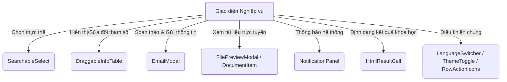

# 0_COMMON_STRUCTURE - TÀI LIỆU CẤU TRÚC CÁC COMPONENT DÙNG CHUNG (COMMON)

Tài liệu này cung cấp mô tả chi tiết về nghiệp vụ, giao diện, cấu trúc logic và mã nguồn của các **Component dùng chung (Common Components)** trong hệ thống LIMS Frontend.

---

## 1. Luồng Nghiệp Vụ & Chức Năng (Business Flow & Features)

Thư mục `src/components/common` chứa các component dùng chung (Shared Components) cốt lõi. Các component này giúp thống nhất trải nghiệm người dùng (UX) trên toàn hệ thống LIMS, tối ưu hóa tái sử dụng mã nguồn và nâng cao tính bảo mật.

---

## 2. Quy trình & Thao tác Sử dụng (User Operations & Flow)

- **Tìm kiếm thực thể trong dropdown**: Người dùng click vào `SearchableSelect`, popover mở ra khớp chiều rộng nút bấm. Gõ từ khóa để lọc nhanh danh mục. Đối với các dữ liệu lớn, người dùng click nút "Trước"/"Sau" ở chân dropdown để phân trang.
- **Kéo thả sắp xếp hàng**: Trong `DraggableInfoTable`, người dùng nhấp giữ icon Grip ở đầu dòng và kéo thả lên xuống để sắp xếp thứ tự hiển thị thông số. Ở chế độ sửa, click đúp để chỉnh sửa trực tiếp nhãn và giá trị của ô.
- **Soạn thảo và gửi email**: Click mở `EmailModal`, soạn thảo nội dung HTML bằng TinyMCE Rich Editor, tick chọn các ảnh mẫu hoặc tài liệu đi kèm từ danh sách được tự động gom nhóm, bấm gửi để đẩy thông tin.
- **Xem trước file và tài liệu**: Click biểu tượng con mắt trong `DocumentItem` hoặc `DocumentPreviewButton` để gọi `FilePreviewModal`. Cửa sổ Radix Dialog mở ra che phủ toàn màn hình, hiển thị file PDF, ảnh hoặc văn bản Office trực tiếp.
- **Xem thông báo**: Bấm vào biểu tượng chuông trên Header để mở `NotificationPanel`, xem danh sách các tin cảnh báo kết quả phân tích hoặc hóa chất quá hạn, click để đánh dấu đã đọc hoặc xóa bỏ.
- **Nhập kết quả khoa học nhanh**: KTV click vào ô `HtmlResultCell`, gõ các ký tự viết tắt (như `^2` cho số mũ hoặc `*` cho dấu nhân), khi click ra ngoài (blur) nội dung sẽ tự động hiển thị dưới dạng công thức khoa học chuẩn.

---

## 3. Cấu Trúc File & Phân Rã Component (File Map & Component Decomposition)

### 3.1 Bản đồ File (File Map)

| Đường dẫn File | Loại | Trách nhiệm chính trong Module |
| :--- | :--- | :--- |
| [SearchableSelect.tsx](./SearchableSelect.tsx) | Select Component | Dropdown tìm kiếm thông minh, hỗ trợ lọc client/server, cho phép tự gõ tạo option mới và tích hợp phân trang footer. |
| [DraggableInfoTable.tsx](./DraggableInfoTable.tsx) | Table Component | Bảng liệt kê thông số kỹ thuật cho phép KTV kéo thả sắp xếp vị trí các hàng (HTML5 Drag & Drop). |
| [EmailModal.tsx](./EmailModal.tsx) | Form Modal | Modal soạn thảo và gửi email đính kèm tài liệu kết hợp TinyMCE editor, tự động gom file kết quả cuối cùng. |
| [FilePreviewModal.tsx](./FilePreviewModal.tsx) | Preview Modal | Modal che phủ toàn màn hình dùng iframe hiển thị trực tiếp nội dung PDF, Office, hoặc hình ảnh. |
| [NotificationPanel.tsx](./NotificationPanel.tsx) | Panel Dropdown | Panel thông báo hệ thống hiển thị số lượng tin chưa đọc, hỗ trợ đánh dấu đã đọc và xóa tin. |
| [DocumentItem.tsx](./DocumentItem.tsx) | Card Component | Thẻ biểu diễn rút gọn thông tin tài liệu bao gồm ID, Title, Status và nút xem trước nhanh. |
| [HtmlResultCell.tsx](./HtmlResultCell.tsx) | Input Component | Ô nhập kết quả phân tích thông minh, hỗ trợ soạn thảo ký tự viết tắt khoa học tự động biên dịch sang HTML. |
| [LanguageSwitcher.tsx](./LanguageSwitcher.tsx) | Switcher Component | Nút chuyển đổi nhanh ngôn ngữ hệ thống giữa tiếng Anh (EN) và tiếng Việt (VI). |
| [ThemeToggle.tsx](./ThemeToggle.tsx) | Switcher Component | Nút chuyển đổi giao diện hệ thống (Light Mode, Dark Mode, System Theme). |
| [RowActionIcons.tsx](./RowActionIcons.tsx) | Icon Component | Cụm biểu tượng chuẩn hóa cho các hành động Xem, Sửa, Xóa trên các dòng của bảng dữ liệu. |

### 3.2 Chi tiết mã nguồn từng File (File-by-File Details)

#### 1. [SearchableSelect.tsx](./SearchableSelect.tsx)
- **Mục đích**: Dropdown thay thế cho thẻ `<select>` mặc định của HTML.
- **Giao diện/Render**:
  - Radix Popover trigger khớp chiều rộng của nút bấm gốc nhờ biến trigger-width.
  - Command Input làm thanh tìm kiếm, Command List chứa các dòng tùy chọn.
  - Nút bấm tạo mới nằm cố định (sticky) dưới đáy nếu cho phép tạo custom value.
  - Phân trang dạng footer ở dưới cùng để duyệt các trang kết quả tiếp theo từ server.
- **Logic / State chính**:
  - `filterMode`: Chế độ lọc "client" dùng logic so khớp mặc định của command, hoặc chế độ "server" nạp dữ liệu động từ backend thông qua debounce search.
  - `allowCustomValue`: Nếu bật, KTV nhập giá trị chưa tồn tại sẽ kích hoạt option tạo mới và gọi hàm callback `onChange(normalizedSearch)`.

#### 2. [DraggableInfoTable.tsx](./DraggableInfoTable.tsx)
- **Mục đích**: Quản lý bảng danh sách thuộc tính mẫu thử, hỗ trợ sắp xếp thứ tự in trên báo cáo.
- **Giao diện/Render**:
  - Header bảng chứa nút bấm thêm hàng.
  - Dòng dữ liệu hiển thị biểu tượng Grip kéo thả ở chế độ Edit, hoặc text tĩnh ở chế độ Xem.
- **Logic / State chính**:
  - Thuật toán kéo thả: Lắng nghe sự kiện `onDragStart` để ghi nhận chỉ số dòng `draggedIndex`, sự kiện `onDragOver` để ngăn chặn hành động mặc định của trình duyệt và thực hiện hoán đổi vị trí phần tử trong mảng `data` qua callback `onChange(newData)`.
  - Hàm `getLabelKey`: Ánh xạ tự động các nhãn tiếng Việt phổ biến sang khóa i18n của hệ thống.

#### 3. [EmailModal.tsx](./EmailModal.tsx)
- **Mục đích**: modal đa năng dùng để gửi báo cáo tiếp nhận hoặc kết quả phân tích cho khách hàng.
- **Giao diện/Render**:
  - Form điền To, Cc, Subject.
  - Vùng soạn thảo tích hợp TinyMCE Editor nạp offline từ `/tinymce/tinymce.min.js`.
  - Grid danh sách tệp tin đính kèm có nút xem trước nhanh (Preview) và nút gỡ bỏ đính kèm.
- **Logic / State chính**:
  - Tự động gom tệp:
    - Nếu là `RECEPTION`: Lấy tất cả ảnh mẫu và tài liệu đính kèm của phiếu nhận.
    - Nếu là `FINAL_RESULT`: Lọc từ danh sách mẫu thử, chọn các tài liệu có loại `RESULT_CERT` trạng thái `Issued` và sắp xếp lấy bản ghi mới nhất theo thời gian.
  - `sendEmailMut`: Mutation gửi payload chứa danh sách ID tệp đính kèm và nội dung HTML xuống server.

#### 4. [FilePreviewModal.tsx](./FilePreviewModal.tsx)
- **Mục đích**: Cung cấp khung xem tệp tin trực tuyến độc lập.
- **Giao diện/Render**:
  - Dialogue Dialog của Radix UI với backdrop-blur và màu nền mờ.
  - Khung header chứa tiêu đề tệp, nút mở tab mới của trình duyệt và nút đóng modal.
  - Vùng nội dung chứa thẻ `<iframe>` phủ kín 100% diện tích.
- **Logic / State chính**:
  - `useEffect`: Theo dõi `documentId` thay đổi để tự động gọi API `documentApi.url` lấy presigned URL, hiển thị vòng tròn xoay `Loader2` trong lúc tải.

#### 5. [NotificationPanel.tsx](./NotificationPanel.tsx)
- **Mục đích**: Panel quản lý thông báo đẩy từ hệ thống.
- **Giao diện/Render**:
  - Icon Chuông trên thanh tiêu đề kèm Badge hiển thị số lượng tin chưa đọc màu đỏ.
  - Dropdown panel phân chia 2 Tab: Tất cả và Chưa đọc.
  - Mỗi hàng thông báo hiển thị icon phân loại theo mức độ nghiêm trọng (success, warning, info, error).
- **Logic / State chính**:
  - State `notifications` lưu trữ danh sách tin. Các hàm `markAsRead`, `markAllAsRead`, và `deleteNotification` cập nhật state cục bộ của panel.

#### 6. [DocumentItem.tsx](./DocumentItem.tsx)
- **Mục đích**: Thẻ hiển thị thông tin tài liệu gọn nhẹ, dùng trong danh sách đính kèm.
- **Giao diện/Render**:
  - Card bo góc chứa icon FileText, tiêu đề tệp tin, nhãn trạng thái và ID tài liệu.
  - Nút bấm xem trước nhanh hiển thị khi di chuột qua (hover).
- **Logic / State chính**:
  - Hàm `handlePreview`: Lấy link presigned URL từ backend, xác định định dạng tệp thông qua phần mở rộng của URL để hiển thị preview modal thích hợp (office, pdf, image).

#### 7. [HtmlResultCell.tsx](./HtmlResultCell.tsx)
- **Mục đích**: Nhập kết quả đo đạc hỗ trợ định dạng khoa học inline.
- **Giao diện/Render**:
  - Click vào ô sẽ chuyển sang thẻ `<input>` để soạn thảo văn bản thô.
  - Blur ra ngoài sẽ chuyển thành thẻ `
` hiển thị HTML có định dạng (superscript, subscript, dấu nhân).
- **Logic / State chính**:
  - Sử dụng 2 hàm helper tiện ích:
    - `htmlToResultShorthand`: Chuyển đổi mã HTML trong database (ví dụ: `103`) thành chuỗi viết tắt dễ gõ (ví dụ: `10^3`) khi focus.
    - `convertResultToHtml`: Chuyển đổi ngược lại chuỗi viết tắt thành mã HTML sạch khi blur.

#### 8. [LanguageSwitcher.tsx](./LanguageSwitcher.tsx)
- **Mục đích**: Thay đổi ngôn ngữ hệ thống.
- **Giao diện/Render**:
  - Nhóm 2 nút nhấn VI và EN.
- **Logic / State chính**:
  - Sử dụng hàm `i18n.changeLanguage(lng)` để ghi đè cấu hình dịch và tự động thay đổi ngôn ngữ trên toàn bộ ứng dụng.

#### 9. [ThemeToggle.tsx](./ThemeToggle.tsx)
- **Mục đích**: Thay đổi giao diện Light/Dark của hệ thống.
- **Giao diện/Render**:
  - Các nút icon Sun, Moon, Laptop đại diện cho Light, Dark và System theme.
- **Logic / State chính**:
  - Sử dụng hàm `setTheme` kế thừa từ theme provider của hệ thống.

#### 10. [RowActionIcons.tsx](./RowActionIcons.tsx)
- **Mục đích**: Cung cấp bộ nút thao tác chuẩn cho các bảng dữ liệu.
- **Giao diện/Render**:
  - Cụm icon FileText (Xem), Pencil (Sửa), Trash2 (Xóa).
- **Logic / State chính**:
  - Nhận các props callback và cờ điều khiển hiển thị (`showView`, `showEdit`, `showDelete`) để render linh hoạt.

---

## 4. Cấu Trúc Logic & Kết Nối API (Logic Structure & API Integration)

- **API tích hợp**:
  - `documentApi.url` & `fileApi.url`: Được gọi trong `DocumentItem`, `FilePreviewModal`, và `EmailModal` để tạo Presigned URL.
  - `receiptsSendEmail`: API mutation gửi email đính kèm tệp tin.
- **Cơ chế chuyển đổi HTML khoa học**:
  - Sử dụng biểu thức chính quy (Regex) trong file tiện ích `resultHtml.ts` để phân tích ký tự `^` thành `` và `_` thành `` một cách chuẩn xác.

---

## 5. Các Quy Chuẩn Thiết Kế & Best Practices (Design Guidelines & Best Practices)

- **Theming**:
  - Tuân thủ quy tắc không dùng mã màu cố định.
  - Sử dụng biến màu chuẩn: `bg-background`, `bg-card`, `border-border`, `text-destructive`.
- **i18n**:
  - Toàn bộ nội dung hiển thị trong các component dùng chung đều được dịch qua namespace `common.*`.
- **TypeScript**:
  - Định nghĩa chặt chẽ các kiểu props interface (ví dụ: `InfoRow[]`, `Option[]`, `EmailModalProps`).
  - Hạn chế tối đa sử dụng kiểu dữ liệu `any`.
- **Safety & Null Handling**:
  - Ô kết quả HTMLResultCell sử dụng cơ chế an toàn dangerouslySetInnerHTML nhưng dữ liệu đầu vào đã được sanitize kỹ qua utility function để tránh mã độc XSS.
