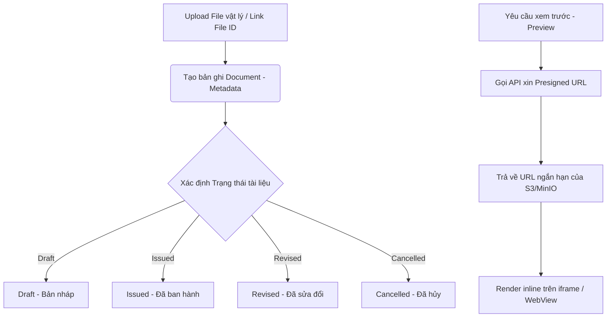

# 0_DOCUMENT_STRUCTURE - TÀI LIỆU CẤU TRÚC TRUNG TÂM TÀI LIỆU (DOCUMENT)

Tài liệu này cung cấp mô tả chi tiết về nghiệp vụ, giao diện, cấu trúc logic và mã nguồn của module **Trung tâm Tài liệu (Document Center)** trong hệ thống LIMS Frontend.

---

## 1. Luồng Nghiệp Vụ & Chức Năng (Business Flow & Features)

Module `DocumentCenter` đóng vai trò là kho lưu trữ tập trung toàn bộ các tệp tin tĩnh và tài liệu liên quan đến quy trình kỹ thuật, hồ sơ tiếp nhận, và chứng nhận kết quả kiểm nghiệm.

### Chi tiết nghiệp vụ cốt lõi:
1. **Sự phân tách giữa Document và File**:
   - **File** đại diện cho tệp tin vật lý lưu trên Storage Server (S3, MinIO). Khi upload file lên qua API `/v2/files/upload`, hệ thống trả về một `fileId` cùng dung lượng và tên tệp tin gốc.
   - **Document** là thực thể logic chứa thông tin metadata nghiệp vụ (như Mã loại tài liệu `documentType`, Trạng thái `documentStatus`, Tham chiếu `commonKeys`, Tiêu đề `documentTitle`) và liên kết đến một `fileId` cụ thể.
2. **Vòng đời tài liệu (`DocumentStatus`)**:
   - `Draft`: Tài liệu đang trong giai đoạn soạn thảo, hiệu chỉnh.
   - `Issued`: Đã ban hành chính thức, áp dụng vào quy trình vận hành.
   - `Revised`: Đã được sửa đổi, cập nhật phiên bản mới.
   - `Cancelled`: Đã bị hủy bỏ, hết hiệu lực sử dụng.
3. **Cơ chế Presigned URL bảo mật**:
   - Để bảo mật tài liệu, hệ thống không công khai link S3 tĩnh. Mỗi lần người dùng click xem trước hoặc tải xuống, Frontend gửi yêu cầu lấy URL ký sẵn (`Presigned URL`) có thời hạn ngắn (thường là 3600 giây). Sau thời gian này link sẽ tự động hết hiệu lực.

---

## 2. Quy trình & Thao tác Sử dụng (User Operations & Flow)

- **Chuyển đổi View Mode**: Người dùng nhấp chọn nút "Tài liệu" hoặc "Files" ở sidebar bên trái để chuyển đổi giữa giao diện quản lý thực thể tài liệu và giao diện quản lý tệp tin vật lý.
- **Lọc và tìm kiếm tài liệu**:
  - Gõ từ khóa tìm kiếm trên thanh search ở góc trên.
  - Sử dụng các danh mục phân loại nhanh ở cột trái (Tất cả / Phương pháp kiểm nghiệm / Khác).
  - Sử dụng bộ lọc Excel trực tiếp trên tiêu đề các cột (Loại, Trạng thái, Ngày tạo) để đa chọn dữ liệu.
- **Tải lên tài liệu**: Nhấp nút **"Tải lên tài liệu"**, kéo thả tệp tin vào dropzone hoặc gõ trực tiếp `fileId` nếu liên kết tệp tin đã có, điền thông tin mô tả và bấm Lưu.
- **Xem trước và chỉnh sửa tài liệu**: Click vào nút Xem trước trên dòng tài liệu để mở modal phóng đại, xem nội dung file inline kết hợp xem panel thông tin metadata ở cạnh trái. Click biểu tượng bút chì để sửa đổi metadata.

---

## 3. Cấu Trúc File & Phân Rã Component (File Map & Component Decomposition)

### 3.1 Bản đồ File (File Map)

| Đường dẫn File | Loại | Trách nhiệm chính trong Module |
| :--- | :--- | :--- |
| [DocumentCenter.tsx](./DocumentCenter.tsx) | Page Component | Giao diện chính quản lý layout chung, tích hợp sidebar phân loại, thống kê tổng số tệp và bảng danh sách. |
| [DocumentUploadModal.tsx](./DocumentUploadModal.tsx) | Upload Modal | Form modal xử lý tải lên file mới thông qua `FormData` hoặc liên kết mã ID tệp tin có sẵn. |
| [DocumentPreviewModal.tsx](./DocumentPreviewModal.tsx) | Preview Modal | Modal phóng đại hiển thị trực quan tài liệu, tích hợp panel thông tin chi tiết (`PreviewSidePanel`) ở cạnh phải. |
| [DocumentPreviewButton.tsx](./DocumentPreviewButton.tsx) | UI Button | Nút bấm tiện ích nạp sẵn logic tự động kiểm tra định dạng tệp để mở preview modal tương ứng. |

### 3.2 Chi tiết mã nguồn từng File (File-by-File Details)

#### 1. [DocumentCenter.tsx](./DocumentCenter.tsx)
- **Mục đích**: Giao diện chính của Trung tâm tài liệu LIMS.
- **Giao diện/Render**:
  - Tiêu đề trang, thanh tìm kiếm và nút bấm tải lên.
  - Sidebar bên trái chứa nút chuyển chế độ xem (Tài liệu / Files) và menu danh mục danh mục (Tất cả / Phương pháp / Khác) kèm widget thống kê.
  - Bảng dữ liệu chính với 2 view: `DocumentsListView` (Hiển thị các cột Tiêu đề, Phân loại, Trạng thái, Tham chiếu, Ngày tạo) và `FilesListView` (Tên file, MIME type, Dung lượng, Ngày tạo).
- **Logic / State chính**:
  - `viewMode`: Quản lý chế độ hiển thị hiện tại (`documents` hoặc `files`).
  - `activeTab`: Lọc danh mục tài liệu cục bộ tại client (Tất cả, SOP/Phương pháp, Tài liệu khác).
  - `filterValues`: Lưu các tham số lọc đa chọn nhận về từ `TableHeaderFilter` trên các cột.
  - `handlePreviewDocument` & `handlePreviewFile`: Gọi API xin presigned URL, tự động xác định định dạng xem (pdf, image, office) và mở modal.

#### 2. [DocumentUploadModal.tsx](./DocumentUploadModal.tsx)
- **Mục đích**: Cung cấp form tạo mới hoặc hiệu chỉnh tài liệu.
- **Giao diện/Render**:
  - Tabs chọn chế độ: Tải file mới hoặc Liên kết file ID.
  - Vùng dropzone tải file tương tác kéo thả.
  - Các trường nhập thông tin: Tiêu đề tài liệu, Loại tài liệu, Trạng thái, Tham chiếu (gõ từ khóa và add badge).
- **Logic / State chính**:
  - Sử dụng `react-hook-form` để quản lý validation trường dữ liệu bắt buộc.
  - `handleUpload`: Đóng gói file và metadata vào đối tượng `FormData` để gửi lên API vật lý `/v2/files/upload`.
  - Mutation: `useMutation` gọi API tạo tài liệu của backend, invalidate query key `documentCenter` khi thành công.

#### 3. [DocumentPreviewModal.tsx](./DocumentPreviewModal.tsx)
- **Mục đích**: Hiển thị nội dung tệp tin trực tuyến đính kèm thông tin bản ghi.
- **Giao diện/Render**:
  - Layout chia đôi khi được truyền prop `previewDoc`:
    - Cạnh trái: Panel chi tiết bản ghi `PreviewSidePanel` hiển thị mã ID, loại, trạng thái, ngày tạo dưới dạng các Badge.
    - Cạnh phải: Khung hiển thị tài liệu chiếm phần lớn diện tích.
  - Backdrop mờ bao phủ toàn màn hình (`backdrop-blur-md z-[200]`).
- **Logic / State chính**:
  - Sử dụng `createPortal` để render modal trực tiếp vào phần tử `document.body`, cô lập các thuộc tính CSS tránh ảnh hưởng đến layout chính.
  - Phân loại phần tử hiển thị: Thẻ `<iframe>` cho PDF, thẻ `` cho ảnh, và nhúng link qua Google Docs Viewer cho Office.

#### 4. [DocumentPreviewButton.tsx](./DocumentPreviewButton.tsx)
- **Mục đích**: Nút bấm xem trước tài liệu có thể đặt ở bất kỳ bảng dữ liệu nào ngoài Document Center.
- **Giao diện/Render**:
  - Thường hiển thị dạng button icon con mắt (ghost button) hoặc button có nhãn chữ tùy cấu hình.
- **Logic / State chính**:
  - Tích hợp sẵn logic bóc tách thông tin: Đầu tiên gọi `documentApi.full` để lấy thông tin chi tiết của tài liệu (lấy MIME type và tên tệp tin thực tế), sau đó gọi `documentApi.url` lấy link S3 và xác minh loại preview phù hợp để mở `DocumentPreviewModal`.

---

## 4. Cấu Trúc Logic & Kết Nối API (Logic Structure & API Integration)

- **API tích hợp**:
  - `documentApi.list`: Query nạp danh sách tài liệu.
  - `fileApi.list`: Query nạp danh sách files.
  - `documentApi.url` & `fileApi.url`: Lấy presigned URL của tệp tin.
- **Cơ chế Invalidation**:
  - Sử dụng Query Key tập trung thông qua đối tượng `documentCenterKeys`.
  - Khi hoàn thành upload hoặc edit tài liệu, Frontend gọi invalidate toàn bộ các query có key chứa `"documentCenter"` để đồng bộ UI lập tức.

---

## 5. Các Quy Chuẩn Thiết Kế & Best Practices (Design Guidelines & Best Practices)

- **Theming**:
  - Sử dụng Tailwind CSS v4 chuẩn hóa cho giao diện (`bg-card`, `text-foreground`, `bg-primary`).
  - Backdrop mờ của preview modal sử dụng màu sắc dịu: `bg-black/70`.
- **i18n**:
  - Namespace chính: `documentCenter.*` và `common.*`.
  - Các nhãn lỗi validation, tải lên, xem trước được dịch chuẩn hóa.
- **TypeScript**:
  - Định nghĩa chặt chẽ dữ liệu qua các kiểu `DocumentInfo` và `FileInfo` được import từ [src/api/documents.ts](../../api/documents.ts) và [src/api/files.ts](../../api/files.ts).
- **Safety & Null Handling**:
  - Cột loại ở tab Files tự động phân tích định dạng mở rộng hoặc cắt ngắn chuỗi MIME quá dài để chống vỡ layout của bảng.
  - Presigned URL được check điều kiện an toàn, nếu lỗi sẽ tự động chuyển sang fallback mở tab mới bằng `window.open`.
