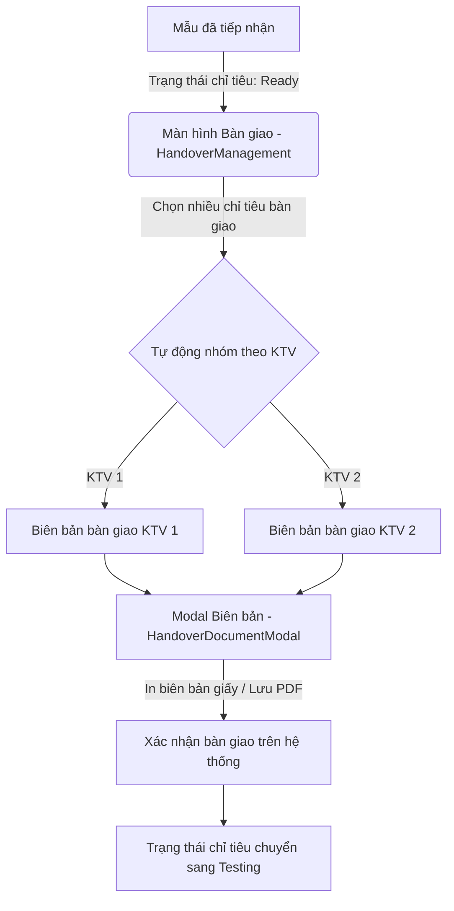

# 0_HANDOVER_STRUCTURE - TÀI LIỆU CẤU TRÚC BÀN GIAO MẪU NỘI BỘ (HANDOVER)

Tài liệu này cung cấp mô tả chi tiết và toàn diện về nghiệp vụ, giao diện, cấu trúc logic và mã nguồn của module **Bàn giao Mẫu Nội bộ (Internal Handover)** trong hệ thống LIMS Frontend.

---

## 1. Luồng Nghiệp Vụ & Chức Năng (Business Flow & Features)

Module `handover` chịu trách nhiệm quản lý quy trình phân công Kỹ thuật viên (KTV) và bàn giao mẫu vật lý cùng chỉ tiêu phân tích từ bộ phận nhận mẫu/phòng lưu trữ sang các phòng Lab chuyên môn để tiến hành đo đạc.

### Chi tiết các bước nghiệp vụ:
1. **Lọc chỉ tiêu sẵn sàng bàn giao**: Hệ thống quét danh sách các phép thử (`Analyses`) có trạng thái `Ready` để đưa lên bảng bàn giao.
2. **Nhóm theo Kỹ thuật viên (Grouping Logic)**: Khi chọn nhiều chỉ tiêu và bấm bàn giao, Frontend tự động nhóm các dòng theo `technicianId` để sinh ra các tab biên bản tương ứng cho từng KTV nhận mẫu, tránh việc gộp chung gây nhầm lẫn chữ ký nhận.
3. **Hiệu chỉnh & Đóng gói biên bản (TinyMCE A4 Preview)**: Nội dung biên bản bàn giao được nạp vào trình soạn thảo Rich Text Editor định dạng khổ A4. Cho phép sửa nhanh ghi chú, in ấn (Print CSS `@media`) hoặc xuất file PDF qua API lưu trữ thông tin đối chiếu ISO 17025.
4. **Xác nhận chuyển trạng thái**: Khi xác nhận bàn giao thành công, trạng thái phép thử chuyển sang `Testing` để KTV bắt đầu nhập kết quả.

---

## 2. Quy trình & Thao tác Sử dụng (User Operations & Flow)

- **Lựa chọn chỉ tiêu bàn giao**: Người dùng sử dụng thanh tìm kiếm nhanh để tìm mẫu/KTV, tick chọn các hàng chỉ tiêu hiển thị ở màn hình chính, sau đó bấm nút **"Bàn giao hàng loạt"**.
- **Soạn thảo và in biên bản A4**: Modal biên bản hiện lên, phân tách thành các Tab theo tên từng KTV. Người dùng có thể sửa đổi nội dung biên bản trực tiếp trong TinyMCE editor, bấm nút **"In biên bản"** hoặc **"Xuất PDF"**.
- **Phân công KTV độc lập theo phiếu nhận**: Bấm vào biểu tượng phân công trên danh sách phiếu nhận để gọi `SampleHandoverModal`, gán KTV chuyên môn cho từng phép thử của các mẫu thử nằm trong phiếu.
- **Phân công theo Nhóm kiểm thử**: Sử dụng màn hình `TesterAssignment` để lọc các chỉ tiêu chưa phân công (`Pending`), lựa chọn hàng loạt chỉ tiêu và gán cho các Nhóm kiểm nghiệm tương ứng (Nhóm hóa lý, nhóm vi sinh, nhóm kim loại nặng).

---

## 3. Cấu Trúc File & Phân Rã Component (File Map & Component Decomposition)

### 3.1 Bản đồ File (File Map)

| Đường dẫn File | Loại | Trách nhiệm chính trong Module |
| :--- | :--- | :--- |
| [HandoverManagement.tsx](./HandoverManagement.tsx) | Page Component | Màn hình chính quản lý danh sách chỉ tiêu sẵn sàng bàn giao, bộ lọc tìm kiếm và logic nhóm KTV. |
| [HandoverDocumentModal.tsx](./HandoverDocumentModal.tsx) | Document Modal | Hiển thị biên bản bàn giao dạng văn bản khổ A4, tích hợp TinyMCE editor, nút In và nút gọi API xuất PDF. |
| [SampleHandoverModal.tsx](./SampleHandoverModal.tsx) | Form Modal | Modal phân công KTV cho các chỉ tiêu phân tích theo cấu trúc phân cấp Phiếu nhận -> Mẫu -> Chỉ tiêu. |
| [StoredSamples.tsx](./StoredSamples.tsx) | Page Component | Panel giám sát các mẫu đang lưu kho, kết nối các modal thông tin chi tiết, chỉnh sửa và xóa mẫu. |
| [TesterAssignment.tsx](./TesterAssignment.tsx) | Page Component | Màn hình thống kê số lượng chỉ tiêu phân công, hỗ trợ giao việc hàng loạt theo Nhóm kỹ thuật (Tester Groups). |

### 3.2 Chi tiết mã nguồn từng File (File-by-File Details)

#### 1. [HandoverManagement.tsx](./HandoverManagement.tsx)
- **Mục đích**: Giao diện trung tâm điều khiển luồng bàn giao mẫu nội bộ.
- **Giao diện/Render**:
  - Giao diện bảng hiển thị danh sách các chỉ tiêu phân tích ở trạng thái `Ready`.
  - Hỗ trợ các checkbox chọn dòng ở đầu bảng và checkbox chọn tất cả ở header.
  - Tích hợp ô tìm kiếm nhanh tự động debounce và nút hành động chuyển tiếp.
- **Logic / State chính**:
  - `selectedAnalysisIds`: Mảng lưu trữ các mã chỉ tiêu đang được tích chọn.
  - Logic nhóm: Khi người dùng bấm **"Bàn giao hàng loạt"**, hệ thống duyệt qua mảng chọn, trích xuất thông tin KTV phụ trách (`technicianId`) và nhóm các chỉ tiêu có cùng KTV vào một nhóm riêng để truyền vào `HandoverDocumentModal`.
  - Checkbox Bàn giao: Radix Checkbox sử dụng thuộc tính `checked` nhận kiểu dữ liệu `"indeterminate" | boolean` để đồng bộ hiển thị các trạng thái chọn một phần (`isTechSomeSelected`) hoặc chọn tất cả (`isTechAllSelected`), loại bỏ hoàn toàn các ép kiểu DOM refs `(el as any).indeterminate` không an toàn.

#### 2. [HandoverDocumentModal.tsx](./HandoverDocumentModal.tsx)
- **Mục đích**: Modal soạn thảo biên bản bàn giao mẫu khổ giấy A4.
- **Giao diện/Render**:
  - Tab list phân chia theo từng KTV nhận bàn giao mẫu.
  - Vùng hiển thị A4 preview với font chữ Times New Roman và cấu trúc bảng chuẩn hành chính Việt Nam (thông tin Viện, Bảng chỉ tiêu, bên giao, bên nhận).
  - Tích hợp editor TinyMCE tải từ CDN để chỉnh sửa nội dung văn bản.
- **Logic / State chính**:
  - `useTransition`: Sử dụng hook này để quản lý việc đổi Tab mượt mà khi nạp đồng thời nhiều editor cho nhiều KTV khác nhau, tránh hiện tượng nghẽn UI.
  - API `analysesGenerateHandoverPdf` (`/v2/analyses/generate/handover-pdf`): Chuyển đổi nội dung HTML thô trong TinyMCE sang PDF và tải xuống.
  - `@media print` CSS: Định hình căn lề, ẩn các nút chức năng của modal khi thực hiện lệnh in của trình duyệt (`window.print()`).

#### 3. [SampleHandoverModal.tsx](./SampleHandoverModal.tsx)
- **Mục đích**: Phân công KTV thực hiện nhanh cho tất cả mẫu và chỉ tiêu trong một Phiếu tiếp nhận.
- **Giao diện/Render**:
  - Panel header hiển thị tổng số phép thử, số phép thử đã gán và chưa gán dưới dạng các Badge màu sắc phân biệt.
  - Bảng chia nhóm theo mã mẫu, nền mẫu, loại mẫu và danh sách chỉ tiêu bên trong.
- **Logic / State chính**:
  - `assignments`: Lưu trạng thái phân công tạm thời dưới dạng key-value (`{ [analysisId]: { technicianId, notes } }`). Khi bấm Save sẽ đẩy dữ liệu phân công này lên component cha để gọi mutation.

#### 4. [StoredSamples.tsx](./StoredSamples.tsx)
- **Mục đích**: Panel giám sát danh sách mẫu lưu trữ trong kho.
- **Giao diện/Render**:
  - Chứa ô tìm kiếm mẫu thử lưu kho, bảng danh sách mẫu `SamplesTable` và hệ thống phân trang.
  - Nút thêm mới mẫu thủ công.
- **Logic / State chính**:
  - Hỗ trợ cơ chế lọc Excel cục bộ (`applyLocalFilters`) hoặc gọi API lấy tất cả mẫu (`useSamplesAll`) tùy thuộc vào cờ `excelFiltering` để tối ưu số lần gọi API lên server.

#### 5. [TesterAssignment.tsx](./TesterAssignment.tsx)
- **Mục đích**: Giao diện phân công các chỉ tiêu chưa gán cho các nhóm kỹ thuật.
- **Giao diện/Render**:
  - 3 thẻ thống kê trên cùng (Tổng chỉ tiêu, chưa phân công, đã phân công).
  - Bảng danh sách chỉ tiêu kèm checkbox đa chọn.
  - Modal danh sách nhóm kỹ thuật (nhóm hóa học, nhóm vi sinh, nhóm kim loại nặng) dạng Radio button.
- **Logic / State chính**:
  - `selectedAnalyses`: Mảng lưu các ID chỉ tiêu được tích chọn để gán hàng loạt cho nhóm kỹ thuật `selectedGroup` khi xác nhận.

---

## 4. Cấu Trúc Logic & Kết Nối API (Logic Structure & API Integration)

- **Các API Hooks**:
  - `useSamplesInPrepAssignments`: Lấy danh sách phép thử được phân nhóm theo KTV sẵn sàng để bàn giao mẫu.
  - `useAnalysesList` / `useSamplesList`: Lấy danh sách phép thử/mẫu thử.
  - `useSamplesAll`: Lấy toàn bộ mẫu phục vụ tính năng lọc Excel cục bộ.
  - `analysesGenerateHandoverPdf` (`/v2/analyses/generate/handover-pdf`): API mutation nhận HTML gửi về từ trình soạn thảo TinyMCE để trả về file PDF biên bản.
- **Cấu trúc dữ liệu liên quan**:
  - Snapshots KTV và Nhóm kỹ thuật được mapping trực tiếp từ bảng `lab.analyses`.

---

## 5. Các Quy Chuẩn Thiết Kế & Best Practices (Design Guidelines & Best Practices)

- **Theming**:
  - Tuân thủ quy tắc không dùng mã màu cố định.
  - Biên bản A4 sử dụng tông màu xám/trắng tối giản, độ tương phản cao phục vụ việc in ấn văn bản giấy.
- **i18n**:
  - Namespace sử dụng: `handover.*` và `common.*`.
  - Tên viện nghiên cứu được lấy động từ cấu trúc locale: `sampleRequest.institute`.
- **TypeScript**:
  - Định nghĩa kiểu dữ liệu props rõ ràng (`SampleHandoverModalProps`, `Receipt`, `Sample`, `Analysis`).
  - Hạn chế tối đa sử dụng kiểu `any`.
- **Safety & Null Handling**:
  - Kiểm tra trạng thái tồn tại của KTV và Nhóm kỹ thuật khi render cột performer trong bảng.
  - Dùng cờ logic để Lazy load TinyMCE Editor, chỉ khởi tạo khi tab KTV tương ứng active để tăng tốc nạp trang.
