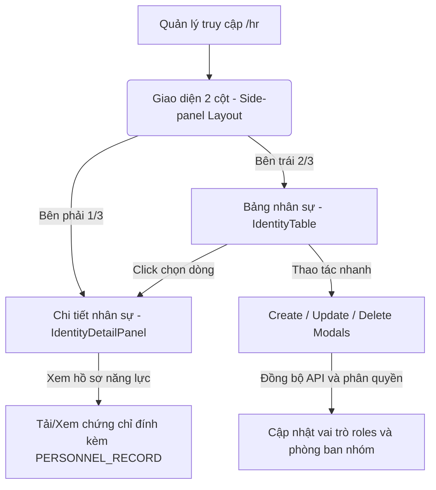

# 0_HR_STRUCTURE - TÀI LIỆU CẤU TRÚC QUẢN LÝ NHÂN SỰ (HR)

Tài liệu này cung cấp mô tả chi tiết về nghiệp vụ, giao diện, cấu trúc logic và mã nguồn của module **Quản lý Nhân sự (HR)** trong hệ thống LIMS Frontend.

---

## 1. Luồng Nghiệp Vụ & Chức Năng (Business Flow & Features)

Module HR là trung tâm quản lý danh tính, phân quyền, sơ đồ tổ chức phòng ban và hồ sơ năng lực của toàn bộ nhân viên/người dùng tham gia vận hành hệ thống LIMS.

### Chi tiết nghiệp vụ cốt lõi:
1. **Side-panel Layout (Giao diện 2 cột)**: Thiết kế cho phép người quản lý duyệt nhanh danh sách nhân viên ở bên trái và xem ngay thông tin hồ sơ chi tiết (địa chỉ, số điện thoại, vai trò, bằng cấp) ở panel trượt bên phải mà không bị che khuất luồng làm việc.
2. **Quản lý Vai trò và Phân quyền (`identityRoles`)**:
   - Vai trò được lưu trữ dưới dạng mảng chuỗi (`ROLE_ADMIN`, `ROLE_TECHNICIAN`, `ROLE_QC`, v.v.).
   - Phục vụ việc phân quyền sử dụng chức năng và ký nhận kết quả đo đạc (ISO 17025).
3. **Chứng minh năng lực nhân sự (Personnel Records)**:
   - Cho phép tải lên các tệp tin bằng cấp, chứng chỉ chuyên môn của từng KTV.
   - Các tài liệu này được lưu trữ trong bảng `documents` với phân loại `documentType = "PERSONNEL_RECORD"`.

---

## 2. Quy trình & Thao tác Sử dụng (User Operations & Flow)

- **Xem chi tiết nhân sự**: Người dùng click chọn một dòng nhân sự trên bảng `IdentityTable`. Sidebar `IdentityDetailPanel` lập tức trượt ra hiển thị avatar, email, CCCD/NID, nhóm phòng ban, các vị trí chuyên môn dạng Badge và danh sách hồ sơ năng lực đính kèm.
- **Lọc nhân sự nâng cao**: Sử dụng bộ lọc Excel popover trên cột Vai trò (Roles) và Trạng thái (Status) của bảng để lọc nhanh các Kỹ thuật viên hoạt động.
- **Thêm mới nhân sự**: Click nút **"Thêm mới"** trên Toolbar, điền thông tin cá nhân, tick chọn các vai trò hệ thống, map nhân sự vào Nhóm phòng ban, đính kèm chứng chỉ chuyên môn và bấm Lưu.
- **Cập nhật thông tin và quyền hạn**: Bấm biểu tượng bút chì trên dòng hoặc trên Detail Panel để mở Modal sửa đổi.
- **Xóa nhân sự**: Xác nhận xóa nhân sự qua `IdentityDeleteModal` (thực hiện soft-delete).

---

## 3. Cấu Trúc File & Phân Rã Component (File Map & Component Decomposition)

### 3.1 Bản đồ File (File Map)

| Đường dẫn File | Loại | Trách nhiệm chính trong Module |
| :--- | :--- | :--- |
| [IdentityContainer.tsx](./IdentityContainer.tsx) | Page Container | Điều phối trạng thái của toàn bộ module, quản lý tabs theo loại entity, liên kết Toolbar, Table và Detail Panel. |
| [IdentityTable.tsx](./IdentityTable.tsx) | Table Component | Bảng hiển thị thông tin trích xuất của nhân sự, tích hợp popover lọc Excel cho vai trò và trạng thái. |
| [IdentityDetailPanel.tsx](./IdentityDetailPanel.tsx) | Side Panel | Panel trượt bên phải hiển thị chi tiết hồ sơ nhân viên, danh bạ liên lạc và danh sách văn bằng đính kèm. |
| [IdentityDetailModal.tsx](./IdentityDetailModal.tsx) | Detail Modal | Modal hiển thị chi tiết hồ sơ nhân viên (dành cho các luồng kích hoạt dạng popup thay vì sidebar). |
| [IdentityCreateModal.tsx](./IdentityCreateModal.tsx) | Form Modal | Modal biểu mẫu thêm mới nhân viên, tích hợp bảng chọn vai trò, nhóm phòng ban và tài liệu đính kèm. |
| [IdentityUpdateModal.tsx](./IdentityUpdateModal.tsx) | Form Modal | Modal biểu mẫu cập nhật thông tin cá nhân và chỉnh sửa các quyền hạn hệ thống của nhân sự. |
| [IdentityDeleteModal.tsx](./IdentityDeleteModal.tsx) | Confirm Modal | Hộp thoại xác nhận trước khi gọi API xóa (soft-delete) tài khoản nhân sự. |
| [IdentityDocumentManager.tsx](./IdentityDocumentManager.tsx) | Helper Component | Trình quản lý tài liệu đính kèm, cho phép tải lên hoặc liên kết chứng chỉ chuyên môn (`PERSONNEL_RECORD`). |
| [IdentityGroupSelect.tsx](./IdentityGroupSelect.tsx) | Selector Component | Dropdown chọn nhanh Nhóm/Phòng ban làm việc cho nhân viên. |
| [IdentityRoleBadges.tsx](./IdentityRoleBadges.tsx) | UI Badge | Rút trích mã vai trò `ROLE_*` hiển thị thành các nhãn tiếng Việt semantic có hiệu ứng highlight đồng bộ. |
| [IdentityToolbar.tsx](./IdentityToolbar.tsx) | Toolbar Component | Thanh công cụ chứa ô tìm kiếm và nút kích hoạt thêm mới nhân sự. |

### 3.2 Chi tiết mã nguồn từng File (File-by-File Details)

#### 1. [IdentityContainer.tsx](./IdentityContainer.tsx)
- **Mục đích**: Component cha điều phối trạng thái của trang Quản lý nhân sự.
- **Giao diện/Render**:
  - Giao diện Tab chia theo loại phòng ban/entity.
  - Layout chia đôi khi có nhân sự được chọn: cột trái chiếm 2/3 chiều rộng hiển thị bảng dữ liệu, cột phải chiếm 1/3 hiển thị sidebar chi tiết.
- **Logic / State chính**:
  - `activeTab`: Lọc danh sách nhân viên theo entity.
  - `detailId`: ID của nhân sự đang được click chọn để nạp vào Detail Panel.
  - `listQ`: Thực hiện hook React Query `unwrapWithMetaOrThrow` lấy danh sách nhân sự phân trang từ cache.

#### 2. [IdentityTable.tsx](./IdentityTable.tsx)
- **Mục đích**: Hiển thị lưới danh sách nhân viên.
- **Giao diện/Render**:
  - Bảng chứa cột Avatar (tự động lấy chữ cái đầu của tên làm fallback), tên nhân sự, email, mã số ID, vai trò, trạng thái và nút hành động.
  - Tích hợp popover lọc Excel cho cột Trạng thái và Vai trò.
- **Logic / State chính**:
  - `FILTER_FROM_MAP`: Mapping bộ lọc Excel được thiết kế dạng Record an toàn kiểu dữ liệu. Thuộc tính `identityRoles` trỏ tới `null` để đánh dấu đây là bộ lọc tĩnh, không cần gửi filter code thô lên API.
  - `buildOtherFiltersForApi`: Tự động bỏ qua các trường có giá trị mapping bằng `null` (như `identityRoles`) để tránh lỗi truyền tham số không hợp lệ lên Backend.

#### 3. [IdentityDetailPanel.tsx](./IdentityDetailPanel.tsx)
- **Mục đích**: Panel trượt hiển thị hồ sơ năng lực chi tiết của nhân viên.
- **Giao diện/Render**:
  - Bố cục gọn gàng dạng danh sách chia vùng: thông tin liên hệ (Email, Phone, Địa chỉ), thông tin định danh (CCCD/NID, Nhóm, Vị trí chuyên môn), và hồ sơ năng lực dạng card tệp đính kèm.
- **Logic / State chính**:
  - Hook `useIdentityFull(identityId)`: Tự động tải thông tin đầy đủ nhất từ Backend khi `identityId` thay đổi.
  - Liên kết Document: `data.documents` được định nghĩa kiểu dữ liệu tường minh là `DocumentEntity[]`, cho phép hiển thị trực tiếp thông tin văn bằng mà không cần ép kiểu không an toàn (`as any[]`).

#### 4. [IdentityDetailModal.tsx](./IdentityDetailModal.tsx)
- **Mục đích**: Modal popup hiển thị thông tin chi tiết nhân sự khi không sử dụng sidebar.
- **Giao diện/Render**:
  - Thừa kế cấu trúc hiển thị của Detail Panel nhưng bọc trong Radix Dialog.
- **Logic / State chính**:
  - Lắng nghe sự kiện đóng/mở modal để đồng bộ ID được chọn.

#### 5. [IdentityCreateModal.tsx](./IdentityCreateModal.tsx)
- **Mục đích**: Form tạo mới tài khoản nhân viên.
- **Giao diện/Render**:
  - Radix Dialog chứa form nhập liệu: Tên, Email, Điện thoại, Địa chỉ, Số CCCD, Mật khẩu.
  - Bảng danh sách các checkbox tương ứng với các vị trí chuyên môn (`ROLE_*`).
  - Dropdown chọn Nhóm phòng ban (`IdentityGroupSelect`).
  - Trình quản lý tài liệu hồ sơ năng lực (`IdentityDocumentManager`).
- **Logic / State chính**:
  - Quản lý form state: Đồng bộ hóa mảng checkbox của các vai trò hệ thống thành object boolean cục bộ, sau đó lọc và đưa về mảng `text[]` khi submit.
  - Khởi tạo Payload: Tham số `identityRoles: rolesArray` được truyền trực tiếp vào body payload của API một cách an toàn và đúng kiểu dữ liệu, loại bỏ ép kiểu `as any` tại modal.

#### 6. [IdentityUpdateModal.tsx](./IdentityUpdateModal.tsx)
- **Mục đích**: Form hiệu chỉnh hồ sơ nhân sự.
- **Giao diện/Render**:
  - Cấu trúc tương tự form tạo mới nhưng nạp sẵn dữ liệu cũ của nhân sự đang chọn.
- **Logic / State chính**:
  - Gọi hook `useIdentityFull` để lấy dữ liệu ban đầu, dùng `useEffect` để gán vào các trường form khi mở modal.
  - Xử lý mật khẩu: Mặc định trường password bị khóa. Người dùng phải bấm vào nút thay đổi và xác nhận hộp thoại để mở khóa trường password, tránh vô tình gửi đè mật khẩu trống.

#### 7. [IdentityDeleteModal.tsx](./IdentityDeleteModal.tsx)
- **Mục đích**: Xác nhận hành động xóa tài khoản nhân sự.
- **Giao diện/Render**:
  - Dialogue Dialog cảnh báo người dùng.
- **Logic / State chính**:
  - Thực thi mutation gọi API soft-delete `/v2/identities/delete`.

#### 8. [IdentityDocumentManager.tsx](./IdentityDocumentManager.tsx)
- **Mục đích**: Quản lý bằng cấp, chứng chỉ của nhân viên.
- **Giao diện/Render**:
  - Dropzone tải file lên và danh sách các tệp đang đính kèm.
- **Logic / State chính**:
  - Khi tải file lên, mặc định gán metadata `documentType = "PERSONNEL_RECORD"` trước khi lưu.

#### 9. [IdentityGroupSelect.tsx](./IdentityGroupSelect.tsx)
- **Mục đích**: Dropdown lựa chọn phòng ban.
- **Giao diện/Render**:
  - Dropdown chọn đơn giản.
- **Logic / State chính**:
  - Gọi API lấy danh sách các nhóm nhân sự có sẵn.

#### 10. [IdentityRoleBadges.tsx](./IdentityRoleBadges.tsx)
- **Mục đích**: Component hiển thị danh sách vai trò dạng Badge màu sắc.
- **Giao diện/Render**:
  - Danh sách các Badge bo góc.
- **Logic / State chính**:
  - Mapping từ mã code hệ thống (ví dụ `ROLE_QC`) sang ngôn ngữ địa phương thông qua khóa `hr.roles.ROLE_*`.

#### 11. [IdentityToolbar.tsx](./IdentityToolbar.tsx)
- **Mục đích**: Thanh tác vụ đầu trang.
- **Giao diện/Render**:
  - Thanh tìm kiếm và nút bấm Thêm mới.
- **Logic / State chính**:
  - Nhận callback `onSearchChange` để cập nhật state tìm kiếm của Container.

---

## 4. Cấu Trúc Logic & Kết Nối API (Logic Structure & API Integration)

- **API tích hợp (`src/api/identities.ts`)**:
  - `useIdentitiesList`: Tải danh sách rút gọn cho bảng.
  - `useIdentityFull`: Tải thông tin chi tiết đầy đủ bao gồm documents liên kết.
  - `identitiesCreate` / `identitiesUpdate` / `identitiesDelete`: Các mutation thay đổi dữ liệu.
- **Cơ chế Invalidation**:
  - Sau khi các modal Cập nhật, Thêm mới hoặc Xóa thực hiện thành công, Query Key `identitiesKeys.all` sẽ bị invalidate để làm sạch bộ nhớ cache và cập nhật danh sách lập tức.

---

## 5. Các Quy Chuẩn Thiết Kế & Best Practices (Design Guidelines & Best Practices)

- **Theming**:
  - Sử dụng Tailwind CSS v4 chuẩn hóa cho giao diện (`bg-card`, `text-primary`, `bg-muted/30`).
  - Highlight màu sắc nhẹ trên dòng đang được chọn (`bg-primary/5`) và bo viền avatar nổi bật.
- **i18n**:
  - Namespace sử dụng: `hr.*` và `common.*`.
  - Hỗ trợ dịch động vai trò KTV: `t("hr.roles.ROLE_TECHNICIAN", { defaultValue: "Kỹ thuật viên" })`.
- **TypeScript**:
  - Định nghĩa kiểu dữ liệu form và props chặt chẽ. Tuyệt đối không dùng `any`.
- **Safety & Null Handling**:
  - Các thông số tùy chọn như CCCD/NID, số điện thoại, địa chỉ nếu trống sẽ hiển thị dấu `"-"` để tránh lỗi giao diện trống.
