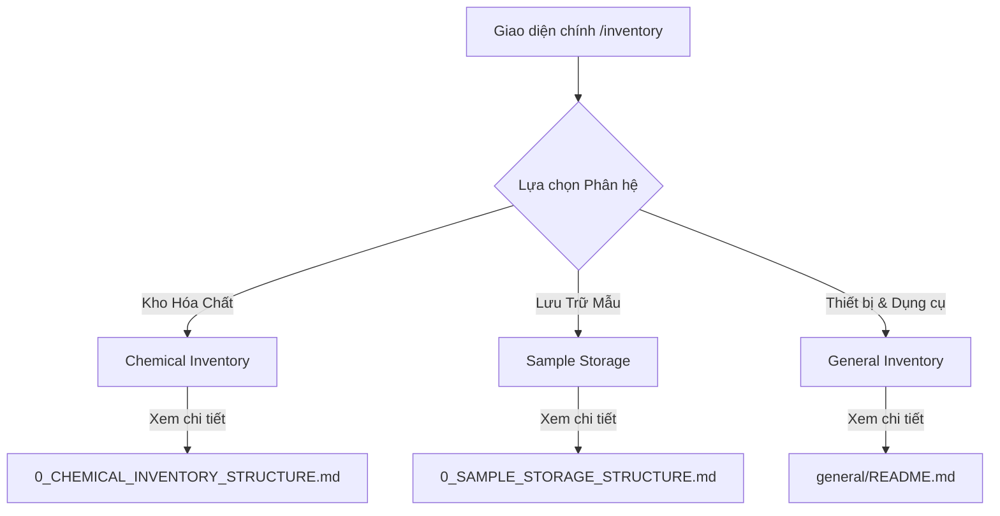

# 0_INVENTORY_STRUCTURE - TÀI LIỆU CẤU TRÚC TỔNG QUAN MODULE QUẢN LÝ KHO (INVENTORY)

Tài liệu này mô tả cấu trúc tổng thể, sơ đồ điều hướng và sự phối hợp giữa các phân hệ trong module **Quản lý Kho (Inventory)** của hệ thống LIMS Frontend.

---

## 1. Luồng Nghiệp Vụ & Chức Năng (Business Flow & Features)

Module Kho là trung tâm quản lý và giám sát tất cả các nguồn lực vật lý trong phòng thí nghiệm, được chia làm ba phân hệ lớn:



### Các phân hệ thành viên:
1. **Kho Hóa chất (Chemical Inventory)**:
   - Quản lý theo vòng đời từ SKU đến chai lọ vật lý.
   - Hỗ trợ in tem nhãn barcode, tách chai, xuất kho cho phép thử, và kiểm kê chênh lệch.
   - Tài liệu chi tiết: [0_CHEMICAL_INVENTORY_STRUCTURE.md](./chemical/0_CHEMICAL_INVENTORY_STRUCTURE.md)
2. **Lưu Trữ Mẫu Thử (Sample Storage)**:
   - Theo dõi vị trí lưu trữ của mẫu trong các tủ lạnh/tủ đông/kệ khô sau khi tiếp nhận.
   - Hỗ trợ đổi vị trí, hủy mẫu, trả mẫu hàng loạt và hiển thị bản đồ tủ trực quan.
   - Tài liệu chi tiết: [0_SAMPLE_STORAGE_STRUCTURE.md](./samples/0_SAMPLE_STORAGE_STRUCTURE.md)
3. **Thiết Bị & Dụng Cụ Chung (General Inventory)**:
   - Quản lý Master Data danh mục thiết bị (`LabSku`) và thực thể máy móc vật lý (`LabInventory`).
   - Theo dõi chu kỳ bảo trì, hiệu chuẩn, và nhật ký luân chuyển tài sản.
   - Tài liệu chi tiết: [README.md](./general/README.md)

---

## 2. Quy trình & Thao tác Sử dụng (User Operations & Flow)

- **Trang Dashboard Tổng Quan (`InventoryDashboard.tsx`)**:
  - Khi truy cập vào đường dẫn kho chung, người dùng sẽ thấy màn hình Dashboard tổng hợp.
  - **Cảnh báo Thông minh (Smart Alerts)**: Phía trên cùng hiển thị banner cảnh báo nếu phát hiện:
    - Hóa chất sắp hết hạn trong vòng 7 ngày (trạng thái `critical`).
    - Hóa chất sắp hết hạn trong vòng 30 ngày (trạng thái `warning`).
    - Thiết bị thí nghiệm đã quá hạn hiệu chuẩn (`overdue`).
  - **Tra cứu nhanh đa phân hệ**: Cung cấp ô tìm kiếm chung và hệ thống 3 Tab (Hóa chất, Dụng cụ thủy tinh, Thiết bị) sử dụng dữ liệu mô phỏng (Mock Data) để tra cứu nhanh thông tin tồn kho và tình trạng máy móc.
- **Điều hướng sang phân hệ chuyên sâu**:
  - Người dùng bấm các nút liên kết hoặc truy cập trực tiếp các route chuyên sâu `/inventory/chemical`, `/inventory/samples`, hoặc `/inventory/general` để thực hiện các nghiệp vụ chuyên biệt của từng kho.

---

## 3. Cấu Trúc File & Phân Rã Component (File Map & Component Decomposition)

### 3.1 Bản đồ File (File Map)

| Đường dẫn File | Loại | Trách nhiệm chính trong Module |
| :--- | :--- | :--- |
| [InventoryDashboard.tsx](./InventoryDashboard.tsx) | Page Component | Trang Dashboard chung hiển thị cảnh báo hạn dùng hóa chất, hạn hiệu chuẩn thiết bị, và tra cứu nhanh. |
| [chemical/](./chemical/) | Thư mục | Thư mục phân hệ quản lý kho hóa chất chuyên sâu. |
| [chemical/0_CHEMICAL_INVENTORY_STRUCTURE.md](./chemical/0_CHEMICAL_INVENTORY_STRUCTURE.md) | Tài liệu | Tài liệu chi tiết của phân hệ Kho Hóa chất. |
| [samples/](./samples/) | Thư mục | Thư mục phân hệ quản lý lưu trữ mẫu thử sau khi phân tích. |
| [samples/0_SAMPLE_STORAGE_STRUCTURE.md](./samples/0_SAMPLE_STORAGE_STRUCTURE.md) | Tài liệu | Tài liệu chi tiết của phân hệ Lưu mẫu. |
| [general/](./general/) | Thư mục | Thư mục phân hệ quản lý dụng cụ và thiết bị thí nghiệm (General Inventory). |
| [general/README.md](./general/README.md) | Tài liệu | Tài liệu chi tiết của phân hệ Thiết bị & Dụng cụ. |
| [guild/](./guild/) | Thư mục | Thư mục chứa các hướng dẫn sử dụng nhanh dạng HTML (`guide-*.html`). |

---

### 3.2 Chi tiết mã nguồn File gốc `InventoryDashboard.tsx`

#### [InventoryDashboard.tsx](./InventoryDashboard.tsx)
- **Mục đích**: Trang chủ giới thiệu của module Kho, cung cấp cái nhìn nhanh về trạng thái tài sản phòng Lab.
- **Logic / State chính**:
  - Quản lý state `activeTab` để chuyển đổi giữa 3 tab thông tin: `chemicals` (Hóa chất), `glassware` (Dụng cụ thủy tinh), `equipment` (Thiết bị). Tab thứ tư `supplies` (Vật tư tiêu hao) bị khóa (`LOCKED`).
  - Lọc dữ liệu: State `searchTerm` dùng để lọc động danh sách hóa chất (theo tên, CAS, số lô), dụng cụ (theo tên, chủng loại) và thiết bị (theo tên, mã, vị trí).
  - Tính toán số liệu cảnh báo:
    ```typescript
    const criticalChemicals = mockChemicals.filter((c) => c.status === "critical").length;
    const warningChemicals = mockChemicals.filter((c) => c.status === "warning").length;
    const overdueEquipment = mockEquipment.filter((e) => e.status === "overdue").length;
    ```
    Nếu các biến này lớn hơn 0, một banner `<Alert variant="destructive">` sẽ tự động hiển thị ở đầu trang để cảnh báo nhân viên xử lý.
  - Hiển thị thanh tiến trình tồn kho (`Progress`): Tính toán tỉ lệ `%` lượng còn lại trong chai so với dung tích tối đa để đổi màu thanh tiến trình trực quan (Dưới 10% hiển thị màu Đỏ cảnh báo, Dưới 30% màu Cam, còn lại màu Xanh lá).

---

## 4. Cấu Trúc Logic & Kết Nối API (Logic Structure & API Integration)

- **Dữ liệu Mock & Dữ liệu Thật**:
  - Trang Dashboard gốc (`InventoryDashboard.tsx`) sử dụng dữ liệu mock cố định để cung cấp cái nhìn tổng quát nhanh.
  - Các phân hệ con (`chemical/`, `samples/`, `general/`) kết nối trực tiếp với hệ thống API Server `/v2/` thông qua React Query và Axios Client.
- **Sử dụng URL-Driven State**:
  - Đặc biệt trong phân hệ `general/`, các thông tin bộ lọc và trang hiển thị được đồng bộ trực tiếp lên Search Params của URL trình duyệt (sử dụng `useSearchParams` của `react-router-dom`). Điều này giúp người dùng có thể chia sẻ trực tiếp link tìm kiếm thiết bị hoặc lưu trữ vị trí làm việc ổn định khi nhấn F5 tải lại trang.

---

## 5. Các Quy Chuẩn Thiết Kế & Best Practices (Design Guidelines & Best Practices)

- **Đồng bộ Giao diện (Consistency)**:
  - Tất cả các bảng dữ liệu trong các phân hệ kho đều dùng chung cấu trúc phân trang `<Pagination>` từ thư viện dùng chung `src/components/ui/pagination.tsx`.
  - Hỗ trợ các lớp màu trạng thái tương đồng (Đỏ - quá hạn/hết hạn, Cam - sắp quá hạn, Xanh lá - hoạt động bình thường).
- **i18n**:
  - Sử dụng chung hook `useTranslation` để dịch nhãn hiển thị. Danh mục dịch được tổ chức tách biệt theo từng phân hệ (`inventory.dashboard.*`, `inventory.chemical.*`, `inventory.samples.*`).
- **Null Safety**:
  - Mọi trường dữ liệu không bắt buộc từ API khi hiển thị lên lưới bảng đều được bọc hàm kiểm tra an toàn hoặc toán tử `?? "-"` để tránh lỗi sập giao diện React.
- **Liên kết Tài liệu**:
  - Tất cả các file tài liệu cấu trúc liên kết nội bộ sử dụng liên kết tương đối (relative paths) để tránh hardcode thư mục local của máy phát triển, đảm bảo hoạt động tốt khi duyệt mã nguồn trên GitLab/GitHub.
