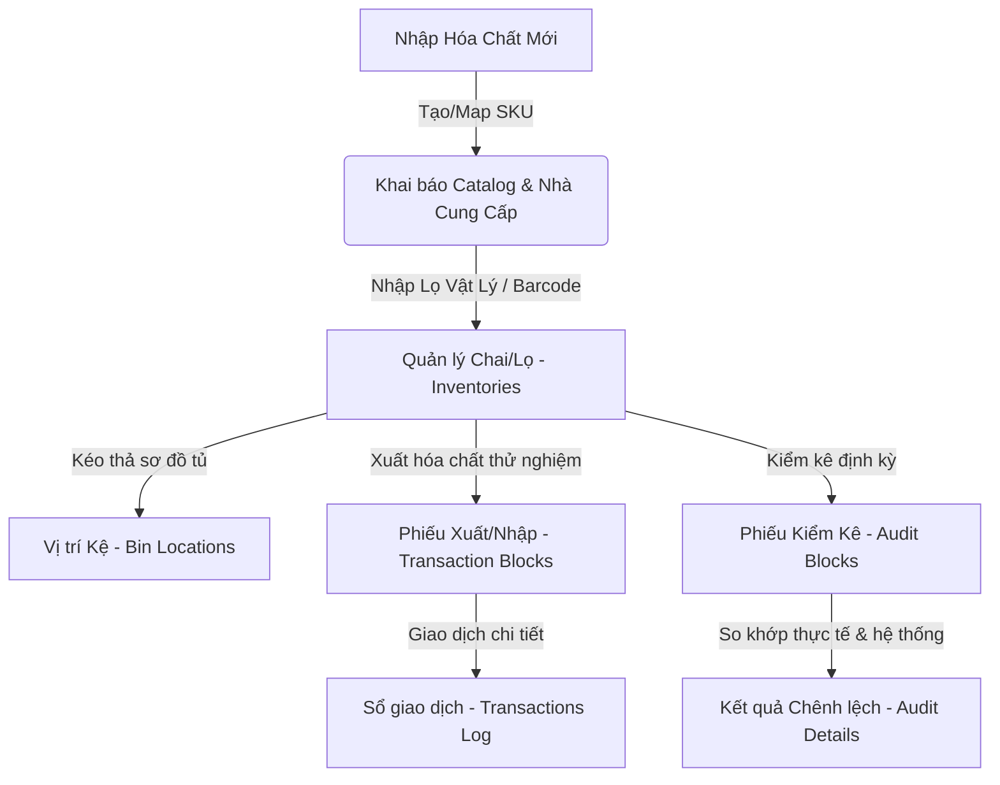

# 0_CHEMICAL_INVENTORY_STRUCTURE - TÀI LIỆU CẤU TRÚC PHÂN HỆ QUẢN LÝ KHO HÓA CHẤT

Tài liệu này cung cấp mô tả chi tiết về nghiệp vụ, quy trình, cấu trúc file, logic nghiệp vụ, và API tích hợp của phân hệ **Quản lý Kho Hóa chất (Chemical Inventory)** trong hệ thống LIMS Frontend.

---

## 1. Luồng Nghiệp Vụ & Chức Năng (Business Flow & Features)

Phân hệ Kho Hóa chất quản lý toàn bộ vòng đời của hóa chất sử dụng trong phòng thí nghiệm, tuân thủ mô hình phân tầng **SKU (Danh mục) - Inventory (Chai lọ vật lý)**.

### Chi tiết nghiệp vụ cốt lõi:
1. **Quản lý Danh mục (SKU) & Nhà cung cấp**:
   - **SKU (`ChemicalSku`)**: Lưu trữ thông tin định danh như Số CAS, Tên hóa chất, Đơn vị cơ sở, Loại hóa chất, Phân loại nguy hiểm (`chemicalHazardClass`) và Mức tồn tối thiểu cảnh báo (`chemicalReorderLevel`).
   - **Nhà cung cấp (`ChemicalSupplier`)**: Quản lý thông tin nhà phân phối, Mã số thuế, Điểm đánh giá nhà cung cấp (`supplierEvaluationScore`), và Danh sách chứng chỉ ISO đính kèm.
2. **Quản lý Thực thể Vật lý (Chai/Lọ Inventories)**:
   - Ánh xạ 1-N từ SKU sang các chai/lọ vật lý thực tế.
   - Mỗi chai/lọ có một mã vạch định danh duy nhất (`chemicalInventoryId` - Barcode).
   - Theo dõi Ngày mở nắp (`openedDate`), Hạn dùng sau khi mở nắp (`openedExpDate`), Số lô sản xuất (`lotNumber`), và Vị trí lưu kho vật lý (`storageBinLocation`).
   - Hỗ trợ tách chai/lọ (`InventorySeparateModal`) từ chai lớn thành các chai nhỏ hơn.
3. **Luân chuyển & Giao dịch Kho (Transaction Blocks)**:
   - Mọi hoạt động Nhập (`IMPORT`), Xuất (`EXPORT`), Điều chỉnh (`ADJUSTMENT`) đều được ghi nhận qua một Phiếu giao dịch Header (`ChemicalTransactionBlock`) và danh sách các chi tiết dòng giao dịch (`ChemicalTransaction`).
   - Khi Xuất (`EXPORT`), hỗ trợ ánh xạ dòng giao dịch tới mã phép thử/chỉ tiêu cụ thể (`analysisId`) và tự động kiểm tra số lượng tồn còn lại.
4. **Kiểm kê Kho định kỳ (Inventory Audit)**:
   - Tổ chức các đợt kiểm kê (`AuditBlocksTab`).
   - Quét QR/Barcode để xác nhận các chai lọ thực tế đang có mặt tại kệ.
   - Hệ thống tự động tính toán chênh lệch (`varianceQty`) giữa Số lượng thực tế (`actualAvailableQty`) và Số lượng hệ thống (`systemAvailableQty`).

---

## 2. Quy trình & Thao tác Sử dụng (User Operations & Flow)

- **Nhập kho chai/lọ mới**: 
  1. Người dùng chọn tab **Lọ/Chai**, bấm **"Nhập Lọ Mới"**.
  2. Chọn SKU hóa chất liên kết, điền số lô (`lotNumber`), lượng đóng chai (`currentAvailableQty`), hạn sử dụng và vị trí lưu trữ.
  3. Sau khi lưu, hệ thống cho phép **In Tem** (chứa mã vạch QR) để dán trực tiếp lên chai.
- **Quét Barcode tra cứu nhanh**:
  - Tại màn hình **Lọ/Chai**, người dùng có thể dùng máy quét Barcode quét nhãn chai. Hệ thống có bộ lắng nghe sự kiện keydown toàn cục (`keydown Listener`) để nhận diện đầu vào máy quét và tự động mở bảng chi tiết của chai hóa chất đó.
  - Trên thiết bị di động, người dùng có thể bấm biểu tượng Scan để mở Camera Scanner tích hợp (`CameraScannerModal`) hỗ trợ zoom camera và tự động nhận diện QR.
- **Sắp xếp vị trí bằng Kéo Thả (Drag & Drop Map)**:
  - Bấm nút **"Kho chứa hóa chất"** tại tab Lọ/Chai để chuyển sang giao diện Map (`ChemicalStorageMap.tsx`).
  - Phía bên trái hiển thị danh sách chai chưa xếp vị trí (Unassigned). Phía bên phải là lưới các Kệ tủ lưu trữ (Storage Shelves).
  - Người dùng nắm biểu tượng kéo (drag handle) của chai và thả vào ô Kệ tủ mong muốn. Hệ thống tự động gọi API cập nhật vị trí kho theo thời gian thực (Optimistic UI Update).
- **Tạo phiếu xuất kho**:
  1. Người dùng vào tab **Phiếu xuất/nhập kho**, bấm **"Tạo Phiếu mới"**.
  2. Chọn loại phiếu là `EXPORT`. Thêm các dòng chai hóa chất cần xuất.
  3. Ở chế độ xem chi tiết (**Details View**), người dùng có thể chỉ định một chai xuất cho nhiều chỉ tiêu khác nhau (`analysisId`) bằng cách duplicate dòng.
  4. Ở chế độ tổng hợp (**Summary View**), các dòng được nhóm tự động theo ID chai để đối chiếu tổng lượng xuất.
  5. Bấm Lưu và phê duyệt phiếu (`ApproveTransactionBlockModal`) để hoàn tất trừ kho vật lý.

---

## 3. Cấu Trúc File & Phân Rã Component (File Map & Component Decomposition)

### 3.1 Bản đồ File (File Map)

| Đường dẫn File | Loại | Trách nhiệm chính trong Module |
| :--- | :--- | :--- |
| [ChemicalInventoryLayout.tsx](./ChemicalInventoryLayout.tsx) | Page Layout | Khung chứa điều hướng chính của Module, quản lý trạng thái chuyển đổi giữa 7 Tab. |
| [SkusTab.tsx](./SkusTab.tsx) | Tab Component | Hiển thị danh mục SKU hóa chất, hỗ trợ tìm kiếm và lọc phân loại nguy hiểm. |
| [SkuDetailPanel.tsx](./SkuDetailPanel.tsx) | Side Panel | Panel trượt bên phải hiển thị chi tiết SKU, danh sách chai lọ vật lý hiện có và các nhà cung cấp SKU này. |
| [SkuEditModal.tsx](./SkuEditModal.tsx) | Form Modal | Modal biểu mẫu tạo mới hoặc chỉnh sửa thông tin SKU hóa chất. |
| [SkuSelect.tsx](./SkuSelect.tsx) | Selector | Dropdown tìm kiếm và chọn nhanh SKU hóa chất. |
| [SuppliersTab.tsx](./SuppliersTab.tsx) | Tab Component | Hiển thị danh sách các nhà cung cấp hóa chất. |
| [SupplierDetailPanel.tsx](./SupplierDetailPanel.tsx) | Side Panel | Panel trượt hiển thị chi tiết nhà cung cấp và danh mục SKU họ cung cấp. |
| [SupplierEditModal.tsx](./SupplierEditModal.tsx) | Form Modal | Modal biểu mẫu tạo mới/chỉnh sửa thông tin nhà cung cấp hóa chất. |
| [InventoriesTab.tsx](./InventoriesTab.tsx) | Tab Component | Quản lý danh sách chai lọ vật lý, tích hợp camera quét QR di động và bộ bắt quét barcode phần cứng. |
| [InventoryDetailPanel.tsx](./InventoryDetailPanel.tsx) | Side Panel | Panel trượt xem chi tiết thông tin chai lọ, lịch sử giao dịch và liên kết SKU. |
| [InventoryEditModal.tsx](./InventoryEditModal.tsx) | Form Modal | Modal nhập mới hoặc sửa đổi thông tin của một chai hóa chất. |
| [InventorySeparateModal.tsx](./InventorySeparateModal.tsx) | Form Modal | Modal nghiệp vụ tách chai: chuyển một phần dung tích từ chai gốc sang một hoặc nhiều chai mới. |
| [AllocateStockModal.tsx](./AllocateStockModal.tsx) | Form Modal | Modal phân bổ lượng tồn kho SKU vào các chai/lọ vật lý mới. |
| [PrintLabelModal.tsx](./PrintLabelModal.tsx) | Print Modal | Giao diện chuẩn bị tem barcode và kích hoạt lệnh in ấn trình duyệt (`window.print`). |
| [ChemicalLogReportEditor.tsx](./ChemicalLogReportEditor.tsx) | Editor Modal | Modal hiển thị và xuất báo cáo Sổ Nhật ký sử dụng hóa chất dưới định dạng in. |
| [ChemicalStorageMap.tsx](./ChemicalStorageMap.tsx) | Dnd Board | Giao diện kéo thả sắp xếp chai hóa chất vào kệ tủ sử dụng `@dnd-kit/core`. |
| [TransactionBlocksTab.tsx](./TransactionBlocksTab.tsx) | Tab Component | Quản lý danh sách các phiếu xuất/nhập/điều chỉnh kho, chứa form tạo phiếu phức hợp. |
| [TransactionBlockDetailPanel.tsx](./TransactionBlockDetailPanel.tsx) | Side Panel | Panel trượt xem chi tiết phiếu giao dịch và danh sách line-items. |
| [ApproveTransactionBlockModal.tsx](./ApproveTransactionBlockModal.tsx) | Confirm Modal | Modal hiển thị chi tiết thông tin và phê duyệt/từ chối phiếu giao dịch kho. |
| [ChemicalTransactionBlockReportEditor.tsx](./ChemicalTransactionBlockReportEditor.tsx) | Editor Modal | Trình chỉnh sửa và kết xuất báo cáo in ấn cho một Phiếu giao dịch kho. |
| [TransactionsTab.tsx](./TransactionsTab.tsx) | Tab Component | Hiển thị sổ nhật ký giao dịch phẳng (flat list) của tất cả các chai lọ hóa chất. |
| [TransactionDetailPanel.tsx](./TransactionDetailPanel.tsx) | Side Panel | Panel xem chi tiết của một dòng nhật ký giao dịch kho. |
| [ChemicalTransactionReportEditor.tsx](./ChemicalTransactionReportEditor.tsx) | Editor Modal | Trình chỉnh sửa kết xuất báo cáo in ấn danh sách giao dịch hóa chất. |
| [AuditBlocksTab.tsx](./AuditBlocksTab.tsx) | Tab Component | Quản lý danh sách các đợt kiểm kê kho định kỳ. |
| [AuditBlockEditModal.tsx](./AuditBlockEditModal.tsx) | Form Modal | Modal biểu mẫu tạo/sửa đợt kiểm kê, hỗ trợ quét QR kiểm đếm trực tiếp và chống trùng mã chai. |
| [AuditDetailsTab.tsx](./AuditDetailsTab.tsx) | Tab Component | Danh sách chi tiết kết quả chênh lệch kiểm kê (Sự khác biệt thực tế và hệ thống). |
| [TableFilterPopover.tsx](./TableFilterPopover.tsx) | UI Component | Popover lọc nhanh đa lựa chọn (Inline Filter) trên tiêu đề các cột của bảng. |
| [HelpBubble.tsx](./HelpBubble.tsx) | UI Component | Nút bong bóng hiển thị hướng dẫn sử dụng nhanh trỏ đến các tài liệu HTML. |

---

### 3.2 Chi tiết mã nguồn một số File cốt lõi (File-by-File Details)

#### 1. [InventoriesTab.tsx](./InventoriesTab.tsx)
- **Mục đích**: Quản lý danh sách chai/lọ hóa chất và tích hợp các công cụ quét mã.
- **Tính năng đặc biệt**:
  - `CameraScannerModal`: Sử dụng thư viện `html5-qrcode` để mở camera di động quét QR. Hỗ trợ điều chỉnh độ phóng đại camera (`zoom`) thông qua phần cứng và CSS fallback. Tự động nhận diện camera sau thông qua phân tích label.
  - **Quét Barcode Toàn Cục**: Tích hợp `useEffect` lắng nghe sự kiện `keydown` trên đối tượng `window`. Nếu phát hiện chuỗi ký tự nhập vào nhanh liên tiếp kết thúc bằng phím `Enter` (đặc trưng của đầu đọc barcode phần cứng), hệ thống sẽ chặn không cho nhập vào input đang active và tự động mở bảng chi tiết của chai hóa chất tương ứng.
  - Tích hợp bộ lọc Popover (`TableFilterPopover`) lọc theo Loại hóa chất, Trạng thái chai, Vị trí lưu kho và Hạn sử dụng.

#### 2. [ChemicalStorageMap.tsx](./ChemicalStorageMap.tsx)
- **Mục đích**: Giao diện kéo thả sắp xếp vị trí chai lọ hóa chất vật lý.
- **Chi tiết kéo thả**:
  - Sử dụng `@dnd-kit/core` với bộ điều phối `DndContext`, `useDraggable` cho từng chai hóa chất, và `useDroppable` cho các kệ chứa.
  - **Thuật toán Va chạm Tùy chỉnh (`customCollisionDetection`)**: Khắc phục lỗi lệch tọa độ do thanh cuộn dọc (scroll container). Thực hiện đo đạc bounding box trực tiếp của container bên trái bằng `document.getElementById('unassigned-chemicals-container').getBoundingClientRect()`. Sau đó tính toán xem con trỏ chuột (`pointerCoordinates`) hoặc trên 35% diện tích hình chữ nhật của card đang kéo (`collisionRect`) có nằm trong vùng đó hay không để xác định hành động kéo về vùng chưa gán.
  - **Cập nhật giao diện Optimistic**: Khi card được thả vào kệ, client tự động dịch chuyển card trong state cục bộ trước khi API trả về kết quả để tạo cảm giác mượt mà tức thì. Nếu API lỗi, state sẽ tự rollback thông qua invalidate cache.

#### 3. [TransactionBlocksTab.tsx](./TransactionBlocksTab.tsx)
- **Mục đích**: Hiển thị danh sách phiếu giao dịch kho và khởi tạo phiếu mới.
- **Logic Tạo Phiếu Phức Hợp (`CreateBlockModal`)**:
  - Hỗ trợ cả 2 góc nhìn: **Details View** (Xem chi tiết dòng vật lý, cho phép 1 chai xuất nhiều lần cho các chỉ tiêu khác nhau) và **Summary View** (Nhóm dữ liệu tự động theo `chemicalInventoryId` để in ấn tem nhãn nhập kho hoặc kiểm tra tổng lượng xuất).
  - Tự động gán dấu âm cho lượng thay đổi (`changeQty`) nếu là phiếu `EXPORT`, dấu dương nếu là phiếu `IMPORT`.
  - Gọi API `POST /v2/chemicaltransactionblocks/createfull` gửi lên toàn bộ thông tin Header và mảng phẳng các chi tiết giao dịch.

#### 4. [AuditBlockEditModal.tsx](./AuditBlockEditModal.tsx)
- **Mục đích**: Tạo hoặc hiệu chỉnh một đợt kiểm kê.
- **Logic Nghiệp vụ**:
  - Hỗ trợ quét mã QR để nhập nhanh chai hóa chất vào danh sách kiểm đếm.
  - **Chống Trùng Lặp**: Kiểm tra mảng chai hiện tại trước khi thêm mới. Nếu mã chai đã quét trước đó, hiển thị cảnh báo lỗi và không cho thêm dòng mới để tránh làm sai lệch số liệu kiểm kê.
  - Tự động tính toán chênh lệch: `varianceQty = actualAvailableQty - systemAvailableQty`.

---

## 4. Cấu Trúc Logic & Kết Nối API (Logic Structure & API Integration)

- **Nguyên tắc Phân Trang & Lọc của Backend**:
  - Backend LIMS xử lý danh sách qua phương thức `POST` tới các endpoint `/get/list` để nhận các filter object phức tạp, tuy nhiên các thông số phân trang như `page`, `itemsPerPage`, `search`, `sortColumn`, `sortDirection` lại được Backend đọc từ **URL query string** (`req.query`).
  - Frontend truyền các tham số này qua thuộc tính `query` trong cấu hình axios (tránh truyền trong body).
- **Cơ chế Cache Key an toàn (`stableKey`)**:
  - File `src/api/chemicalKeys.ts` chứa hàm `stableKey(obj)` dùng `JSON.stringify(obj)` tuần tự hóa tham số để tạo ra các cache key động cho React Query.
  - Khi người dùng thay đổi bộ lọc hoặc trang, React Query phát hiện key mới và tự động fetch lại API. Tham số `placeholderData: keepPreviousData` được sử dụng để giữ giao diện bảng cũ hiển thị mượt mà trong lúc tải dữ liệu mới.
- **Các API Hook chính (`src/api/chemical.ts`)**:
  - `useChemicalSkusList`: Danh sách SKU hóa chất.
  - `useChemicalInventoriesList`: Danh sách chai lọ vật lý.
  - `useChemicalTransactionBlocksList`: Danh sách phiếu nhập/xuất kho.
  - `useChemicalTransactionsList`: Nhật ký giao dịch chi tiết.
  - `useChemicalAuditBlocksList` & `useChemicalAuditDetailsList`: Quản lý kiểm kê.
- **Invalidation Cache**:
  - Khi thực hiện các thao tác đột biến dữ liệu (Mutations) như tạo phiếu, sửa chai, tách chai, cập nhật vị trí kéo thả, hệ thống gọi `qc.invalidateQueries({ queryKey: chemicalKeys.all })` để đồng bộ lại dữ liệu tức thì trên tất cả các tab.

---

## 5. Các Quy Chuẩn Thiết Kế & Best Practices (Design Guidelines & Best Practices)

- **Theming & Tailwind CSS**:
  - Sử dụng Tailwind CSS v4 với các biến màu semantic (`bg-card`, `text-primary`, `border-border`).
  - Phân màu trực quan theo trạng thái chai hóa chất (Mới - Xanh lá, Đang dùng - Xanh dương, Hết hạn - Đỏ, Kiểm dịch - Vàng).
  - Phân loại trực quan cho phiếu giao dịch (IMPORT - Xanh lá, EXPORT - Đỏ, ADJUSTMENT - Xanh dương).
- **i18n & Dịch**:
  - Tất cả các nhãn (Labels) hiển thị và thông báo lỗi được định nghĩa qua file dịch JSON với namespace `inventory.chemical.*` và `common.*`.
- **An toàn Kiểu Dữ liệu (TypeScript)**:
  - Khai báo kiểu chặt chẽ cho SKU (`ChemicalSku`), Chai lọ (`ChemicalInventory`), Giao dịch (`ChemicalTransaction`), Phiếu giao dịch (`ChemicalTransactionBlock`).
  - Loại bỏ hoàn toàn ép kiểu `as any` tại các modal và panel dữ liệu để đảm bảo an toàn biên dịch.
- **Null Safety**:
  - Các trường dữ liệu tùy chọn như số lô (`lotNumber`), vị trí lưu kho (`storageBinLocation`), điều kiện bảo quản nếu trống sẽ được hiển thị fallback bằng dấu `"-"`.
