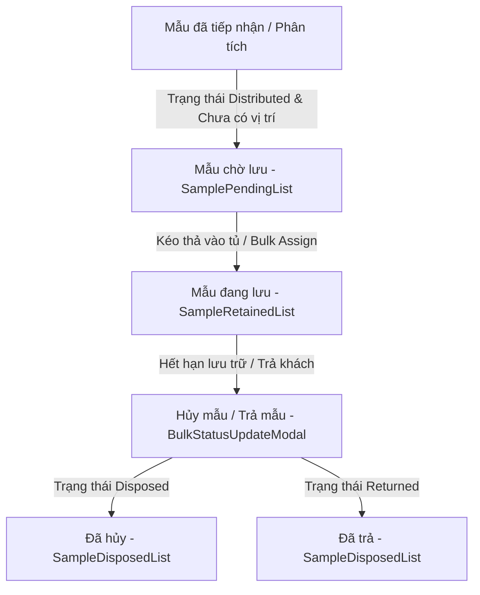

# 0_SAMPLE_STORAGE_STRUCTURE - TÀI LIỆU CẤU TRÚC PHÂN HỆ LƯU MẪU (SAMPLE STORAGE)

Tài liệu này cung cấp mô tả chi tiết về nghiệp vụ, quy trình, cấu trúc file, logic nghiệp vụ và API tích hợp của phân hệ **Quản lý Lưu mẫu (Sample Storage)** trong hệ thống LIMS Frontend.

---

## 1. Luồng Nghiệp Vụ & Chức Năng (Business Flow & Features)

Phân hệ Lưu mẫu chịu trách nhiệm theo dõi và quản lý vị trí vật lý của các mẫu thử sau khi tiếp nhận và phân tích trong phòng thí nghiệm.



### Chi tiết nghiệp vụ cốt lõi:
1. **Theo dõi trạng thái lưu trữ mẫu**:
   - **Chờ lưu (Pending)**: Mẫu có trạng thái hệ thống `Distributed` và trường vị trí lưu trữ `sampleStorageLoc` bằng `null` (hoặc `["IS NULL"]`).
   - **Đang lưu (Retained)**: Mẫu đã được cất vào tủ/kệ chuyên dụng, trạng thái chuyển sang `Retained` và lưu ngày dự kiến hủy (`sampleRetentionDate`).
   - **Đã hủy/Trả (Disposed/Returned)**: Mẫu hết thời gian lưu trữ được xử lý hủy bỏ (`Disposed`) hoặc trả lại cho khách hàng (`Returned`), đồng thời ghi nhận ngày hủy/trả thực tế (`sampleDisposalDate`).
2. **Quản lý Vị trí Lưu trữ theo tủ lạnh/tủ đông/kệ khô**:
   - Mẫu cần bảo quản ở các điều kiện khác nhau (lạnh sâu, mát, khô).
   - Vị trí lưu trữ được định nghĩa động từ API enum `/v2/enum/get/list?enumType=sampleStorageLoc` (Ví dụ: `Tủ Lạnh A`, `Tủ Đông C`, `Kệ Khô 1`).
   - Phân loại tủ được suy luận tự động từ tên: Chứa chữ "lạnh" -> Tủ mát (`cold`), chứa chữ "đông" -> Tủ đông (`frozen`), các từ còn lại -> Kệ khô (`dry`).
3. **Thao tác hàng loạt (Bulk Actions)**:
   - Cho phép chọn nhiều mẫu (checkbox) để gán vị trí lưu kho hàng loạt (`BulkStorageUpdateModal`) hoặc chuyển trạng thái hàng loạt sang Hủy/Trả (`BulkStatusUpdateModal`).

---

## 2. Quy trình & Thao tác Sử dụng (User Operations & Flow)

- **Cất mẫu vào tủ kệ**:
  1. Người dùng vào tab **Mẫu chờ lưu**, hệ thống hiển thị danh sách mẫu chưa có vị trí.
  2. **Cách 1 (Dạng bảng)**: Tích chọn các mẫu, bấm nút **"Xếp vị trí"**, điền hoặc chọn vị trí tủ, bấm **Lưu**.
  3. **Cách 2 (Kéo thả)**: Bấm nút **"Kéo Thả Vị Trí"** để mở giao diện Map (`StorageLocationMap.tsx`). Nắm thẻ mẫu ở cột trái và thả vào hộp tủ tương ứng ở cột phải.
- **Xuất hủy/Trả mẫu**:
  1. Người dùng vào tab **Mẫu đang lưu**, tìm kiếm các mẫu đã hết hạn hoặc cần trả.
  2. Tích chọn các mẫu mong muốn, bấm nút **"Hủy / Trả"**.
  3. Chọn trạng thái đích là `Disposed` (Hủy) hoặc `Returned` (Trả lại khách hàng), điền ngày xử lý thực tế, và xác nhận. Mẫu sẽ tự động chuyển sang tab lịch sử tương ứng.
- **Tra cứu lịch sử**:
  - Tại hai tab **Đã hủy** và **Trả lại khách hàng**, người dùng có thể tìm kiếm và xem lại vị trí cũ cũng như ngày xử lý thực tế của mẫu.

---

## 3. Cấu Trúc File & Phân Rã Component (File Map & Component Decomposition)

### 3.1 Bản đồ File (File Map)

| Đường dẫn File | Loại | Trách nhiệm chính trong Module |
| :--- | :--- | :--- |
| [SampleStorageBoard.tsx](./SampleStorageBoard.tsx) | Page Layout | Khung điều hướng chính của phân hệ, chứa 4 Tabs: Mẫu chờ lưu, Mẫu đang lưu, Đã hủy, Trả lại khách hàng. |
| [SamplePendingList.tsx](./SamplePendingList.tsx) | Tab Component | Quản lý danh sách mẫu chờ lưu, hỗ trợ chuyển đổi giữa chế độ xem bảng và chế độ kéo thả bản đồ. |
| [SampleRetainedList.tsx](./SampleRetainedList.tsx) | Tab Component | Quản lý danh sách mẫu đang lưu trữ, cung cấp các nút kích hoạt thay đổi vị trí hoặc trạng thái hàng loạt. |
| [SampleDisposedList.tsx](./SampleDisposedList.tsx) | Tab Component | Hiển thị lịch sử các mẫu đã hủy (`Disposed`) hoặc đã trả (`Returned`), chế độ chỉ đọc. |
| [StorageLocationMap.tsx](./StorageLocationMap.tsx) | Dnd Board | Giao diện kéo thả trực quan để phân bổ vị trí lưu trữ mẫu vào các tủ kệ. |
| [BulkStorageUpdateModal.tsx](./BulkStorageUpdateModal.tsx) | Form Modal | Modal biểu mẫu gán hoặc cập nhật vị trí lưu kho hàng loạt cho nhiều mẫu đã chọn. |
| [BulkStatusUpdateModal.tsx](./BulkStatusUpdateModal.tsx) | Form Modal | Modal biểu mẫu cập nhật trạng thái xuất kho (Hủy/Trả) và ngày xử lý hàng loạt cho các mẫu. |

---

### 3.2 Chi tiết mã nguồn từng File (File-by-File Details)

#### 1. [SampleStorageBoard.tsx](./SampleStorageBoard.tsx)
- **Mục đích**: Bọc ngoài điều phối 4 tab chính của phân hệ Lưu mẫu.
- **Logic**: Sử dụng state cục bộ `activeTab` kết hợp component `<Tabs>` của Radix UI để chuyển đổi render các component con.

#### 2. [SamplePendingList.tsx](./SamplePendingList.tsx)
- **Mục đích**: Giao diện quản lý mẫu chờ cất tủ.
- **Logic / State chính**:
  - Lọc mẫu: `sampleStorageLoc: ["IS NULL"]` và `sampleStatus: ["Distributed"]`.
  - Tích hợp bộ lọc dropdown tìm kiếm loại sản phẩm (`SearchableSelect`) hỗ trợ phân trang server-side cho loại mẫu để tránh quá tải DOM.
  - Quản lý state `viewMode` để chuyển đổi qua lại giữa dạng bảng (`table`) và dạng bản đồ kéo thả (`dnd`).
  - Quản lý mảng ID được chọn `selectedIds` để truyền vào `BulkStorageUpdateModal`.

#### 3. [StorageLocationMap.tsx](./StorageLocationMap.tsx)
- **Mục đích**: Bản đồ kéo thả cất mẫu.
- **Cơ chế hoạt động**:
  - Tương tự như kho hóa chất, sử dụng `@dnd-kit/core` để bắt sự kiện kéo thả thẻ mẫu (`DraggableSampleCard`) vào các tủ chứa (`DroppableCabinet`).
  - **Thuật toán Va chạm Tùy chỉnh**: Đo đạc trực tiếp bounding rect của container chưa lưu `unassigned-samples-container` tại viewport để tránh sai số khi cuộn trang.
  - Khi thả mẫu thành công vào tủ: gọi mutation `useBulkUpdateSamples` để cập nhật `sampleStorageLoc` và chuyển `sampleStatus` thành `Retained`. Nếu thả ngược về vùng bên trái, xóa vị trí lưu trữ và trả trạng thái mẫu về `Distributed`.

#### 4. [SampleRetainedList.tsx](./SampleRetainedList.tsx)
- **Mục đích**: Giao diện quản lý mẫu đang lưu trữ.
- **Logic**:
  - Lọc danh sách mẫu theo `sampleStatus: ["Retained"]`.
  - Cung cấp các hành động đa chọn: đổi vị trí hàng loạt (`BulkStorageUpdateModal`) hoặc hủy/trả hàng loạt (`BulkStatusUpdateModal`).

#### 5. [SampleDisposedList.tsx](./SampleDisposedList.tsx)
- **Mục đích**: Hiển thị danh sách mẫu đã hủy hoặc đã trả.
- **Logic**:
  - Nhận prop `status` (`Disposed` hoặc `Returned`) để lọc danh sách.
  - Sắp xếp mặc định theo thời gian hiệu chỉnh gần nhất `sortColumn: "modifiedAt"` giảm dần để đưa các mẫu vừa xử lý lên đầu.

#### 6. [BulkStorageUpdateModal.tsx](./BulkStorageUpdateModal.tsx) & [BulkStatusUpdateModal.tsx](./BulkStatusUpdateModal.tsx)
- **Mục đích**: Xử lý thay đổi dữ liệu hàng loạt.
- **Logic**:
  - Gọi mutation `useBulkUpdateSamples()` nhận mảng `sampleIds` và truyền payload cập nhật lên API.
  - Sau khi submit thành công, gọi callback `onSuccess` để xóa sạch mảng check chọn `selectedIds` ở component cha và đưa trang danh sách về trang 1.

---

## 4. Cấu Trúc Logic & Kết Nối API (Logic Structure & API Integration)

- **Đồng bộ qua API GET (`GET /v2/samples/get/list`)**:
  - Khác với kho hóa chất sử dụng `POST`, phân hệ mẫu thử thực hiện yêu cầu `GET` để tải danh sách.
  - Bộ lọc mảng (như `sampleStatus`) được truyền trực tiếp dưới dạng các tham số lặp trong query string (ví dụ: `&sampleStatus=Returned&sampleStatus=Disposed`) thay vì chuỗi JSON, giúp parser của Backend phân tích chính xác.
- **Payload của API Update hàng loạt (`POST /v2/samples/update/bulk`)**:
  - Frontend chuyển đổi từ object input dạng `{ sampleIds: [...], updateData: {...} }` thành mảng phẳng các dòng cập nhật trước khi gửi:
  ```json
  [
    { "sampleId": "SAM-101", "sampleStorageLoc": "Tủ Lạnh A", "sampleStatus": "Retained" },
    { "sampleId": "SAM-102", "sampleStorageLoc": "Tủ Lạnh A", "sampleStatus": "Retained" }
  ]
  ```
- **Cập nhật Cache**:
  - Khi cập nhật thành công, hook thực hiện xóa cache list cũ:
  ```typescript
  await qc.invalidateQueries({ queryKey: [...samplesKeys.all, "list"], exact: false });
  ```
  Điều này kích hoạt re-fetch tự động cho các tab đang active.

---

## 5. Các Quy Chuẩn Thiết Kế & Best Practices (Design Guidelines & Best Practices)

- **Giao diện & Biến màu**:
  - Tủ mát (`cold`) được hiển thị với tông màu xanh nhạt hoặc viền xanh nước biển để biểu thị nhiệt độ thấp (2-8°C).
  - Tủ đông (`frozen`) hiển thị với viền xanh đậm hoặc biểu tượng tuyết biểu thị nhiệt độ âm.
  - Kệ khô (`dry`) hiển thị với tông màu xám ấm hoặc vàng cát.
- **i18n**:
  - Nhãn ngôn ngữ và placeholder sử dụng namespace `inventory.samples.*` và `lab.samples.*`.
- **TypeScript**:
  - Định nghĩa prop và kiểu dữ liệu chặt chẽ cho `SampleListItem` và `SamplesBulkUpdateBody` từ file `src/types/sample.ts`.
- **Null Safety**:
  - Hiển thị dấu `"-"` cho các trường ngày dự kiến hủy hoặc vị trí lưu trữ khi chưa được xếp kệ.
