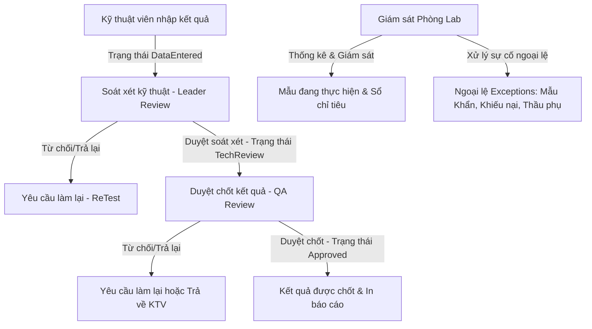

# 0_LAB_MANAGER_STRUCTURE - TÀI LIỆU CẤU TRÚC PHÂN HỆ QUẢN LÝ PHÒNG THÍ NGHIỆM (LAB MANAGER)

Tài liệu này cung cấp mô tả chi tiết về nghiệp vụ, quy trình, cấu trúc file, logic nghiệp vụ và API tích hợp của phân hệ **Quản lý Phòng thí nghiệm (Lab Manager)** trong hệ thống LIMS Frontend.

---

## 1. Luồng Nghiệp Vụ & Chức Năng (Business Flow & Features)

Module Lab Manager cung cấp bộ công cụ toàn diện cho Quản lý Phòng Lab và các Trưởng nhóm chuyên môn để kiểm soát chất lượng, duyệt kết quả thử nghiệm và điều hành hoạt động kiểm nghiệm hàng ngày.



### Chi tiết nghiệp vụ cốt lõi:
1. **Quy trình Phê duyệt & Soát xét chỉ tiêu hai cấp (Approvals)**:
   - **Cấp 1 - Soát xét kỹ thuật (Leader Review)**: Khi KTV hoàn thành đo đạc và nhập dữ liệu, chỉ tiêu ở trạng thái `DataEntered`. Trưởng nhóm chuyên môn soát xét tính hợp lệ của phép đo. Nếu đạt, duyệt chuyển lên cấp tiếp theo (`TechReview`). Nếu có nghi ngờ, trả lại yêu cầu làm lại (`ReTest`).
   - **Cấp 2 - Duyệt chốt kết quả (QA / Lab Manager Review)**: Chỉ tiêu ở trạng thái `TechReview` sẽ được bộ phận QA soát xét sự tuân thủ quy chuẩn ISO 17025. Nếu đạt, phê duyệt chốt kết quả (`Approved`). Kết quả này sẽ được sử dụng để in phiếu kết quả trả khách hàng. Nếu từ chối, trả về làm lại (`ReTest`).
2. **Giám sát Tiến độ mẫu và chỉ tiêu đang thực hiện (Processing)**:
   - Theo dõi thời gian thực tỷ lệ hoàn thành (%) của từng mẫu dựa trên số lượng chỉ tiêu đã chốt trên tổng số chỉ tiêu được giao.
   - Hỗ trợ đổi người thực hiện (Kỹ thuật viên) trong trường hợp có sự thay đổi nhân sự đột xuất.
3. **Quản lý & Xử lý Ngoại lệ (Exceptions)**:
   - Tập hợp các trường hợp đặc biệt cần ưu tiên xử lý:
     - **Mẫu Khẩn (`Fast`)**: Mẫu có nhãn khẩn cần ưu tiên làm trước để kịp deadline cam kết.
     - **Làm lại (`ReTest`)**: Chỉ tiêu bị Leader hoặc QA từ chối duyệt, hiển thị lý do lỗi chi tiết để KTV đối chiếu và thực hiện lại.
     - **Khiếu nại (`Complained`)**: Mẫu hoặc chỉ tiêu bị khách hàng khiếu nại kết quả, yêu cầu phân tích trọng tài.
     - **Thầu phụ (`EX` / Subcontract)**: Chỉ tiêu được gửi sang phòng thí nghiệm đối tác liên kết thực hiện do thiết bị trong nhà bảo trì hoặc không đủ năng lực đo.
4. **Báo cáo Thống kê hiệu suất phòng Lab (Reports)**:
   - Biểu đồ thời gian thực về khối lượng mẫu nhận, tỷ lệ hoàn tất, số lượng mẫu trễ hạn.
   - Thống kê phân bổ tải công việc (Workload) của các Kỹ thuật viên để điều phối công việc tối ưu.

---

## 2. Quy trình & Thao tác Sử dụng (User Operations & Flow)

- **Duyệt kết quả (Leader / QA)**:
  1. Người dùng vào màn hình **Duyệt kết quả**, chọn tab tương ứng: **Chờ soát xét (Leader)** hoặc **Chờ duyệt chốt (QA)**.
  2. Bảng hiển thị danh sách các chỉ tiêu, kết quả đo đạc, và file biên bản đính kèm (nếu có).
  3. **Phê duyệt nhanh**: Click biểu tượng dấu tích xanh (`CheckCircle2`) trực tiếp trên dòng để duyệt nhanh chỉ tiêu đó.
  4. **Duyệt hàng loạt**: Tích chọn nhiều chỉ tiêu ở đầu bảng, bấm nút **"Duyệt soát xét"** hoặc **"Duyệt chốt (QA)"** trên thanh tác vụ.
  5. **Xem chi tiết & Từ chối**: Click biểu tượng mắt (`Eye`) để mở [AnalysisReviewModal.tsx](./modals/AnalysisReviewModal.tsx). Xem chi tiết thông số. Nếu từ chối, **bắt buộc nhập lý do từ chối** vào ô textarea, sau đó bấm nút **Từ chối (Yêu cầu làm lại)**.
- **Lọc thông tin nâng cao trên bảng**:
  - Tại bảng danh sách chỉ tiêu, người dùng có thể nhấp vào biểu tượng lọc trên tiêu đề các cột (ví dụ: cột **Nhóm phụ trách**, **Người thực hiện**, hoặc **Biên bản**) để mở [FilterPopover.tsx](./FilterPopover.tsx). Nhập tên hoặc chọn nhanh đối tượng từ danh sách để lọc ngay lập tức mà không cần tải lại trang.
- **Giám sát Mẫu & Chỉ tiêu**:
  - Truy cập mục **Mẫu đang thực hiện** để xem tiến độ hoàn thành dưới dạng thanh progress bar trực quan của từng mẫu. Click xem chi tiết mẫu để hiển thị bảng phân rã các chỉ tiêu bên trong và xem biên bản PDF của từng chỉ tiêu qua nút [DocumentPreviewButton](../document/DocumentPreviewButton.tsx).
- **Xem Báo cáo Vận hành**:
  - Truy cập mục **Thống kê** để xem biểu đồ phân bổ trạng thái mẫu và biểu đồ khối lượng việc theo Kỹ thuật viên. Người dùng có thể bấm nút **"Xuất báo cáo (Excel)"** để tải dữ liệu thống kê chi tiết.

---

## 3. Cấu Trúc File & Phân Rã Component (File Map & Component Decomposition)

### 3.1 Bản đồ File (File Map)

| Đường dẫn File | Loại | Trách nhiệm chính trong Module |
| :--- | :--- | :--- |
| [LabManagerDashboard.tsx](./LabManagerDashboard.tsx) | Switch Router | Component gốc nhận diện đường dẫn URL để render view tương ứng (Analyses, Exceptions, Samples, Approvals, Reports). |
| [FilterPopover.tsx](./FilterPopover.tsx) | UI Filter | Component lọc nhanh dạng Command Menu trên TableHead, hỗ trợ tìm kiếm và chọn giá trị lọc. |
| [hooks/useLabApprovals.ts](./hooks/useLabApprovals.ts) | Custom Hook | Quản lý state, fetch dữ liệu và mutation cập nhật trạng thái duyệt kết quả chỉ tiêu (`DataEntered`, `TechReview`). |
| [hooks/useLabExceptions.ts](./hooks/useLabExceptions.ts) | Custom Hook | Fetch và điều phối danh sách mẫu khẩn, mẫu khiếu nại, chỉ tiêu làm lại, thầu phụ. |
| [hooks/useLabStats.ts](./hooks/useLabStats.ts) | Custom Hook | Thực hiện các lệnh gọi thống kê số lượng mẫu và tổng hợp khối lượng việc của KTV. |
| [hooks/useProcessingAnalyses.ts](./hooks/useProcessingAnalyses.ts) | Custom Hook | Truy vấn danh sách chỉ tiêu đang xử lý và hỗ trợ API phân công lại Kỹ thuật viên. |
| [hooks/useProcessingSamples.ts](./hooks/useProcessingSamples.ts) | Custom Hook | Truy vấn danh sách mẫu đang trong tiến trình phân tích tại các phòng Lab. |
| [modals/AnalysisReviewModal.tsx](./modals/AnalysisReviewModal.tsx) | Form Modal | Modal hiển thị chi tiết kết quả đo đạc, ghi chú của KTV, hỗ trợ Leader/QA duyệt kết quả hoặc nhập lý do từ chối. |
| [views/LabManagerAnalyses.tsx](./views/LabManagerAnalyses.tsx) | View Component | Màn hình giám sát tất cả chỉ tiêu đang xử lý, hỗ trợ lọc theo Nhóm phụ trách, Người thực hiện, Người liên quan. |
| [views/LabManagerApprovals.tsx](./views/LabManagerApprovals.tsx) | View Component | Màn hình phê duyệt và trả lại kết quả chỉ tiêu theo hai cấp duyệt (Leader / QA). |
| [views/LabManagerExceptions.tsx](./views/LabManagerExceptions.tsx) | View Component | Màn hình giám sát ngoại lệ, tự động phân chia tải truy vấn sang API Sample hoặc API Analysis dựa trên loại tab. |
| [views/LabManagerSamples.tsx](./views/LabManagerSamples.tsx) | View Component | Màn hình theo dõi tiến độ mẫu, tích hợp thanh tiến trình hoàn thành và danh sách chỉ tiêu con. |
| [views/LabManagerReports.tsx](./views/LabManagerReports.tsx) | View Component | Trang báo cáo thống kê và biểu đồ phân bổ thời gian thực. |
| [tabs/analyses/ProcessingAnalysesTab.tsx](./tabs/analyses/ProcessingAnalysesTab.tsx) | Tab Component | Giao diện tab thay thế hiển thị danh sách chỉ tiêu đang xử lý. |
| [tabs/approvals/LabApprovalTab.tsx](./tabs/approvals/LabApprovalTab.tsx) | Tab Component | Giao diện tab thay thế quản lý duyệt chỉ tiêu qua RadioGroup chuyển chế độ xem. |
| [tabs/approvals/DataEnteredList.tsx](./tabs/approvals/DataEnteredList.tsx) | List Component | Danh sách chỉ tiêu chờ Leader soát xét kỹ thuật (sử dụng trong `LabApprovalTab`). |
| [tabs/approvals/TechReviewList.tsx](./tabs/approvals/TechReviewList.tsx) | List Component | Danh sách chỉ tiêu chờ QA duyệt chốt kết quả (sử dụng trong `LabApprovalTab`). |
| [tabs/exceptions/LabExceptionsTab.tsx](./tabs/exceptions/LabExceptionsTab.tsx) | Tab Component | Giao diện tab thay thế quản lý ngoại lệ với sidebar phân loại. |
| [tabs/processing/ProcessingSamplesTab.tsx](./tabs/processing/ProcessingSamplesTab.tsx) | Tab Component | Giao diện tab thay thế hiển thị danh sách mẫu đang thực hiện. |
| [tabs/reports/LabStatsTab.tsx](./tabs/reports/LabStatsTab.tsx) | Tab Component | Giao diện tab thay thế hiển thị báo cáo hiệu suất và phân bổ tải công việc KTV. |

---

### 3.2 Chi tiết mã nguồn từng File cốt lõi (File-by-File Details)

#### 1. [LabManagerDashboard.tsx](./LabManagerDashboard.tsx)
- **Mục đích**: Điểm truy cập trung tâm của module Lab Manager.
- **Logic**: Sử dụng hook `useLocation` từ `react-router-dom` để phân tích đường dẫn URL hiện tại (`location.pathname`) và tự động mount view chức năng tương ứng mà không cần khai báo nhiều route phức tạp ở tầng ngoài.

#### 2. [FilterPopover.tsx](./FilterPopover.tsx)
- **Mục đích**: Component lọc đa năng tích hợp trực tiếp trên tiêu đề các cột của bảng.
- **Logic / Giao diện**:
  - Sử dụng `<Popover>` và `<Command>` của Shadcn để tạo giao diện menu trượt xuống.
  - Chứa ô tìm kiếm phụ để lọc danh sách các lựa chọn (ví dụ: tìm kiếm tên KTV trong danh sách 100 người).
  - Trạng thái lọc hiển thị dạng nhãn kèm theo tiêu đề cột khi có giá trị active (ví dụ: `Người thực hiện (Lê Văn C)`).

#### 3. [modals/AnalysisReviewModal.tsx](./modals/AnalysisReviewModal.tsx)
- **Mục đích**: Modal trung tâm cho quá trình phê duyệt hai cấp.
- **Logic**:
  - Nhận prop `mode` (`DataEntered` hoặc `TechReview`) để hiển thị nhãn nút bấm hành động tương ứng.
  - Hiển thị kết quả dạng số lớn kèm theo Badge trạng thái Đạt (`pass`) màu xanh lá hoặc Không Đạt (`fail`) màu đỏ dựa trên đánh giá tự động của hệ thống.
  - **Khóa nút bấm**: Nút **"Từ chối"** sẽ bị disabled nếu người dùng chưa nhập lý do từ chối vào Textarea để đảm bảo KTV nhận được phản hồi lý do làm lại rõ ràng.

#### 4. [views/LabManagerExceptions.tsx](./views/LabManagerExceptions.tsx)
- **Mục đích**: Quản lý tập trung các sự cố ngoại lệ của phòng Lab.
- **Logic đặc biệt**:
  - Giao diện có 6 tab con: Mẫu khẩn, Mẫu khiếu nại, Mẫu thầu phụ (các tab này truy vấn thông tin dạng mẫu thông qua `useSamplesProcessing`), và CT khiếu nại, CT làm lại, CT thầu phụ (các tab này truy vấn thông tin chỉ tiêu phân rã thông qua `useAnalysesProcessing`).
  - Hệ thống tự động chuyển đổi layout bảng hiển thị (bảng Mẫu thử gồm STT, Mã mẫu, Mã phiếu, Loại mẫu, Trạng thái, Nhãn; bảng Chỉ tiêu bổ sung thêm cột Phương pháp, Kết quả, Đơn vị, KTV thực hiện, Nhóm phụ trách) linh hoạt dựa trên tab được chọn.

#### 5. [hooks/useLabStats.ts](./hooks/useLabStats.ts)
- **Mục đích**: Thu thập dữ liệu thống kê từ Server để vẽ biểu đồ hiệu năng.
- **Logic**:
  - Gọi API `POST /v2/analyses/get/options` gửi lên body chứa `filterFrom: "analysisStatus"` để đếm số lượng chỉ tiêu theo từng trạng thái.
  - Tự động gán các mã màu Hex tương ứng cho từng trạng thái (`Approved`: Xanh lá, `Testing`: Xanh dương, `ReTest`: Đỏ, v.v.) để làm dữ liệu vẽ biểu đồ.
  - Gửi yêu cầu với `filterFrom: "technicianId"` để lấy dữ liệu thống kê khối lượng việc của 5 kỹ thuật viên bận rộn nhất.

---

## 4. Cấu Trúc Logic & Kết Nối API (Logic Structure & API Integration)

- **Quy tắc API Phê duyệt chỉ tiêu**:
  - Quá trình chuyển trạng thái duyệt hoặc yêu cầu làm lại được thực hiện qua endpoint `/v2/analyses/update` (hoặc `/v2/analyses/update/bulk` cho duyệt hàng loạt).
  - Payload duyệt cấp 1 (Leader):
    ```json
    { "analysisId": "ANL-101", "analysisStatus": "TechReview" }
    ```
  - Payload duyệt cấp 2 (QA):
    ```json
    { "analysisId": "ANL-101", "analysisStatus": "Approved" }
    ```
  - Payload yêu cầu làm lại (Reject):
    ```json
    { "analysisId": "ANL-101", "analysisStatus": "ReTest", "analysisNotes": "Kết quả đo lệch chuẩn kiểm chứng" }
    ```
- **Tách biệt API xử lý**:
  - API `/v2/analyses/get/processing` và `/v2/samples/get/processing` trả về các đối tượng đang trong hàng đợi xử lý thực tế, khác với các API list chung để đảm bảo hiệu năng tối ưu cho màn hình Lab Manager.
- **Đồng bộ Cache của React Query**:
  - Sau khi Trưởng nhóm hoặc QA thực hiện duyệt hoặc từ chối thành công, hệ thống gọi invalidation query:
    ```typescript
    qc.invalidateQueries({ queryKey: ["operations", "analyses"] });
    ```
    Để tự động làm mới danh sách chỉ tiêu chờ duyệt trên giao diện mà không cần reload trang.

---

## 5. Các Quy Chuẩn Thiết Kế & Best Practices (Design Guidelines & Best Practices)

- **Quy chuẩn hiển thị bảng dữ liệu (Table Layout)**:
  - Căn trái toàn bộ tiêu đề cột (headers) và nội dung ô (cells) cho các trường văn bản.
  - Cột mã số (Mã mẫu, Mã chỉ tiêu) hiển thị font chữ Mono (`font-mono text-xs`) để dễ so khớp ký tự.
  - File biên bản phân tích được hiển thị dạng icon `FileText` tích hợp component xem thử tài liệu tại chỗ, tránh mở tab mới không cần thiết.
- **Cảnh báo và Highlight màu sắc**:
  - Dòng chỉ tiêu đang được tích chọn duyệt hàng loạt hiển thị nền xanh nhạt (`bg-primary/5`).
  - Các badge trạng thái chốt kết quả và ngoại lệ tuân thủ các quy tắc màu của dự án (Đạt - Xanh lá, Không đạt - Đỏ, Đang kiểm nghiệm - Xanh dương, Chờ duyệt - Vàng).
- **i18n**:
  - Hỗ trợ đầy đủ đa ngôn ngữ qua i18next với namespace `lab.analyses.*`, `lab.samples.*` và `common.*`.
- **Null Safety**:
  - Tất cả các thuộc tính tùy chọn như phương pháp thử (`protocolCode`), đơn vị kết quả (`analysisUnit`), người phụ trách (`technicianName`) nếu chưa được khai báo sẽ hiển thị fallback dạng `"-"` hoặc `"N/A"`.
