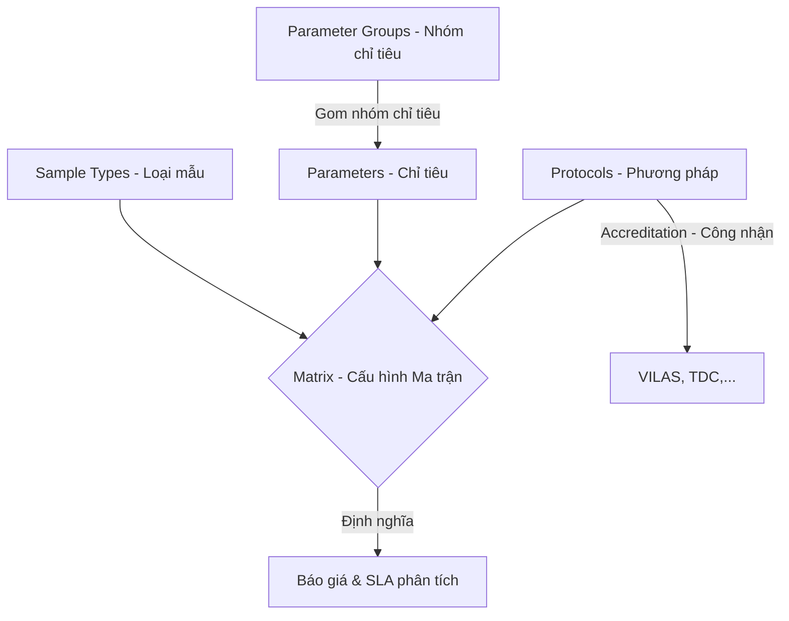

# 0_LIBRARY_STRUCTURE - TÀI LIỆU CẤU TRÚC DANH MỤC THƯ VIỆN (LIBRARY CATALOG)

Tài liệu này cung cấp mô tả chi tiết và toàn diện về nghiệp vụ, giao diện, cấu trúc logic và mã nguồn của module **Danh mục Thư viện (Library Catalog)** trong hệ thống LIMS Frontend.

---

## 1. Luồng Nghiệp Vụ & Chức Năng (Business Flow & Features)

Module `library` chịu trách nhiệm định nghĩa và quản lý các danh mục nền tảng (Master Data) của phòng Lab. Đây là xương sống cấu hình cho phép bộ phận tiếp nhận mẫu (Reception) báo giá và chỉ định đúng phép thử cho mẫu của khách hàng.

### Chi tiết các phân hệ danh mục:
1. **Loại mẫu (Sample Types)**: Phân loại các nền mẫu (ví dụ: nước uống, thực phẩm, thức ăn chăn nuôi, đất sét,...).
2. **Chỉ tiêu phân tích (Parameters)**: Các đặc tính vật lý, hóa học, sinh học cần phân tích (ví dụ: pH, hàm lượng chì, tổng số vi sinh vật hiếu khí,...).
3. **Phương pháp thử (Protocols)**: Quy trình chuẩn (SOP) hoặc tiêu chuẩn quốc tế/quốc gia (ví dụ: TCVN, ISO, AOAC) dùng để thực hiện phép thử.
4. **Nhóm chỉ tiêu (Parameter Groups)**: Gói chỉ tiêu tiện ích gom nhóm nhiều chỉ tiêu phân tích có cùng đặc trưng để chọn nhanh khi lập phiếu tiếp nhận.
5. **Ma trận cấu hình (Matrices)**: Sự giao thoa ba bên giữa `Loại mẫu` + `Chỉ tiêu` + `Phương pháp thử`. Đây là nơi định hình:
   - Đơn giá trước thuế (`feeBeforeTax`) và sau thuế (`feeAfterTax`).
   - Thời gian phân tích cam kết - SLA (`turnaroundTime`).
   - Mối liên kết nghiệp vụ cho phép bộ phận tiếp nhận gán chỉ tiêu vào mẫu.

---

## 2. Quy trình & Thao tác Sử dụng (User Operations & Flow)

- **Cấu hình Ma trận mới (Matrix Creation)**: Người dùng truy cập phân hệ Cấu hình (Matrices), bấm "Thêm ma trận", chọn Loại mẫu, Chỉ tiêu, Phương pháp thử, điền đơn giá và số ngày trả kết quả cam kết. Hệ thống sẽ tự động chặn nếu tổ hợp này đã tồn tại để tránh trùng lặp dữ liệu.
- **Quản lý Chỉ tiêu**: Thiết lập tên chỉ tiêu (Tiếng Việt & Tiếng Anh), gán Nhóm kỹ thuật phụ trách (`technicianGroupId`) và Kỹ thuật viên mặc định (`technicianAlias`). Tại bảng chi tiết chỉ tiêu, người dùng có thể xem nhanh danh sách Accordion các Ma trận giá đang áp dụng và chỉnh sửa/xóa trực tiếp các ma trận này.
- **Thiết lập Phương pháp & Công nhận ISO**: Trong form tạo/sửa phương pháp (Protocols), người dùng chọn các chứng chỉ công nhận (VILAS, TDC,...) và nhập ngày cấp/hết hạn tương ứng. Cho phép đính kèm cả tài liệu công bố công khai (`PROTOCOL_DOC`) và hồ sơ SOP bảo mật nội bộ (`PROTOCOL_SOP`).
- **Gom nhóm chỉ tiêu (Parameter Grouping)**: Thiết lập các gói combo chỉ tiêu. Kéo thả hoặc tích chọn danh sách chỉ tiêu thuộc gói để người dùng tại màn hình tiếp nhận mẫu có thể chọn một gói và tự động bung ra toàn bộ các chỉ tiêu thành phần.

---

## 3. Cấu Trúc File & Phân Rã Component (File Map & Component Decomposition)

### 3.1 Bản đồ File (File Map)

| Đường dẫn File | Loại | Trách nhiệm chính trong Module |
| :--- | :--- | :--- |
| [LibraryHeader.tsx](./LibraryHeader.tsx) | UI Component | Thanh tiêu đề chung cho các trang danh mục, quản lý ô tìm kiếm nhanh và nút "Thêm mới". |
| [hooks/useDebouncedValue.ts](./hooks/useDebouncedValue.ts) | Custom Hook | Trì hoãn cập nhật giá trị tìm kiếm để tránh gửi request API liên tục (debounce). |
| [hooks/useServerPagination.ts](./hooks/useServerPagination.ts) | Custom Hook | Quản lý state phân trang và số dòng trên trang đồng bộ với backend. |
| [hooks/useLibraryData.ts](./hooks/useLibraryData.ts) | Custom Hook | Gom và lọc dữ liệu bộ nhớ đệm phục vụ hiển thị liên kết nhanh. |
| **matrices/** | Thư mục | **Phân hệ quản lý Ma trận cấu hình chỉ tiêu & giá** |
| [matrices/MatricesView.tsx](./matrices/MatricesView.tsx) | Page Orchestrator | Màn hình chính điều phối danh sách ma trận, phân trang server và các modal CRUD. |
| [matrices/MatricesTable.tsx](./matrices/MatricesTable.tsx) | Table Component | Bảng hiển thị ma trận, tích hợp bộ lọc Excel-style theo Loại mẫu và Chỉ tiêu. |
| [matrices/MatricesCreateModal.tsx](./matrices/MatricesCreateModal.tsx) | Form Modal | Modal tạo mới ma trận với các bộ chọn liên kết danh mục. |
| [matrices/MatricesEditModal.tsx](./matrices/MatricesEditModal.tsx) | Form Modal | Modal chỉnh sửa các tham số của ma trận hiện tại. |
| [matrices/MatricesDetailModal.tsx](./matrices/MatricesDetailModal.tsx) | UI Drawer | Xem thông tin chi tiết đầy đủ 360 độ của ma trận. |
| [matrices/MatrixDetailPanel.tsx](./matrices/MatrixDetailPanel.tsx) | UI Panel | Panel trượt bên phải hiển thị chi tiết ma trận khi click chọn hàng trong bảng. |
| [matrices/MatricesDeleteConfirm.tsx](./matrices/MatricesDeleteConfirm.tsx) | UI Dialog | Hộp thoại xác nhận trước khi xóa ma trận khỏi hệ thống. |
| [matrices/matrixFormat.ts](./matrices/matrixFormat.ts) | Helper | Định dạng hiển thị chuỗi ma trận. |
| **parameterGroups/** | Thư mục | **Phân hệ quản lý Gói/Nhóm chỉ tiêu** |
| [parameterGroups/ParameterGroupsView.tsx](./parameterGroups/ParameterGroupsView.tsx) | Page Orchestrator | Trang quản lý danh mục gói chỉ tiêu phân tích. |
| [parameterGroups/ParameterGroupsTable.tsx](./parameterGroups/ParameterGroupsTable.tsx) | Table Component | Bảng hiển thị danh mục các gói chỉ tiêu. |
| [parameterGroups/ParameterGroupCreateModal.tsx](./parameterGroups/ParameterGroupCreateModal.tsx) | Form Modal | Modal thêm mới/chỉnh sửa gói chỉ tiêu và gán chỉ tiêu thành phần. |
| [parameterGroups/ParameterGroupDetailPanel.tsx](./parameterGroups/ParameterGroupDetailPanel.tsx) | UI Panel | Panel hiển thị chi tiết gói chỉ tiêu và danh sách chỉ tiêu con đi kèm. |
| **parameters/** | Thư mục | **Phân hệ quản lý Chỉ tiêu kiểm nghiệm** |
| [parameters/ParametersView.tsx](./parameters/ParametersView.tsx) | Page Orchestrator | Trang quản lý danh mục chỉ tiêu phân tích tổng thể. |
| [parameters/ParametersTable.tsx](./parameters/ParametersTable.tsx) | Table Component | Bảng hiển thị chỉ tiêu và KTV phụ trách. |
| [parameters/ParameterFormModal.tsx](./parameters/ParameterFormModal.tsx) | Form Modal | Form tạo mới hoặc sửa thông tin chỉ tiêu. |
| [parameters/ParametersDetailPanel.tsx](./parameters/ParametersDetailPanel.tsx) | UI Panel | Panel chi tiết chỉ tiêu, tích hợp danh sách ma trận áp dụng bên dưới. |
| [parameters/MatricesAccordionItem.tsx](./parameters/MatricesAccordionItem.tsx) | UI Component | Accordion item hiển thị giá tiền, SLA của từng ma trận liên kết với chỉ tiêu. |
| [parameters/ParameterMatrixManager.tsx](./parameters/ParameterMatrixManager.tsx) | Panel Component | Trình quản lý gán/gỡ ma trận nhanh ngay trong màn hình chỉ tiêu. |
| **protocols/** | Thư mục | **Phân hệ quản lý Phương pháp thử nghiệm** |
| [protocols/ProtocolsView.tsx](./protocols/ProtocolsView.tsx) | Page Orchestrator | Trang quản lý các quy trình SOP và tiêu chuẩn phương pháp thử. |
| [protocols/ProtocolsTable.tsx](./protocols/ProtocolsTable.tsx) | Table Component | Bảng hiển thị các phương pháp và phân loại tài liệu đính kèm. |
| [protocols/ProtocolFormModal.tsx](./protocols/ProtocolFormModal.tsx) | Form Modal | Form cấu hình phương pháp thử, chứng chỉ công nhận ISO và đính kèm file. |
| [protocols/ProtocolDetailPanel.tsx](./protocols/ProtocolDetailPanel.tsx) | UI Panel | Panel hiển thị thông tin phương pháp và liên kết tài liệu. |
| [protocols/ProtocolDetailModal.tsx](./protocols/ProtocolDetailModal.tsx) | UI Drawer | Drawer xem thông tin phương pháp đầy đủ. |
| [protocols/ProtocolMatrixManager.tsx](./protocols/ProtocolMatrixManager.tsx) | Panel Component | Quản lý nhanh các ma trận liên kết với phương pháp. |
| [protocols/SearchSelectPicker.tsx](./protocols/SearchSelectPicker.tsx) | Select Picker | Bộ chọn phương pháp hỗ trợ tìm kiếm nhanh debounce. |
| **sampleTypes/** | Thư mục | **Phân hệ quản lý Loại nền mẫu** |
| [sampleTypes/SampleTypesView.tsx](./sampleTypes/SampleTypesView.tsx) | Page Orchestrator | Trang quản lý danh mục loại mẫu/nền mẫu phân tích. |
| [sampleTypes/SampleTypesTable.tsx](./sampleTypes/SampleTypesTable.tsx) | Table Component | Bảng danh sách các loại nền mẫu. |
| [sampleTypes/SampleTypeFormModal.tsx](./sampleTypes/SampleTypeFormModal.tsx) | Form Modal | Form thêm/sửa loại mẫu và sản phẩm liên quan. |
| [sampleTypes/SampleTypeDetailPanel.tsx](./sampleTypes/SampleTypeDetailPanel.tsx) | UI Panel | Panel hiển thị chi tiết loại mẫu và danh mục ma trận đi kèm. |
| [sampleTypes/SampleTypeMatrixManager.tsx](./sampleTypes/SampleTypeMatrixManager.tsx) | Panel Component | Quản lý gán nhanh các chỉ tiêu vào loại mẫu hiện tại. |
| **shared/** | Thư mục | **Các component dùng chung trong danh mục** |
| [shared/AccreditationTagInput.tsx](./shared/AccreditationTagInput.tsx) | Input Component | Nhập và chọn mã hiệu công nhận (VILAS, TDC...) kèm ngày hết hạn. |
| [shared/ChemicalBomTable.tsx](./shared/ChemicalBomTable.tsx) | Table Component | Bảng hiển thị định mức hóa chất (BOM) cần thiết cho phương pháp. |
| [shared/EquipmentSnapshotTable.tsx](./shared/EquipmentSnapshotTable.tsx) | Table Component | Danh sách thiết bị cần dùng được gán cho phương pháp. |
| [shared/LabSkuSearchDropdown.tsx](./shared/LabSkuSearchDropdown.tsx) | Dropdown Picker | Ô tìm kiếm hóa chất SKU từ danh mục kho để gán định mức. |
| [shared/LabToolSnapshotTable.tsx](./shared/LabToolSnapshotTable.tsx) | Table Component | Danh sách dụng cụ cần dùng được gán cho phương pháp. |

### 3.2 Chi tiết mã nguồn của các file chính

#### 1. [LibraryHeader.tsx](./LibraryHeader.tsx)
- **Mục đích**: Render thanh công cụ đầu trang chứa các điều khiển tìm kiếm và hành động thêm mới.
- **Giao diện/Render**:
  - Tiêu đề trang (`titleKey`) và dòng mô tả động hiển thị tổng số bản ghi (`totalCount`).
  - Ô tìm kiếm text tích hợp icon kính lúp.
  - Nút "Thêm mới" (`onAdd`) màu Primary có thể cấu hình nhãn qua `addLabelKey`.

#### 2. [hooks/useLibraryData.ts](./hooks/useLibraryData.ts)
- **Mục đích**: Custom hook xử lý logic kết hợp dữ liệu các bảng danh mục ở Frontend.
- **Logic & State**:
  - `normalizeJoinKey()`: Loại bỏ các ký tự đặc biệt và đưa về chữ hoa (ví dụ: `PAR-0875` thành `PAR0875`) để tránh lỗi so khớp khóa phụ thuộc định dạng nhập.
  - `detailedParameters`: Nhận vào danh sách chỉ tiêu và ma trận thô, thực hiện gom nhóm và ánh xạ danh sách các ma trận liên quan trực tiếp vào từng đối tượng chỉ tiêu dưới dạng thuộc tính `matrices: Matrix[]` để hiển thị Accordion mượt mà ở màn hình chi tiết.
  - `filteredProtocols`: Lọc danh sách phương pháp thử dựa trên mã hoặc tên phương pháp.

#### 3. [matrices/MatricesTable.tsx](./matrices/MatricesTable.tsx)
- **Mục đích**: Bảng hiển thị danh sách ma trận cấu hình giá & SLA.
- **Giao diện/Render**:
  - Các cột dữ liệu: Loại mẫu, Tên chỉ tiêu (Việt/Anh), Phương pháp, Đơn giá trước thuế, Đơn giá sau thuế, Số ngày trả kết quả (SLA), Hành động.
  - Các ô lọc Excel-style ở tiêu đề cột cho phép click mở Popover chọn nhiều Loại mẫu hoặc nhiều Chỉ tiêu để lọc danh sách.

#### 4. [shared/AccreditationTagInput.tsx](./shared/AccreditationTagInput.tsx)
- **Mục đích**: Component nhập và quản lý thông tin chứng nhận ISO cho từng phương pháp phân tích.
- **Giao diện/Render**:
  - Giao diện các ô input dạng dòng chứa: Tên tổ chức công nhận (VILAS, TDC,...), Số quyết định, Ngày cấp và Ngày hết hạn.
  - Hỗ trợ thêm dòng và xóa dòng động.
- **Logic & State**:
  - Lưu cấu trúc JSONB dạng `{ [accreditationCode]: { registrationDate, expirationDate } }` và phát sự kiện `onChange` trả lại giá trị hợp lệ cho form cha `ProtocolFormModal.tsx`.

---

## 4. Cấu Trúc Logic & Kết Nối API (Logic Structure & API Integration)

- **Các API Query & Mutation** (import từ [library.ts](../../api/library.ts)):
  - `useMatricesList`, `useCreateMatrix`, `useUpdateMatrix`, `useDeleteMatrix`
  - `useParametersList`, `useCreateParameter`, `useUpdateParameter`, `useDeleteParameter`
  - `useProtocolsList`, `useCreateProtocol`, `useUpdateProtocol`, `useDeleteProtocol`
  - `useSampleTypesList`, `useCreateSampleType`, `useUpdateSampleType`, `useDeleteSampleType`
- **Cơ chế Phân trang phía Server**:
  - Hook [useServerPagination](./hooks/useServerPagination.ts) duy trì các state `currentPage` và `itemsPerPage`. Khi người dùng chuyển trang hoặc thay đổi số dòng hiển thị, hook kích hoạt làm mới tham số đầu vào của query React Query, kích hoạt gọi API tải trang mới từ backend.
- **Debounce Tìm kiếm**:
  - [useDebouncedValue](./hooks/useDebouncedValue.ts) nhận vào `searchTerm` và trả về `debouncedSearch` trễ 300ms. Màn hình chính lắng nghe `debouncedSearch` để gọi API, giúp giảm tải hàng loạt truy vấn thừa lên server khi người dùng đang gõ phím.

---

## 5. Các Quy Chuẩn Thiết Kế & Best Practices (Design Guidelines & Best Practices)

- **Tính di động của tài liệu (Relative Links)**:
  - Bắt buộc sử dụng đường dẫn tương đối (ví dụ: `./MatricesTable.tsx`, `../../api/library.ts`) cho tất cả các liên kết tệp để đảm bảo tài liệu luôn tự động định vị đúng tệp nguồn trên bất kỳ môi trường IDE hoặc hệ thống kiểm soát phiên bản nào.
- **Hiển thị song ngữ (DisplayStyle)**:
  - Các nhãn hiển thị của chỉ tiêu phân tích (`displayStyle`) bắt buộc phải hỗ trợ cấu trúc dữ liệu song ngữ `{ "vie": "...", "eng": "..." }`. Khi hiển thị trong bảng hoặc biên bản, hệ thống luôn ưu tiên hiển thị cả hai dòng (Tiếng Việt bên trên, Tiếng Anh chữ nghiêng xám bên dưới).
- **Độ an toàn kiểu dữ liệu (TypeScript)**:
  - Định nghĩa rõ ràng các interface dữ liệu cốt lõi (`Matrix`, `Parameter`, `Protocol`, `SampleType`) từ thư mục `@/types/library.ts`. Hạn chế tối đa sử dụng kiểu `any` bằng cách gán type guards và ép kiểu chính xác thông qua helper `asArray<T>`.
- **Tối ưu hóa UI/UX**:
  - Các danh sách Accordion ma trận liên kết trong màn hình chi tiết phải được thiết kế lazy load, chỉ nạp dữ liệu ma trận từ API hoặc thực hiện map bộ nhớ khi Drawer/Panel chi tiết tương ứng được người dùng mở ra.
- **Quản lý Hóa chất BOM**:
  - Định mức tiêu hao hóa chất phải được chọn trực tiếp thông qua ô tìm kiếm [LabSkuSearchDropdown](./shared/LabSkuSearchDropdown.tsx) kết nối trực tiếp với danh mục SKU kho thực tế để tránh lỗi sai lệch mã CAS hoặc tên hóa chất.
