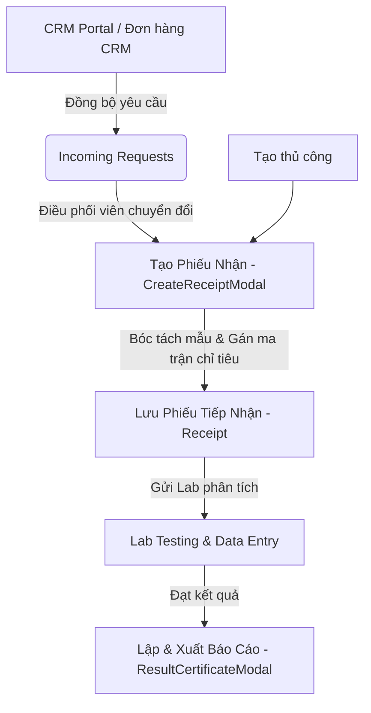

# 0_RECEPTION_STRUCTURE - TÀI LIỆU CẤU TRÚC TIẾP NHẬN MẪU (SAMPLE RECEPTION)

Tài liệu này cung cấp mô tả chi tiết và toàn diện về nghiệp vụ, giao diện, cấu trúc logic và mã nguồn của module **Tiếp nhận mẫu (Sample Reception)** trong hệ thống LIMS Frontend.

---

## 1. Luồng Nghiệp Vụ & Chức Năng (Business Flow & Features)

Module `reception` là cửa ngõ khởi đầu cho mọi hoạt động phân tích thí nghiệm tại phòng Lab. Tại đây, điều phối viên tiếp nhận yêu cầu dịch vụ từ khách hàng hoặc hệ thống CRM/Portal ngoại vi, lập phiếu tiếp nhận mẫu chính thức, gán chỉ tiêu phân tích tương ứng và kiểm soát toàn bộ vòng đời của phiếu nhận.

### Các chức năng nghiệp vụ trọng yếu:
1. **Quản lý Yêu cầu Tiếp nhận (Incoming Requests)**: Tiếp nhận các yêu cầu phân tích thô gửi từ CRM hoặc Cổng Portal dịch vụ công.
2. **Khởi tạo Phiếu Nhận (`CreateReceiptModal`)**: Form nhập liệu quy mô lớn hỗ trợ hai chế độ:
   - **Basic (Cơ bản)**: Nhập nhanh các thông tin tối giản.
   - **Full (Đầy đủ)**: Quản lý chi tiết thông tin thanh toán thuế VAT, thông tin người liên hệ, các điều khoản giao trả kết quả, và tài liệu hợp đồng đính kèm.
3. **Phân phối chỉ tiêu & Giá trị (Matrix Binding & Pricing)**: Gán các ma trận chỉ tiêu vào từng mẫu riêng lẻ, tự động tính tổng tiền dịch vụ trước thuế, sau thuế VAT và chi phí lưu mẫu.
4. **Biên tập & Kết xuất Báo cáo Kết quả (`ResultCertificateModal`)**: Soạn thảo kết quả phân tích theo chứng chỉ ISO 17025 sử dụng TinyMCE editor, xuất file PDF và gửi báo cáo trực tiếp qua email cho khách hàng.
5. **Vận chuyển & Bàn giao Ngoại kiểm (Shipment Management)**: Đóng gói và theo dõi lộ trình vận chuyển mẫu gửi đi các phòng Lab liên kết hoặc nhà thầu phụ bên ngoài.

---

## 2. Quy trình & Thao tác Sử dụng (User Operations & Flow)

- **Quy trình Tiếp nhận từ CRM/Portal**:
  1. Người dùng mở tab **Yêu cầu tiếp nhận**, click xem chi tiết một yêu cầu từ CRM gửi sang.
  2. Bấm nút **"Chuyển đổi nhanh"** (`FastConvertModal`) để tự động điền các thông tin khách hàng, số lượng mẫu và mã đơn hàng vào phiếu nhận mới.
  3. Hoàn thiện thông tin ghi nhận tình trạng mẫu lúc nhận (`conditionCheck`) và danh sách chỉ tiêu phân tích cho từng mẫu, sau đó bấm **Lưu**.
- **Quy trình Biên tập Phiếu chi tiết (`ReceiptDetailModal`)**:
  - Tại màn hình chi tiết Phiếu tiếp nhận, người dùng có thể tải lên ảnh chụp thực tế của mẫu vật lý.
  - Bấm vào từng mẫu để gọi `SampleDetailModal` điều chỉnh các thông tin chuyên biệt: giới hạn phát hiện (LOD/LOQ), phương pháp tùy chỉnh, thời hạn phân tích, vị trí đặt mẫu và in nhãn mã vạch (Label Barcode) dán lên vỏ hộp mẫu.
- **Quy trình Phát hành Chứng chỉ Kết quả (Result Certificate)**:
  1. Khi toàn bộ chỉ tiêu của phiếu đã có kết quả phân tích ổn định từ phòng thí nghiệm, bấm **"Xuất báo cáo"** trên hàng của phiếu nhận.
  2. Modal `ResultCertificateModal` mở ra. Người dùng chọn ngôn ngữ in (Tiếng Việt mặc định, Tiếng Anh hoặc Tiếng Trung bổ sung), và kiểu hiển thị (Standard song ngữ song song hoặc Legacy truyền thống).
  3. Nếu đây là bản báo cáo hiệu chỉnh lại của một báo cáo đã phát hành trước đó, người dùng tích chọn báo cáo cũ tại trường **"Báo cáo thay thế"** (`replacingReportId`) để in kèm thông tin đính chính ISO.
  4. Bấm **"Gửi Email"** để gửi file PDF đính kèm cùng mẫu email soạn sẵn cho khách hàng, hoặc bấm **"In"** để in trực tiếp từ trình duyệt.

---

## 3. Cấu Trúc File & Phân Rã Component (File Map & Component Decomposition)

### 3.1 Bản đồ File (File Map)

| Đường dẫn File | Loại | Trách nhiệm chính trong Module |
| :--- | :--- | :--- |
| [SampleReception.tsx](./SampleReception.tsx) | Page Orchestrator | Màn hình tiếp nhận trung tâm, quản lý bộ lọc tìm kiếm nâng cao, chuyển đổi Tabs giữa Receipts và Incoming Requests. |
| [ReceiptsTable.tsx](./ReceiptsTable.tsx) | Table Component | Bảng hiển thị danh sách phiếu tiếp nhận, phân chia tab phụ (Lưu nháp, Đang xử lý, Quá hạn, Đã hoàn thành). |
| [IncomingRequestsTable.tsx](./IncomingRequestsTable.tsx) | Table Component | Bảng hiển thị các yêu cầu dịch vụ thô từ khách hàng/CRM. |
| [CreateReceiptModal.tsx](./CreateReceiptModal.tsx) | Form Modal | Giao diện tạo phiếu tiếp nhận mẫu quy mô lớn (114KB), xử lý thông tin CRM, bóc lô mẫu và giá tiền. |
| [ReceiptDetailModal.tsx](./ReceiptDetailModal.tsx) | Detail Modal | Giao diện quản lý 360 độ phiếu tiếp nhận (103KB), upload file đính kèm, sửa đổi chỉ tiêu phân tích và gọi in tem nhãn. |
| [SampleDetailModal.tsx](./SampleDetailModal.tsx) | Detail Modal | Quản lý chi tiết một mẫu thử nghiệm cụ thể nằm trong phiếu nhận, gán LOD/LOQ và thời hạn của từng phép thử. |
| [ResultCertificateModal.tsx](./ResultCertificateModal.tsx) | Report Editor | Trình soạn thảo và kết xuất PDF báo cáo kết quả kiểm nghiệm tích hợp TinyMCE editor, cấu hình đa ngôn ngữ hiển thị. |
| [AddSampleModal.tsx](./AddSampleModal.tsx) | Form Modal | Hỗ trợ thêm mẫu mới trực tiếp vào một Phiếu tiếp nhận đã tồn tại trên hệ thống. |
| [IncomingRequestDetailModal.tsx](./IncomingRequestDetailModal.tsx) | Detail Modal | Xem thông tin chi tiết và xử lý chuyển đổi đơn yêu cầu từ CRM thành phiếu nhận. |
| [FastConvertModal.tsx](./FastConvertModal.tsx) | Form Modal | Modal rút gọn giúp chuyển đổi nhanh yêu cầu CRM thành phiếu tiếp nhận. |
| [SamplePrintLabelModal.tsx](./SamplePrintLabelModal.tsx) | Printer Modal | Thiết lập kích thước tem nhãn và cấu hình gửi lệnh in nhãn barcode ra máy in tem chuyên dụng. |
| [ReceiptDeleteModal.tsx](./ReceiptDeleteModal.tsx) | UI Dialog | Hộp thoại xác nhận trước khi xóa vĩnh viễn phiếu tiếp nhận. |
| [AnalysesEditableTable.tsx](./AnalysesEditableTable.tsx) | Grid Table | Bảng chỉ tiêu phân tích hỗ trợ sửa nhanh đơn giá, LOD/LOQ và phương pháp ngay trong form tạo phiếu. |
| [CreateIncomingRequestFromOrderModal.tsx](./CreateIncomingRequestFromOrderModal.tsx) | Form Modal | Modal tra cứu thông tin đơn hàng CRM gốc và kéo dữ liệu về lập phiếu tiếp nhận LIMS. |
| [FilterBar.tsx](./FilterBar.tsx) | UI Component | Thanh lọc danh sách phiếu tiếp nhận theo khách hàng, khoảng ngày tiếp nhận, và loại mẫu. |
| [TableHeaderFilter.tsx](./TableHeaderFilter.tsx) | Popover Filter | Bộ lọc Excel cục bộ trên tiêu đề cột cho phép lọc đa trị. |
| **shipment/** | Thư mục | **Phân hệ quản lý vận chuyển mẫu ngoại kiểm** |
| [shipment/ShipmentManagerModal.tsx](./shipment/ShipmentManagerModal.tsx) | Presentational Modal | Giao diện điều phối vận chuyển mẫu đi phân tích bên thứ ba. |
| [shipment/ShipmentActionForm.tsx](./shipment/ShipmentActionForm.tsx) | Stepper Form | Quy trình gán đơn vị logistics (DHL, ViettelPost,...), số vận đơn tracking và danh sách mẫu gửi đi. |
| [shipment/ShipmentContextView.tsx](./shipment/ShipmentContextView.tsx) | Detail Panel | Hiển thị tình trạng vận chuyển thời gian thực của lô mẫu ngoại kiểm. |
| [shipment/ShipmentLabelPrint.tsx](./shipment/ShipmentLabelPrint.tsx) | Printer Component | Định dạng khổ tem gửi hàng A6 phục vụ in nhãn dán lên thùng hàng đóng gói vận chuyển. |

### 3.2 Chi tiết mã nguồn của các file chính

#### 1. [CreateReceiptModal.tsx](./CreateReceiptModal.tsx)
- **Mục đích**: Form khởi tạo phiếu tiếp nhận mới (Basic & Full).
- **Giao diện/Render**:
  - Giao diện chia 2 Tab chính: Thông tin chung (Khách hàng CRM, thông tin liên hệ, thông tin hóa đơn thuế VAT) và Thông tin mẫu phân tích.
  - Tích hợp ô tìm kiếm thông tin khách hàng từ danh mục khách hàng CRM (`clientsGetList`).
- **Logic & State chính**:
  - `BasicFormState`: Quản lý các trường thông tin chung của phiếu.
  - `samples`: Mảng chứa thông tin các mẫu thử nghiệm đang soạn thảo, bao gồm tên mẫu, khối lượng, điều kiện mẫu và danh sách các phép thử (`analyses: FormAnalysis[]`) được liên kết.
  - Logic tính toán: Khi thêm/sửa chỉ tiêu phân tích, hệ thống duyệt mảng và tự động tính toán tổng số tiền trước thuế (`feeBeforeTax`), tiền thuế VAT và tổng tiền sau thuế (`feeAfterTax`) để hiển thị trực tiếp lên sidebar báo giá.

#### 2. [ReceiptDetailModal.tsx](./ReceiptDetailModal.tsx)
- **Mục đích**: Quản lý và hiệu chỉnh toàn bộ dữ liệu của một Phiếu tiếp nhận đang hoạt động.
- **Giao diện/Render**:
  - Sidebar bên trái chứa thông tin hành chính, danh mục file đính kèm, ảnh chụp mẫu vật lý thực tế.
  - Vùng trung tâm chứa danh sách mẫu phân tích. Mỗi mẫu là một card hiển thị các thông tin đo lường và bảng chỉ tiêu phân tích tương ứng.
- **Logic & State chính**:
  - Sử dụng React Query mutation `useReceiptsUpdate` để đồng bộ ngay lập tức các chỉnh sửa thông tin hành chính hoặc thông tin mẫu.
  - Gắn sự kiện in hàng loạt tem nhãn mẫu thử thông qua `SamplePrintLabelModal`.

#### 3. [ResultCertificateModal.tsx](./ResultCertificateModal.tsx)
- **Mục đích**: Trình biên soạn và in ấn báo cáo kết quả kiểm nghiệm chuẩn ISO 17025.
- **Giao diện/Render**:
  - Cột bên trái: Cấu hình in (Chọn ngôn ngữ chính/phụ, chọn kiểu hiển thị, chọn báo cáo thay thế, cấu hình chữ ký).
  - Vùng trung tâm: Trình soạn thảo Rich Text Editor TinyMCE hiển thị trang văn bản A4 chuẩn.
- **Logic & State chính**:
  - `generateSampleResultHtml()`: Khởi tạo mã HTML báo cáo kết quả từ dữ liệu mẫu và các phép thử đã hoàn thành. Tên chỉ tiêu được dịch động theo ngôn ngữ lựa chọn nhờ cấu trúc thuộc tính `displayStyle` (ví dụ: `displayStyle.vie` + `displayStyle.eng`).
  - Google Fonts integration: Văn bản báo cáo sử dụng font chữ sans-serif cao cấp **Wix Madefor Display** được nhúng trực tiếp qua CSS `@import url` nhằm đảm bảo tính mỹ thuật cao khi in ra giấy hoặc chuyển đổi sang định dạng PDF.
  - Repetitive Print Headers: Định dạng bảng in bao quanh nội dung báo cáo bằng cấu trúc `.print-wrapper` sử dụng các thẻ `<thead>` và `<tfoot>` chuẩn trình duyệt để tự động lặp lại tiêu đề cơ quan và chân trang chữ ký trên mọi trang khi in nhiều trang.

---

## 4. Cấu Trúc Logic & Kết Nối API (Logic Structure & API Integration)

- **Các API chính**:
  - `receiptsGetFull` (`/v2/receipts/get/full`): Lấy dữ liệu chi tiết của phiếu tiếp nhận bao gồm đầy đủ danh sách mẫu và chỉ tiêu.
  - `useExportReport` (`/v2/reports/export`): API mutation nhận mã HTML thô từ TinyMCE gửi lên và xuất ra file PDF báo cáo kết quả hoàn chỉnh.
  - `useIncomingRequestConvert` (`/v2/incoming-requests/convert`): API thực hiện chuyển đổi trạng thái đơn CRM thành phiếu nhận LIMS.
- **Cơ chế dịch tự động (i18n)**:
  - Sử dụng thư viện `i18next` với namespace `reception.*` để hiển thị nhãn và thông điệp dịch.
  - Trạng thái mẫu (`sampleStatus`) và trạng thái phép thử (`analysisStatus`) được map màu và chuỗi ký tự hiển thị qua các helper `getReceiptStatusBadge(status)` và `getAnalysisStatusBadge(status)`.

---

## 5. Các Quy Chuẩn Thiết Kế & Best Practices (Design Guidelines & Best Practices)

- **Địa chỉ liên kết tương đối (Relative Linking)**:
  - Bắt buộc sử dụng đường dẫn tương đối (ví dụ: `./CreateReceiptModal.tsx`, `../common/EmailModal.tsx`, `../../api/receipts.ts`) trong toàn bộ tài liệu cấu trúc để đảm bảo tính di động cao khi di chuyển giữa các thư mục hoặc khi chạy trên các hệ thống phát triển cục bộ khác nhau.
- **Độ chính xác tính toán tài chính (Financial Calculations)**:
  - Các phép tính tổng tiền dịch vụ và tiền thuế VAT bắt buộc phải sử dụng hàm làm tròn chuẩn để tránh sai số dấu phẩy động JavaScript (ví dụ: `Math.round(value * 100) / 100`).
- **An toàn nội dung HTML (HTML Security)**:
  - Khi render kết quả phân tích có chứa các thẻ HTML (như số mũ, ký tự đặc biệt) trên bảng, bắt buộc dùng các hàm lọc hoặc thẻ bao bọc an toàn để tránh lỗ hổng bảo mật Cross-Site Scripting (XSS).
- **Tối ưu hóa In ấn (Print Styling)**:
  - Tất cả các CSS cho in ấn bắt buộc phải gom trong khối `@media print`. Các thành phần nút bấm điều khiển, thanh tab, nút đóng modal phải được ẩn (`display: none !important`) khi in bằng trình duyệt.
- **Lazy Loading các Editor lớn**:
  - Trình soạn thảo TinyMCE có kích thước tải lớn nên chỉ được khởi tạo khi Modal báo cáo kết quả (`ResultCertificateModal`) được active thực sự ở trạng thái mở (`open === true`).
