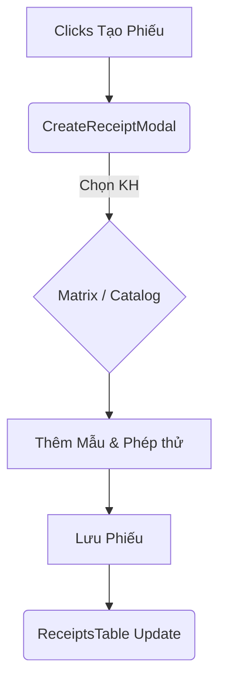
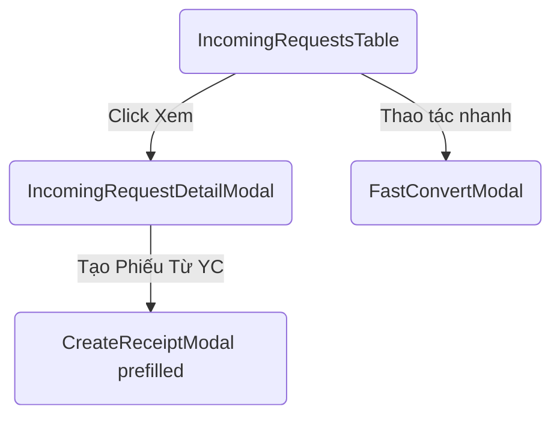
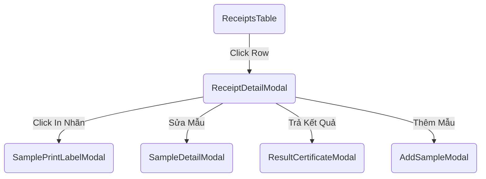

# Reception Module (Tiếp nhận mẫu)

## I. Tổng quan

Module `reception/` xử lý toàn bộ nghiệp vụ **Tiếp nhận mẫu** và xử lý **Yêu cầu phân tích** từ khách hàng — từ tạo phiếu nhận, xem chi tiết, quản lý danh sách mẫu & phép thử, xuất phiếu trả kết quả, đến quản lý các yêu cầu (Incoming Requests). Đây là module trọng yếu nhất của hệ thống LIMS vì nó là điểm bắt đầu của toàn bộ quy trình xét nghiệm.

---

## II. Danh sách Component chính

| Component | Vai trò |
| :--- | :--- |
| **`SampleReception.tsx`** | Container chính (trang Tiếp nhận mẫu). Quản lý filter, tab điều hướng (Receipts / Incoming Requests), trạng thái modal tạo/xóa và render các bảng tương ứng. |
| **`ReceiptsTable.tsx`** | Bảng hiển thị danh sách Phiếu tiếp nhận (Receipts) hỗ trợ phân trang, lọc theo trạng thái, tìm kiếm và thao tác nhanh (Mở chi tiết, Xóa, In labbel, Xuất báo cáo). |
| **`IncomingRequestsTable.tsx`** | Bảng hiển thị danh sách Yêu cầu phân tích (từ khách hàng gửi lên qua CRM/Portal). |
| **`CreateReceiptModal.tsx`** | Modal tạo Phiếu nhận mới. Hỗ trợ thao tác thêm/xóa nhiều mẫu cùng lúc, chọn Matrix, điền thông tin khách cung cấp, và cấu hình thông tin Receipt. Hỗ trợ tải file đính kèm. |
| **`ReceiptDetailModal.tsx`** | Modal xem/sửa chi tiết phiếu nhận (Full 360 độ). Quản lý view mẫu, phép thử, upload hình ảnh, tạo tài liệu, in nhãn. Hỗ trợ thao tác Edit tất cả các field của phiếu. |
| **`SampleDetailModal.tsx`** | Modal quản lý chi tiết một mẫu cụ thể của phiếu, kèm theo danh sách các phép thử (analyses) liên quan tới mẫu đó. Cho phép cấu hình LOD, LOQ, Phương pháp, Thời gian thực hiện của từng chỉ tiêu. |
| **`ResultCertificateModal.tsx`** | Modal cho phép quản lý nội dung và xuất báo cáo PDF (Result Certificate). Giao diện thiết kế thành 3 cột (Thông tin Receipt/Docs - Text Editor - Preview & Config hiển thị ngôn ngữ/thay thế báo cáo). |
| **`AddSampleModal.tsx`** | Modal add thêm mẫu mới vào một phiếu tiếp nhận đã có sẵn. |
| **`IncomingRequestDetailModal.tsx`** | Modal xem và xử lý chi tiết một yêu cầu từ khách hàng. Cung cấp chức năng tạo phiếu nhận từ yêu cầu này. |
| **`FastConvertModal.tsx`** | Chuyển đổi nhanh các Yêu cầu (Request) thành Phiếu tiếp nhận (Receipt). |
| **`SamplePrintLabelModal.tsx`** | Giao diện cấu hình in nhãn dán (Label) lên các hũ/lọ/bao bì đựng mẫu phục vụ lưu kho/phân phối phòng thí nghiệm. |
| **`ReceiptDeleteModal.tsx`** | Modal xác nhận hệ thống khi Xóa phiếu tiếp nhận. |

---

## III. Luồng Nghiệp vụ (Workflow)

### 1. Luồng Tiếp Nhận Mới (Tạo Receipt)

### 2. Luồng Xử lý Yêu Cầu (Incoming Requests)

### 3. Luồng Quản lý Phiếu (Receipt Detail)

---

## IV. Cấu trúc và Kiến trúc Dữ liệu

1. **Receipts (Phiếu tiếp nhận)**
   - Lưu trữ tại `receipts`.
   - Đối tượng chính chứa `receiptId`, `receiptCode`, `clientId`, thông tin hóa đơn (invoiceInfo), cấu hình giao trả kết quả, điều kiện mẫu (`conditionCheck`), ...
2. **Samples (Mẫu thử)**
   - Lưu trữ tại `samples`, mapping 1-n với Receipts qua `receiptId`.
   - Chứa `sampleName`, loại nền mẫu (`sampleTypeName`), `sampleNote`, thông tin khách hàng cung cấp (cấu trúc flexible dạng json `sampleInfo` và `sampleReceiptInfo`).
3. **Analyses (Phép thử / Chỉ tiêu)**
   - Lưu trữ tại `analyses`, mapping 1-n với Samples qua `sampleId`.
   - Thông tin về `parameterName`, `protocolCode`, giá trị `analysisResult`, trạng thái phân tích `analysisStatus`, ngày hết hạn phân tích, và thông tin đa ngôn ngữ (`displayStyle` dạng `{ "vie": "...", "eng": "..." }`).
4. **Incoming Requests (Yêu cầu)**
   - Lưu trữ tại `incomingRequests`, chứa thông tin sơ khai mà sale/khách hàng cung cấp trước khi nó được chuyển (`converted`) thành Phiếu tiếp nhận thực.

---

## V. Cấu hình In ấn / Xuất Báo cáo (Result Certificate)

Component `ResultCertificateModal.tsx` tích hợp module tạo Editor mạnh mẽ sử dụng `TinyMCE` để biên tập báo cáo dưới dạng HTML trước khi chuyển thành PDF qua backend.

*   **HTML Structure**: Cấu trúc A4 print-ready được load sẵn trong nội dung Editor.
*   **Ngôn ngữ (Language)**: Hỗ trợ tạo template theo tiếng Việt (VIE) hoặc tiếng Anh (ENG), cho phép cập nhật song ngữ tên chỉ tiêu phụ thuộc cấu hình `displayStyle`.
*   **Replace Report**: Cho phép chọn ID của bản báo cáo cũ để phát hành một bản sửa đổi (hiển thị thông tin thay thế trực tiếp trên header của PDF).
*   **Preview Mode**: Có thể Export qua Endpoint PDF API của Backend ở dạng Preview URL tạm thời hoặc Submit thẳng thành Record Document liên kết trực tiếp vào Phiếu.

---

## VI. Đặc tả Kỹ thuật khác

### 1. i18n (Internationalization)
Toàn bộ văn bản hiển thị trong module được cấu hình qua i18next với namespace chính là `reception.*` và fallback qua `defaultValue`.

- Các nút/trạng thái luôn wrap kèm Translation: `{t("common.save", "Lưu")}`
- Labels phân tích: `lab.analyses.*`
- Labels trạng thái mẫu: `lab.samples.*`

### 2. Status Badge (Màu sắc)
Module sử dụng các logic Helper lấy màu phân biệt các trạng thái (Draft, In-Progress, Pending, Completed, v.v.):
* `getReceiptStatusBadge(status)`
* `getAnalysisStatusBadge(status)`
* Hoàn toàn đồng nhất UI thư viện `Badge` (`@/components/ui/badge`).

### 3. File & Document Upload
Tính năng Upload ảnh phiếu (cắt / xem preview) thông qua `ReceiptDetailModal.tsx`. Tương tác trực tiếp API `fileApi` quản lý các object file định dạng. Báo cáo (Result Certificates) xuất ra sẽ gắn kèm với `documentApi`.

### 4. Xử lý Lỗi (Error Handling)
Thực hiện thông qua `toast` (`sonner`), ví dụ `toast.error("Thao tác thất bại")` và dùng React-Query lifecycle để reset hoặc refetch bảng (`queryClient.invalidateQueries(["receipts", "list"])`).

---

**Version:** 2.0.0 | **Cập nhật:** Tháng 03/2026.
Tài liệu được hợp nhất giữa `0_RECEPTION_STRUCTURE.md` và `README.md` cũ để làm source of truth duy nhất cho Reception Module.
