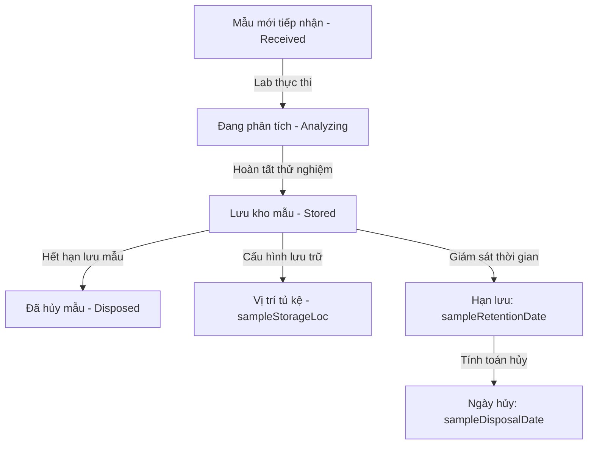

# 0_SAMPLES_STRUCTURE - TÀI LIỆU CẤU TRÚC MẪU THỬ ĐỘC LẬP (SAMPLES STANDALONE)

Tài liệu này cung cấp mô tả chi tiết và toàn diện về nghiệp vụ, giao diện, cấu trúc logic và mã nguồn của module **Mẫu thử độc lập (Samples Standalone)** trong hệ thống LIMS Frontend.

---

## 1. Luồng Nghiệp Vụ & Chức Năng (Business Flow & Features)

Khác với việc quản lý mẫu cục bộ bên trong một Phiếu tiếp nhận (`src/components/reception/SampleDetailModal.tsx`), module `samples` độc lập cung cấp góc nhìn tổng thể cho phép quản lý vòng đời lưu trữ của mẫu sau khi tiếp nhận và chuyển tiếp qua các trạng thái phân tích, lưu kho và hủy mẫu vật lý.

### Các tính năng nghiệp vụ chính:
1. **Lưu kho và Độc lập tủ kệ (`sampleStorageLoc`)**: Theo dõi chính xác tọa độ vị trí vật lý (ví dụ: Tủ mát B - Ngăn 3) của mẫu khi chuyển sang trạng thái lưu kho (`Stored`).
2. **Quản lý Hạn lưu và Ngày hủy mẫu**:
   - `sampleRetentionDate` (Hạn lưu mẫu): Thời hạn tối đa mẫu phải được bảo quản để phục vụ hậu kiểm hoặc khiếu nại.
   - `sampleDisposalDate` (Ngày hủy mẫu): Ngày chính thức tiến hành tiêu hủy mẫu vật lý khỏi hệ thống lưu trữ.
3. **Ghi nhận trạng thái vật lý (`physicalState`)**: Ghi chép đặc điểm vật lý tại thời điểm kiểm tra mẫu (ví dụ: dạng lỏng, đông lạnh, bột mịn, có mùi lạ,...).
4. **Cấu hình mẫu chuẩn (`sampleIsReference`)**: Đánh dấu các mẫu đóng vai trò làm mẫu chuẩn đối chứng (Reference Material) dùng để hiệu chuẩn thiết bị hoặc kiểm soát chất lượng nội bộ (QC).
5. **Gán chỉ tiêu phân tích bổ sung**: Cho phép bổ sung thêm phép thử mới trực tiếp cho mẫu mà không cần mở lại form sửa đổi Phiếu tiếp nhận gốc.

---

## 2. Quy trình & Thao tác Sử dụng (User Operations & Flow)

- **Quy trình Quản lý danh sách mẫu**:
  - Người dùng truy cập màn hình Mẫu thử độc lập để xem danh sách tổng thể mẫu trên toàn hệ thống (không phân biệt phiếu nhận).
  - Sử dụng thanh tìm kiếm nhanh để tìm kiếm theo Mã mẫu (`sampleId`) hoặc Mã phiếu tiếp nhận (`receiptId`).
- **Quy trình Cập nhật lưu kho & Trạng thái (`SampleUpsertModal`)**:
  1. Người dùng bấm chọn icon chỉnh sửa (✏️) trên dòng mẫu.
  2. Tại modal, chuyển đổi trạng thái mẫu sang `Stored` (Lưu trữ) hoặc `Disposed` (Đã hủy).
  3. Nhập vị trí lưu trữ thực tế vào ô **"Vị trí lưu kho"** (`sampleStorageLoc`) để nhân viên kho dễ dàng truy xuất mẫu vật lý khi cần. Bấm **Lưu**.
- **Quy trình Xem chi tiết & Gán phép thử (`SampleDetailModal`)**:
  - Click vào Mã mẫu để hiển thị màn hình chi tiết 360 độ chứa: thông tin hành chính, hạn lưu, ngày hủy, trạng thái vật lý, danh mục chỉ tiêu phân tích đang chạy, lịch sử bàn giao và các hồ sơ tài liệu đính kèm mẫu.
  - **Cập nhật trạng thái mẫu trực tiếp**: Cho phép cập nhật `sampleStatus` trực tiếp thông qua hộp chọn `<Select>` (gọi API cập nhật qua hook `useUpdateSample`).
  - **Gán chỉ tiêu phân tích tùy chỉnh**: Thêm một phân vùng/form ở dưới bảng chỉ tiêu cho phép nhập tên chỉ tiêu (autocomplete qua `libraryApi.parameters.list`, bắt buộc chọn), nền mẫu (tự động mặc định gán nền mẫu của mẫu thử hiện tại, cho phép thay đổi hoặc nhập tay custom value), và phương pháp thử (autocomplete qua `libraryApi.protocols.list`, cho phép chọn hoặc tự nhập tay custom value). Hỗ trợ cấu hình tích chọn hai checkbox chứng nhận `VILAS997` và `TDC` (nếu tích sẽ cập nhật vào JSONB object `protocolAccreditation`, nếu không tích gì thì field này sẽ gán `null`).
- **Quy trình Xóa mẫu**:
  - Bấm nút xóa (🗑️) để gọi `SampleDeleteModal` xác nhận mã mẫu cần xóa khỏi hệ thống.

---

## 3. Cấu Trúc File & Phân Rã Component (File Map & Component Decomposition)

### 3.1 Bản đồ File (File Map)

| Đường dẫn File | Loại | Trách nhiệm chính trong Module |
| :--- | :--- | :--- |
| [SamplesTable.tsx](./SamplesTable.tsx) | Table Component | Bảng hiển thị danh sách toàn bộ mẫu, hỗ trợ phân trang server, tìm kiếm, lọc theo trạng thái mẫu và sắp xếp cột. |
| [SampleDetailModal.tsx](./SampleDetailModal.tsx) | Detail Modal | Giao diện xem chi tiết đầy đủ của một mẫu độc lập, tích hợp gán chỉ tiêu nhanh qua Autocomplete Matrix và xem tài liệu. |
| [SampleUpsertModal.tsx](./SampleUpsertModal.tsx) | Form Modal | Modal tích hợp phục vụ cả hai luồng: Tạo mẫu mới (chọn liên kết Receipt) và cập nhật thông số kho (vị trí tủ kệ, trạng thái). |
| [SampleDeleteModal.tsx](./SampleDeleteModal.tsx) | UI Dialog | Hộp thoại xác nhận trước khi xóa mẫu vật lý khỏi hệ thống. |

### 3.2 Chi tiết mã nguồn từng File

#### 1. [SamplesTable.tsx](./SamplesTable.tsx)
- **Mục đích**: Render danh sách mẫu cross-receipts (liên phiếu tiếp nhận).
- **Giao diện/Render**:
  - Các cột hiển thị: Mã mẫu (clickable link), Mã phiếu, Loại mẫu, Lượng mẫu, Trạng thái mẫu (Badge màu phân biệt), Ngày tiếp nhận, Hành động.
- **Logic & State chính**:
  - Sử dụng API `samplesGetList` để nạp dữ liệu phân trang.
  - Phân biệt rõ ràng kiểu dữ liệu sử dụng là `SampleListItem` từ `@/types/sample.ts`.

#### 2. [SampleDetailModal.tsx](./SampleDetailModal.tsx)
- **Mục đích**: Giao diện chi tiết mẫu, cập nhật trạng thái mẫu và gán chỉ tiêu tùy chỉnh động.
- **Giao diện/Render**:
  - Khung thông tin chia grid: Mã mẫu, mã phiếu, lượng mẫu, bảo quản, hạn lưu, ngày hủy, trạng thái vật lý, mẫu chuẩn. Trạng thái mẫu hiển thị dưới dạng `<Select>` dropdown cho phép thay đổi nhanh.
  - Bảng chỉ tiêu: Hiển thị trạng thái phân tích, đơn vị, kết quả thô (hỗ trợ render HTML) và nơi thực hiện phân tích.
  - Phân vùng "Thêm chỉ tiêu phân tích mới" gồm:
    - Bộ chọn chỉ tiêu (`SearchableSelect` - bắt buộc).
    - Bộ chọn nền mẫu (`SearchableSelect` - prefill nền mẫu hiện tại của mẫu thử, hỗ trợ nhập giá trị tự do `allowCustomValue`).
    - Bộ chọn phương pháp (`SearchableSelect` - hỗ trợ nhập giá trị tự do `allowCustomValue`).
    - Checkbox VILAS997 và TDC để khai báo chứng nhận phòng thí nghiệm.
    - Nút hành động "Thêm chỉ tiêu".
  - Danh sách tài liệu đính kèm: Render dạng card kèm nút "Xem tệp" trực quan.
- **Logic & State chính**:
  - Gọi query `samplesGetFull` truyền `sampleId` để lấy thông tin chi tiết.
  - Autocomplete queries: Tích hợp `libraryApi.parameters.list`, `libraryApi.sampleTypes.list`, và `libraryApi.protocols.list` với 20 itemsPerPage và debounce 300ms.
  - `handleAddAnalysis()`: Gọi mutation tạo phép thử `useCreateAnalysis`. Nếu có chọn chứng nhận, gửi object `protocolAccreditation` (ví dụ `{ VILAS997: true }`). Nếu không chọn gì thì gửi `null`. Sau đó kích hoạt refetch `invalidateQueries` để làm mới danh sách chỉ tiêu hiển thị tại chỗ mà không cần reload trang.
  - `handlePreviewFile()`: Liên kết với `fileApi.url` lấy link download tạm thời (hạn dùng 3600 giây) để hiển thị tài liệu đính kèm.

#### 3. [SampleUpsertModal.tsx](./SampleUpsertModal.tsx)
- **Mục đích**: Form thêm mới hoặc cập nhật thông tin lưu trữ của mẫu.
- **Logic & State chính**:
  - Chế độ **Create**: Cho phép người dùng tìm kiếm debounce và chọn mã phiếu nhận (`receiptId`) qua component bộ chọn thông minh `SearchableSelect`, điền loại mẫu, lượng mẫu.
  - Chế độ **Update**: Khóa các trường hành chính, chỉ cho phép chỉnh sửa trạng thái mẫu (`sampleStatus`) và tọa độ vị trí vật lý (`sampleStorageLoc`).

---

## 4. Cấu Trúc Logic & Kết Nối API (Logic Structure & API Integration)

- **Các React Query Keys**:
  - Định nghĩa tập trung trong [samplesKeys](../../api/samplesKeys.ts) để quản lý cache nhất quán:
    - `samplesKeys.all`: Key tổng thể danh sách mẫu.
    - `samplesKeys.detail(id)`: Key chi tiết của từng mẫu theo ID.
- **Các API tích hợp**:
  - `samplesGetList` (`/v2/samples/get/list`): Lấy danh sách mẫu phân trang.
  - `samplesGetFull` (`/v2/samples/get/full`): Lấy chi tiết mẫu, danh sách phép thử và file đính kèm liên quan.
  - `samplesCreate` / `samplesUpdate` / `samplesDelete`: Các API thực thi CRUD mẫu.
  - `libraryApi.matrices.list`: Tìm kiếm nhanh ma trận phục vụ việc gán chỉ tiêu.
- **Sự khác biệt về Model dữ liệu**:
  - Mẫu độc lập sử dụng kiểu dữ liệu `SampleDetail` và `SampleAnalysis` định nghĩa tại `@/types/sample.ts`.
  - Mẫu tiếp nhận sử dụng kiểu dữ liệu `ReceiptSample` và `ReceiptAnalysis` định nghĩa tại `@/types/receipt.ts`.

---

## 5. Các Quy Chuẩn Thiết Kế & Best Practices (Design Guidelines & Best Practices)

- **Liên kết tương đối bắt buộc (Relative Links)**:
  - Tất cả liên kết trỏ đến file nguồn (ví dụ: `./SamplesTable.tsx`, `../../api/samples.ts`, `../../types/sample.ts`) bắt buộc dùng đường dẫn tương đối để đảm bảo tài liệu hoạt động trơn tru khi di chuyển thư mục dự án.
- **Kiểm soát vòng đời lưu kho**:
  - Khi cập nhật mẫu sang trạng thái `Disposed` (Đã hủy), hệ thống khuyến cáo xóa bỏ hoặc khóa trường `sampleStorageLoc` để giải phóng tọa độ tủ kệ cho các mẫu mới tiếp nhận.
- **i18n Namespace**:
  - Sử dụng hệ thống ngôn ngữ tập trung với các khóa `lab.samples.*` (ví dụ: `lab.samples.status.stored` cho trạng thái lưu kho).
- **Tránh nhầm lẫn Context**:
  - Nếu nghiệp vụ yêu cầu xem mẫu nằm trong phiếu báo giá tiếp nhận -> Sử dụng `reception/SampleDetailModal.tsx`.
  - Nếu nghiệp vụ yêu cầu quản lý hạn lưu kho, hủy mẫu, vị trí tủ kệ tổng thể -> Sử dụng `samples/SampleDetailModal.tsx`.
