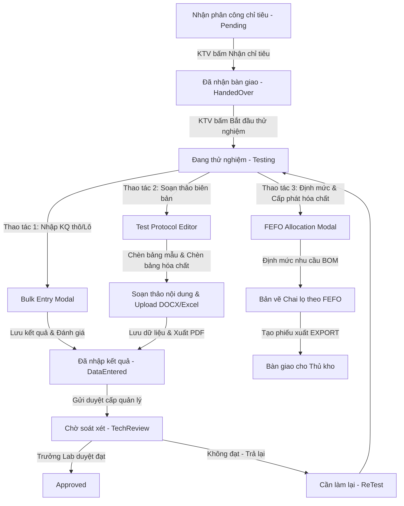

# 0_TECHNICIAN_STRUCTURE - TÀI LIỆU CẤU TRÚC KHÔNG GIAN KỸ THUẬT VIÊN (TECHNICIAN)

Tài liệu này cung cấp mô tả chi tiết về nghiệp vụ, giao diện, cấu trúc logic, API tích hợp và mã nguồn của module **Kỹ thuật viên (Technician)** trong hệ thống LIMS Frontend.

---

## 1. Luồng Nghiệp Vụ & Chức Năng (Business Flow & Features)

Không gian làm việc của Kỹ thuật viên (Technician Workspace) là trung tâm thực thi kỹ thuật trong phòng thí nghiệm. Tại đây, Kỹ thuật viên (KTV) tiếp nhận các chỉ tiêu phân tích được phân công, thực hiện quá trình thực nghiệm, quản lý hóa chất tiêu hao, ghi nhận kết quả thô từ thiết bị ngoại vi và lập biên bản thử nghiệm theo tiêu chuẩn **ISO/IEC 17025**.



### Chi tiết luồng nghiệp vụ chính:

1. **Nhận Phân Công & Chạy Thử Nghiệm (`Pending` -> `HandedOver` -> `Testing`)**:
   - Chỉ tiêu mới phân công nằm ở trạng thái `Pending` (Chờ nhận). KTV thực hiện nhận mẫu vật lý tại phòng thí nghiệm và bấm **Nhận chỉ tiêu** để chuyển sang trạng thái `HandedOver` (Đã nhận bàn giao), lưu trữ dấu mốc thời gian nhận mẫu.
   - Khi sẵn sàng hóa chất và thiết bị phân tích, KTV bấm **Bắt đầu thử nghiệm** để đưa chỉ tiêu sang trạng thái `Testing` (Đang thử nghiệm) và lưu thời gian bắt đầu chạy.
2. **Quản Lý Tiêu Hao Vật Tư & Tự Động Phân Bổ FEFO**:
   - Từ danh sách chỉ tiêu đang thử nghiệm, hệ thống tính toán nhu cầu định mức hóa chất (BOM) dựa trên phương pháp thử nghiệm (`Protocol Code`).
   - Gọi thuật toán **FEFO (First Expired, First Out - Hết hạn trước xuất trước)** để tự động bốc các chai lọ hóa chất trong kho đang mở nắp hoặc có hạn sử dụng gần nhất, sinh ra **Phiếu xuất kho (EXPORT)** và cập nhật khối lượng tiêu hao vào từng chỉ tiêu.
3. **Nhập Liệu Kết Quả Lô (`Bulk Entry`)**:
   - Cho phép nhập nhanh kết quả phân tích của nhiều chỉ tiêu cùng lúc trên một bảng lưới dạng Excel, hỗ trợ định dạng kết quả phong phú (ví dụ: `^` cho số mũ, `_` cho chỉ số dưới, `*` cho dấu nhân).
   - Tích hợp trực tiếp với **Cân Phân Tích (Analytical Balance)** qua Web Serial API. Số liệu cân ổn định sẽ được tự động điền vào ô kết quả và tự động chuyển tiêu điểm sang dòng tiếp theo.
4. **Lập Biên Bản Thử Nghiệm Nâng Cao (`Test Protocol Editor`)**:
   - Tích hợp trình soạn thảo WYSIWYG TinyMCE cho phép thiết kế biên bản tùy chỉnh.
   - Hỗ trợ **nhập biểu mẫu Word (.docx)** bằng cơ chế giải nén XML nội bộ để khôi phục định dạng lề, thụt đầu dòng (indentation) và giãn dòng (spacing).
   - Tích hợp **bảng tính Excel điện tử (ExcelProcessorModal)** chạy trên engine HyperFormula để tính toán công thức thực nghiệm ngay trong trình duyệt trước khi chèn bảng dữ liệu vào biên bản.
   - Kết xuất biên bản dưới định dạng PDF chuẩn ISO thông qua API backend và lưu trữ tài liệu vĩnh viễn đính kèm phép thử.

---

## 2. Giao diện & Quy trình Thao tác (UI & User Operations)

Giao diện kỹ thuật viên được thiết kế tinh giản nhưng mạnh mẽ, tối ưu hóa các thao tác lặp đi lặp lại để hạn chế sai sót nhập liệu:

* **Thanh Công Cụ Workspace (Action Toolbar)**:
  - Cho phép tích chọn hàng loạt chỉ tiêu. Các nút hành động động (Nhận chỉ tiêu, Nhập KQ lô, Soạn biên bản, Đề xuất hóa chất) sẽ tự động sáng/tối tùy thuộc vào trạng thái của nhóm chỉ tiêu được chọn.
  - Hỗ trợ tính năng **Quét chuột chọn vùng (Multi-row drag-to-select range selection)**: KTV chỉ cần nhấn và kéo chuột trên danh sách bảng để chọn nhanh hàng chục dòng mà không cần click từng checkbox.
* **Bộ Tabs Trạng Thái**: Phân chia rõ ràng công việc theo từng giai đoạn xử lý: `Chờ nhận`, `Đã nhận bàn giao`, `Đang thử nghiệm`, `Đã nhập kết quả`, `Cần làm lại`, và `Yêu cầu hóa chất` (nơi theo dõi phiếu xuất vật tư từ kho).
* **Màn Hình Lập Biên Bản (Split-Screen Editor)**:
  - **Bên trái (70%)**: Không gian soạn thảo văn bản. Thước căn chỉnh tự động bó buộc nội dung theo khổ A4 portrait dọc hoặc landscape ngang để đảm bảo in ấn không vỡ layout.
  - **Bên phải (30%)**: Thanh công cụ nghiệp vụ gồm:
    - Tab **Phương pháp**: Nơi tải file Word biểu mẫu hoặc mở bảng tính công thức Excel. Có nút chèn nhanh khối chữ ký xác nhận của Người thực hiện/Người kiểm tra.
    - Tab **Hóa chất (BOM)**: Nạp danh sách hóa chất thực tế đã cấp phát cho lô chỉ tiêu này. Nhập số lượng thực tế sử dụng và chèn bảng hóa chất hoàn chỉnh vào văn bản.
* **Màn Hình Kết Nối Thiết Bị (Equipment Workspace)**:
  - Giao diện giả lập LED màu xanh lục huỳnh quang hiển thị số cân thời gian thực.
  - Switch **Mặc định thiết bị kết nối cân (Dedicated Equipment Mode)**: Dành riêng cho máy tính chuyên dụng đặt cạnh cân phân tích. Khi bật chế độ này, trình duyệt chỉ hiển thị màn hình LED cân, khóa các tính năng khác và tự động đăng xuất sau 5 phút không hoạt động để bảo mật dữ liệu.

---

## 3. Cấu Trúc File & Phân Rã Component (File Map & Component Decomposition)

### 3.1 Bản đồ File (File Map)

| Đường dẫn File | Loại | Trách nhiệm chính trong Module |
| :--- | :--- | :--- |
| [TechnicianWorkspace.tsx](./TechnicianWorkspace.tsx) | Container Panel | Màn hình làm việc chính của KTV, quản lý tabs trạng thái, thanh hành động và cơ chế quét chuột chọn nhiều dòng (`drag-to-select`). |
| [TestProtocolEditor.tsx](./TestProtocolEditor.tsx) | Rich Text Editor | Trình soạn thảo biên bản thử nghiệm nâng cao (TinyMCE), tích hợp nhập Word/Excel, chèn bảng động và xuất PDF. |
| [ExcelProcessorModal.tsx](./ExcelProcessorModal.tsx) | Spreadsheet Engine | Modal bảng tính Excel ảo chạy trên HyperFormula giúp tính toán công thức thực nghiệm và kết xuất bảng HTML định dạng đẹp. |
| [AnalyticalBalanceStreamer.tsx](./AnalyticalBalanceStreamer.tsx) | IoT Streamer | Giao diện điều khiển cân phân tích, kết nối Web Serial API, quét barcode vật cân, hiển thị LED và quản lý cơ chế khóa thiết bị tự động. |
| [TechnicianBulkEntryModal.tsx](./TechnicianBulkEntryModal.tsx) | Grid Editor Form | Giao diện nhập kết quả lô, tích hợp bắt sự kiện cân ổn định tự động, phím tắt F2 nạp số cân và tự chuyển dòng thông minh. |
| [TechnicianChemicalAllocationModal.tsx](./TechnicianChemicalAllocationModal.tsx) | Stepper Workflow | Quy trình 3 bước: Tính BOM định mức -> Chạy thuật toán bốc chai FEFO -> Xác nhận xuất kho và gán hóa chất vào chỉ tiêu. |
| [TechnicianChemicalRequestsTab.tsx](./TechnicianChemicalRequestsTab.tsx) | Presentational Tab | Liệt kê lịch sử các yêu cầu xuất kho hóa chất do KTV hiện tại khởi tạo, tích hợp drawer xem chi tiết phiếu. |
| [AnalysisTableInsertModal.tsx](./AnalysisTableInsertModal.tsx) | Configuration Form | Cho phép chọn các cột thông tin (Mã mẫu, kết quả, phương pháp...) để tự động sinh bảng HTML chèn vào biên bản. |
| [ChemicalInsertModal.tsx](./ChemicalInsertModal.tsx) | Rich Text Editor | Trình soạn thảo thu nhỏ giúp tinh chỉnh bảng danh sách hóa chất tiêu hao trước khi đưa vào biên bản chính. |
| [ChemicalProposalEditor.tsx](./ChemicalProposalEditor.tsx) | Document Preview | Trình soạn thảo/in ấn các loại phiếu kho (Nhập/Xuất/Điều chỉnh) định dạng chuẩn A4 có chữ ký xác nhận của kế toán, thủ kho. |
| [EquipmentWorkspace.tsx](./EquipmentWorkspace.tsx) | Switcher Workspace | Module quản lý thiết bị đầu cuối, chuyển đổi giữa Cân phân tích, Kính hiển vi và Buồng sắc ký lớp mỏng (TLC). |
| [EquipmentCatalogTab.tsx](./EquipmentCatalogTab.tsx) | Management Tab | Quản lý thông tin lý lịch thiết bị phòng lab, lịch hiệu chuẩn và nhật ký hoạt động bảo trì. |
| [CameraStreamer.tsx](./CameraStreamer.tsx) | Media Streamer | Kết nối camera kính hiển vi hoặc buồng sắc ký qua WebRTC/getUserMedia, vẽ lưới tiêu cự (focus grid/lane) và chụp ảnh thực nghiệm. |
| [guide/HDSD_Ky_Thuat_Vien.md](./guide/guide/HDSD_Ky_Thuat_Vien.md) | Document Guide | Hướng dẫn sử dụng tổng quan nghiệp vụ kỹ thuật viên phòng Lab. |
| [guide/HDSD_Tao_Bien_Ban_Thu_Nghiem.md](./guide/guide/HDSD_Tao_Bien_Ban_Thu_Nghiem.md) | Document Guide | Hướng dẫn chi tiết quy trình lập biên bản và biểu mẫu trong hệ thống. |

### 3.2 Chi tiết mã nguồn từng File (File-by-File Details)

#### 1. [TechnicianWorkspace.tsx](./TechnicianWorkspace.tsx)
- **Mục đích**: Giao diện điều phối luồng công việc chính của KTV phòng Lab.
- **Giao diện/Render**:
  - Giao diện thanh hành động trên đầu chứa các nút: Nhận chỉ tiêu, Xin cấp lại mẫu, Nhập kết quả lô, Gợi ý hóa chất FEFO, Lập biên bản.
  - Phân vùng dữ liệu dạng bảng với các cột hiển thị: Mã mẫu, Chỉ tiêu, Phương pháp, Kết quả (render HTML định dạng mũ/chỉ số), Hạn trả, Người phụ trách.
  - Render vùng hộp quét chuột màu xanh nhạt `selectionBox` nổi trên màn hình khi quét kéo chọn dòng.
- **Logic / State chính**:
  - `activeTab`: Quản lý tab hiện tại (`pending`, `handedover`, `testing`, `data-entered`, `retest`, `chemical-requests`).
  - `selectedIds`: Mảng lưu trữ các mã chỉ tiêu đang được chọn.
  - `isSelecting`, `dragStartId`, `selectionBox`: Quản lý trạng thái và tính toán tọa độ chuột phục vụ tính năng kéo thả quét chọn dòng.
  - `updateSelectionRange()`: Xác định chỉ mục đầu cuối trong danh sách và cập nhật trạng thái chọn hàng loạt.

#### 2. [TestProtocolEditor.tsx](./TestProtocolEditor.tsx)
- **Mục đích**: Trình soạn thảo biên bản kỹ thuật chính kết xuất báo cáo kết quả.
- **Giao diện/Render**:
  - Bố cục chia đôi: Trái chiếm 70% chứa khung soạn thảo TinyMCE; Phải chiếm 30% chứa Sidebar gồm Tab Phương pháp (tải Word/Excel biểu mẫu) và Tab Hóa chất (quản lý BOM tiêu hao thực tế).
  - Thanh tiêu đề chứa Badge số lượng chỉ tiêu và bộ chọn phương pháp chính (`hasMultipleProtocols`).
- **Logic / State chính**:
  - `stableInitialHtml`: Chuỗi HTML khởi tạo ban đầu nạp vào TinyMCE, bảo lưu cấu trúc bảng Header động.
  - `processDocxArrayBuffer()`: Tiến hành giải nén tệp docx bằng JSZip, phân tích XML thô, chuyển sang HTML bằng mammoth và bù các giá trị indentation/spacing dưới dạng inline CSS.
  - Setup TinyMCE keyboard handler: bắt đè ký tự `^`, `_`, `*` để tự kích hoạt lệnh superscript, subscript hoặc chèn ký tự `×`.
  - Custom paste event listener: Bóc tách clipboard nhiều dòng, phân phối từng dòng xuống các ô tương ứng theo chiều dọc của cột bảng.

#### 3. [ExcelProcessorModal.tsx](./ExcelProcessorModal.tsx)
- **Mục đích**: Bảng tính Excel thu nhỏ tích hợp HyperFormula để tính số liệu thô.
- **Giao diện/Render**:
  - Thanh công thức (Formula Bar) nằm trên đầu cùng ô nhập tọa độ ô (ví dụ: `A1:B10`).
  - Lưới bảng tính với thanh tiêu đề cột A, B, C và tiêu đề dòng 1, 2, 3.
  - Thanh Toolbar chứa các nút: Gộp ô (Merge), Hủy gộp (Split), In đậm, In nghiêng, Căn lề, Tô màu nền, Kẻ viền.
- **Logic / State chính**:
  - `hfInstance`: Ref lưu trữ thực thể HyperFormula dùng để đăng ký sheet và đánh giá biểu thức công thức.
  - `sheetInputs` & `sheetValues`: Hai ma trận lưu giá trị nhập gốc (công thức `=SUM(A1:A5)`) và giá trị tính toán thực tế (`150`).
  - `mergedRanges`: Mảng chứa thông tin các vùng ô đã gộp.
  - `cellStyles`: Object lưu định dạng font chữ, căn lề, border và background color của từng ô theo khóa `row_col`.

#### 4. [AnalyticalBalanceStreamer.tsx](./AnalyticalBalanceStreamer.tsx)
- **Mục đích**: Hub kết nối và giám sát dữ liệu cân phân tích trong phòng thí nghiệm.
- **Giao diện/Render**:
  - Hộp hiển thị số khối lượng LED xanh nổi bật trên nền đen, có badge chỉ thị trạng thái ổn định (`Stable`/`Unstable`).
  - Bảng điều khiển kết nối chọn cổng Baudrate, nút Connect/Disconnect.
  - Ô quét Barcode nhập mã vật cân và bảng danh sách lịch sử các lượt cân đo thô.
- **Logic / State chính**:
  - `timeLeft` & `showBlockingLogin`: Quản lý bộ đếm ngược 300 giây và hiển thị màn hình khóa yêu cầu xác thực lại khi ở Dedicated Mode.
  - `latestReading`: Nhận dữ liệu phát ra từ context Serial Port. Khi giá trị này thay đổi và ở trạng thái ổn định, tự động gọi API `useCreateEquipmentLog` để ghi nhật ký cân lên cơ sở dữ liệu.
  - `handleExportPdf()`: Biên soạn mã HTML nhật ký sử dụng cân định dạng biểu mẫu A4 và gửi tới API backend chuyển thành tệp PDF tải xuống máy.

#### 5. [TechnicianBulkEntryModal.tsx](./TechnicianBulkEntryModal.tsx)
- **Mục đích**: Nhập kết quả phân tích hàng loạt cho nhóm mẫu thử.
- **Giao diện/Render**:
  - Panel hiển thị giá trị cân live nhỏ gọn ở trên đầu để KTV giám sát số liệu từ cân.
  - Bảng nhập liệu gồm các cột: STT, Mã mẫu, Chỉ tiêu, Kết quả (sử dụng `HtmlResultCell`), Đơn vị, Đánh giá, Áp dụng xuống (Fill down).
- **Logic / State chính**:
  - Lắng nghe `latestReading` từ Serial Balance context: Nếu `latestReading.isStable = true` và `config.autoFill = true`, tự động nạp trị số cân vào ô kết quả của dòng đang active (`activeRowIndex`).
  - Nếu `config.autoNext = true`, tự động kích hoạt chuyển tiêu điểm lấy nét xuống dòng tiếp theo sau 1 giây.
  - Lắng nghe sự kiện bàn phím toàn cục: Nếu nhấn `F2`, nạp giá trị cân hiện tại vào ô đang chọn bất kể trạng thái cân có ổn định hay không.
  - `handleFillDown()`: Sao chép kết quả và đơn vị của dòng được chọn cho toàn bộ các dòng nằm dưới nó.

#### 6. [TechnicianChemicalAllocationModal.tsx](./TechnicianChemicalAllocationModal.tsx)
- **Mục đích**: Tính toán định mức hóa chất cần dùng và đề xuất bốc chai theo FEFO.
- **Giao diện/Render**:
  - Thanh tiến trình 3 bước (BOM Nhu cầu -> Phân bổ FEFO -> Hoàn tất).
  - Bước 1: Render bảng tổng hợp nhu cầu theo hóa chất (tên SKU, CAS, số mẫu, tổng định mức) và chi tiết theo từng chỉ tiêu.
  - Bước 2: Render danh sách đi lấy hàng (Picking List) chỉ rõ mã chai lọ cụ thể, vị trí đặt chai trong kho, và số lượng cần lấy.
- **Logic / State chính**:
  - `estimateData` & `allocationData`: State lưu kết quả trả về từ API tính BOM và API phân bổ kho.
  - `handleAllocate()`: Gửi danh sách nhu cầu định mức sang hệ thống bốc chai của kho.
  - `handleConfirmExport()`: Tạo phiếu xuất kho EXPORT chính thức trên hệ thống, hoàn tất cập nhật tồn kho thực tế.

#### 7. [TechnicianChemicalRequestsTab.tsx](./TechnicianChemicalRequestsTab.tsx)
- **Mục đích**: Theo dõi trạng thái cung ứng hóa chất từ kho.
- **Giao diện/Render**:
  - Bảng danh sách phiếu: Mã phiếu, Trạng thái (Draft, Chờ duyệt, Đã duyệt, Từ chối), Ngày tạo, Người tạo.
  - Drawer chi tiết phiếu mở ra ở cạnh phải khi click chọn một dòng.
- **Logic / State chính**:
  - Fetch dữ liệu từ API `useChemicalTransactionBlocksList` lọc theo ID của kỹ thuật viên hiện tại và loại giao dịch `EXPORT`.

#### 8. [AnalysisTableInsertModal.tsx](./AnalysisTableInsertModal.tsx)
- **Mục đích**: Modal cấu hình cấu trúc bảng chỉ tiêu để chèn vào biên bản.
- **Giao diện/Render**:
  - Hộp hội thoại hiển thị danh sách các cột chia thành 3 nhóm: Thông tin cơ bản, Cột bổ sung (nhập tay), Kết quả & Ghi chú.
- **Logic / State chính**:
  - `selectedCols`: Mảng chứa các ID cột được chọn để hiển thị.
  - `handleInsert()`: Duyệt qua danh sách chỉ tiêu được chọn trong biên bản, sinh mã HTML `<table>` tương ứng với các cột đã cấu hình, kèm theo style viền và font chữ Serif đồng bộ, sau đó kích hoạt callback `onInsert()`.

#### 9. [ChemicalInsertModal.tsx](./ChemicalInsertModal.tsx)
- **Mục đích**: Tinh chỉnh bảng hóa chất tiêu hao trước khi đưa vào biên bản.
- **Giao diện/Render**:
  - Hộp TinyMCE editor chiếm trọn vẹn diện tích modal, tự động nạp nội dung bảng hóa chất thô dựa trên prop `consumablesUsed`.
- **Logic / State chính**:
  - `buildChemicalTableHtml()`: Sinh mã HTML bảng hóa chất (STT, Tên, Số CAS, Số lô, Nhà sản xuất, Số lượng tiêu thụ).

#### 10. [ChemicalProposalEditor.tsx](./ChemicalProposalEditor.tsx)
- **Mục đích**: Soạn thảo, xem trước và in ấn các loại phiếu giao dịch kho hóa chất.
- **Giao diện/Render**:
  - Khung TinyMCE hiển thị biểu mẫu phiếu kho kích thước chuẩn A4 dọc.
  - Nút "In / Xuất PDF" và nút "Đóng".
- **Logic / State chính**:
  - `buildProposalHtml()`: Tạo HTML biểu mẫu phiếu kho dựa trên loại block (IMPORT/EXPORT/ADJUSTMENT) chứa logo viện IRDOP, thông tin người lập, người nhận, bảng danh sách lô hóa chất và khối chữ ký của Kế toán, Thủ kho, Người nhận tương ứng.

#### 11. [EquipmentWorkspace.tsx](./EquipmentWorkspace.tsx)
- **Mục đích**: Giao diện chuyển đổi giữa các thiết bị kiểm nghiệm.
- **Giao diện/Render**:
  - Hệ thống Tab chính gồm: Cân phân tích, Kính hiển vi, Sắc ký lớp mỏng (TLC).
  - Nút Switch "Mặc định thiết bị kết nối cân".
- **Logic / State chính**:
  - `isDefaultBalance`: State kiểm tra xem máy tính có đang được cấu hình làm máy trạm cân chuyên dụng hay không thông qua localStorage `uiMode === "equipment"`. Khi click thay đổi, hệ thống sẽ set/remove localStorage và kích hoạt tải lại trang (`window.location.reload()`).

#### 12. [EquipmentCatalogTab.tsx](./EquipmentCatalogTab.tsx)
- **Mục đích**: Lưu trữ thông số kỹ thuật và nhật ký hiệu chuẩn/bảo trì thiết bị.
- **Giao diện/Render**:
  - Danh sách thiết bị gồm: Mã thiết bị, tên, hãng, model, người phụ trách, ngày hiệu chuẩn tiếp theo.
  - Modal chi tiết chứa 2 tab: Thông tin chung (form nhập thông số kỹ thuật, tần suất kiểm định) và Nhật ký hoạt động (lịch sử sử dụng và bảo trì).
- **Logic / State chính**:
  - `isSuperAdmin`: Kiểm tra quyền quản trị của tài khoản đang đăng nhập để bật/tắt quyền chỉnh sửa thông tin thiết bị.

#### 13. [CameraStreamer.tsx](./CameraStreamer.tsx)
- **Mục đích**: Truyền hình ảnh trực tiếp từ thiết bị quang học để thu thập hình ảnh kết quả.
- **Giao diện/Render**:
  - Khung Viewport hiển thị luồng video camera thời gian thực.
  - Lưới hỗ trợ lấy nét (Focus Grids): Microscope hiển thị các vòng tròn đồng tâm nét đứt; TLC hiển thị các đường chia làn sắc ký thẳng đứng.
  - Bảng danh sách các ảnh chụp snapshot thu nhỏ ở bên trái.
- **Logic / State chính**:
  - `startStream()`: Gọi API camera trình duyệt `navigator.mediaDevices.getUserMedia()` truyền vào `selectedDeviceId`.
  - `handleCapture()`: Vẽ khung hình video hiện tại lên thẻ canvas ẩn, chuyển đổi thành dữ liệu base64 URL qua `canvas.toDataURL("image/png")` và đẩy vào mảng hình ảnh lưu tạm.

---

## 4. Cấu Trúc Logic & API (Logic Structure & APIs)

### 4.1 Cơ chế Kéo Thả Chọn Dòng Workspace (Drag-to-Select)

Tính năng kéo thả chọn dòng sử dụng cơ chế bắt tọa độ chuột động để tối ưu hóa trải nghiệm kỹ thuật viên:

1. **Kích hoạt (`onMouseDown`)**: Khi KTV nhấn chuột trái lên dòng bất kỳ trong bảng danh sách chỉ tiêu, sự kiện kích hoạt trạng thái chọn `isSelecting = true` và lưu ID dòng khởi đầu `dragStartId`.
2. **Quét chọn (`onMouseMove`)**: Khi di chuyển chuột, hệ thống liên tục tính toán khoảng cách và hiển thị khung chọn nổi `selectionBox`.
3. **Phát hiện va chạm dòng (Hit-testing)**:
   - Sử dụng phương thức trình duyệt `document.elementFromPoint(clientX, clientY)` để lấy ra element nằm dưới con trỏ chuột tại thời điểm quét.
   - Tìm kiếm dòng bảng tương ứng qua `.closest("tr")` để trích xuất thuộc tính `data-analysis-id`.
   - Tính toán khoảng chỉ mục (index range) giữa dòng bắt đầu và dòng hiện tại trong mảng dữ liệu `analysesList`, sau đó thêm hoặc bớt các ID chỉ tiêu này vào mảng `selectedIds` dựa trên chế độ chọn (`select` hoặc `deselect`).

### 4.2 Bộ Giải Mã Định Dạng Word XML Trong TestProtocolEditor

Khi người dùng upload file Word (`.docx`), hệ thống không chỉ dùng mammoth để convert văn bản thô, mà còn thực hiện phân tích cấu trúc zip XML để giữ nguyên định dạng lề:

```
[File .docx] ➔ Mở tệp dưới dạng ZIP (JSZip) ➔ Đọc tệp 'word/document.xml' 
                     │
                     ▼
             [DOMParser XML]
                     │
                     ▼
          Duyệt qua các thẻ <w:p>
                     │
                     ▼
    Trích xuất thông số định dạng trong <w:pPr>:
    - Lề trái/phải: <w:ind w:left="..." w:right="...">
    - Thụt đầu dòng: <w:ind w:firstLine="...">
    - Hanging Indent: <w:ind w:hanging="...">
    - Giãn dòng: <w:spacing w:line="..." w:before="..." w:after="...">
                     │
                     ▼
    Quy đổi đơn vị Twips sang Millimeters (1 mm ≈ 56.69 twips)
                     │
                     ▼
    Gộp thông tin định dạng với HTML sinh ra từ Mammoth
                     │
                     ▼
    Tiêm Inline Styles vào các thẻ <p> tương ứng trong TinyMCE
```

### 4.3 Engine Bảng Tính HyperFormula trong ExcelProcessorModal

Biểu mẫu Excel hệ thống được nạp và xử lý cục bộ trên trình duyệt qua HyperFormula:
- **Tải file**: Sử dụng thư viện `xlsx` (SheetJS) đọc file nhị phân thành JSON Workbook, đăng ký tên các sheet vào HyperFormula qua `hf.addSheet(sheetName)`.
- **Khởi tạo ô**: Nạp ma trận dữ liệu. Nếu ô chứa công thức (bắt đầu bằng `=`), truyền công thức vào động cơ tính toán; ngược lại truyền giá trị thô.
- **Tính toán động**: Khi KTV sửa nội dung ô bất kỳ, hệ thống gọi `hf.setCellContents()` để cập nhật ô đó. HyperFormula tự động biên dịch và cập nhật giá trị của toàn bộ các ô phụ thuộc công thức trong ma trận `sheetValues`.
- **Xử lý gộp ô (Merge)**: Trạng thái gộp ô được lưu trong `mergedRanges`. Khi render lưới, các ô bị gộp sẽ được gắn thuộc tính HTML `rowSpan` và `colSpan` phù hợp, đồng thời ẩn các ô con bị đè để tránh vỡ cấu trúc lưới.

### 4.4 Chế Độ Thiết Bị Trạm Cân Chuyên Dụng (Dedicated Balance Mode)

Khi máy trạm kiểm nghiệm được thiết lập `uiMode === "equipment"` tại `EquipmentWorkspace.tsx`:
- Hệ thống áp dụng cơ chế khóa an toàn sử dụng cookie `lastActivityAt`.
- Một bộ đếm thời gian kiểm tra mỗi giây hiệu số giữa thời gian hiện tại và `lastActivityAt`. Nếu vượt quá 300 giây (5 phút), hệ thống tự động xóa token và thực hiện đăng xuất (`logout()`), sau đó hiển thị modal chặn màn hình `showBlockingLogin` yêu cầu nhập mật khẩu xác thực lại.
- Bất kỳ hoạt động cân đo thành công nào từ cân phân tích truyền về đều sẽ tự động làm mới cookie `lastActivityAt` để reset bộ đếm ngược.

### 4.5 Danh Sách API Backend Tích Hợp

| API Endpoint | HTTP Method | Mô tả chức năng | Component sử dụng |
| :--- | :--- | :--- | :--- |
| `/v2/analyses/get/processing` | GET | Lấy danh sách các chỉ tiêu phân tích đang trong quá trình xử lý của KTV (tối ưu hóa tốc độ so với API list tổng). | `TechnicianWorkspace` |
| `/v2/analyses/update-bulk` | POST | Cập nhật trạng thái và kết quả hàng loạt cho nhiều chỉ tiêu phân tích. | `TechnicianWorkspace`, `TechnicianBulkEntryModal` |
| `/v2/analyses/generate-lab-report` | POST | Gửi nội dung HTML của biên bản lên backend để kết xuất thành file PDF, lưu trữ và liên kết vào chỉ tiêu. | `TestProtocolEditor` |
| `/v2/chemical/estimate` | POST | Truy vấn định mức nhu cầu hóa chất (BOM) cần thiết cho danh sách chỉ tiêu đã chọn. | `TechnicianChemicalAllocationModal` |
| `/v2/chemical/allocate-stock` | POST | Tính toán bốc chai lọ cụ thể từ kho theo thuật toán FEFO dựa trên nhu cầu BOM. | `TechnicianChemicalAllocationModal` |
| `/v2/chemical/create-transaction-block`| POST | Tạo phiếu xuất kho EXPORT chính thức và trừ tồn kho các chai hóa chất đã lấy. | `TechnicianChemicalAllocationModal` |
| `/v2/equipment-logs/` | POST / GET | Ghi nhận hoặc truy vấn nhật ký hoạt động thô của thiết bị cân phân tích (audit trail). | `AnalyticalBalanceStreamer` |
| `/v2/convert-html-to-pdf/form-3` | POST | Chuyển đổi mã HTML nhật ký cân (khổ A4 ngang) thành file PDF nhị phân để tải xuống. | `AnalyticalBalanceStreamer` |

---

## 5. Quy chuẩn Thiết kế & Best Practices (Design Standards & Best Practices)

1. **Căn Lề Dữ Liệu Bảng (Table Alignment Guidelines)**:
   - Toàn bộ các cột văn bản (Tên chỉ tiêu, tên hóa chất, người phụ trách) và các ô tiêu đề (Table Headers) phải được căn lề trái (`text-left`, `justify-start`) để tối ưu hóa hướng quét mắt đọc từ trái sang phải của người dùng.
   - Các cột số liệu (STT, kết quả đo thô, số lượng) và cột trạng thái/badge căn lề giữa hoặc căn lề phải phù hợp.
2. **Bảo Trì Nhật Ký Thiết Bị (Equipment Audit Trail)**:
   - Mọi số liệu cân truyền về từ Web Serial API khi đã ổn định (`isStable`) phải được tự động tạo bản ghi log sử dụng cân (`useCreateEquipmentLog`) lưu thông tin kỹ thuật viên vận hành, thời gian, tên mẫu thử và giá trị thô để phục vụ hoạt động hậu kiểm ISO 17025.
3. **Quản Lý Kết Nối Ngoại Vi (Hardware Connection Resiliency)**:
   - Các thao tác mở cổng Serial Port phải được bọc trong các khối `try/catch` chặt chẽ.
   - Nếu trình duyệt không hỗ trợ Web Serial API (ví dụ: trình duyệt nhân non-Chromium) hoặc kết nối không bảo mật (không phải HTTPS/localhost), hệ thống phải hiển thị bảng cảnh báo thân thiện và đề xuất cách khắc phục thay vì crash trang.
4. **Tối Ưu Hóa Truy Vấn Màn Hình Chính**:
   - Sử dụng API chuyên dụng `/v2/analyses/get/processing` kết hợp cơ chế lọc trạng thái theo tab (`Pending`, `Testing`, `DataEntered`, `ReTest`) để giới hạn lượng bản ghi tải về, tránh quá tải DOM khi số lượng mẫu trong ngày lên đến hàng ngàn mẫu.
5. **Đảm Bảo Tính Di Động Của Tài Liệu (Relative Linking)**:
   - Tất cả các liên kết đến tệp tin nguồn trong tài liệu này bắt buộc sử dụng đường dẫn tương đối để đảm bảo tài liệu luôn hoạt động chính xác khi cấu trúc thư mục dự án được di chuyển hoặc tích hợp vào các hệ thống IDE khác.
