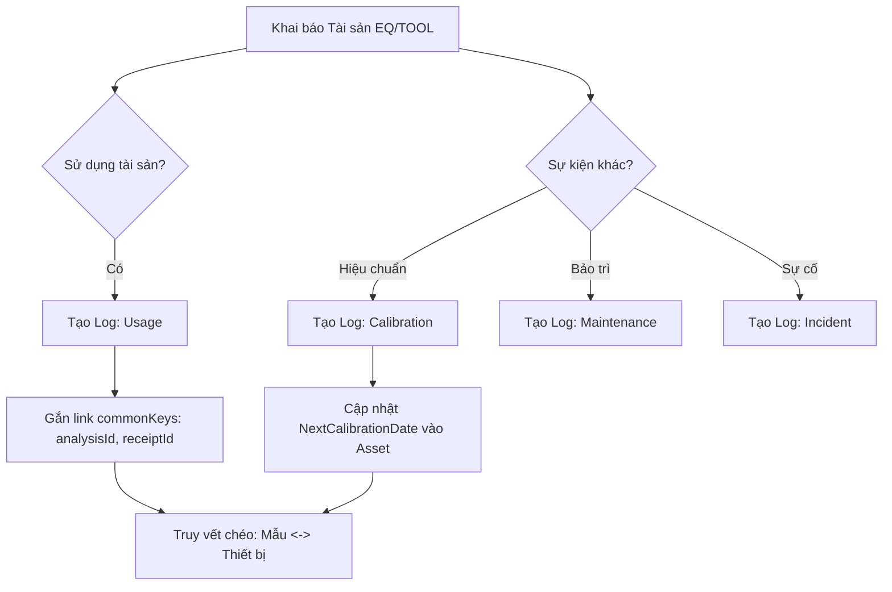

# LAB INVENTORY FLOW (EQUIPMENT & TOOLS)

_Tài liệu hướng dẫn luồng nghiệp vụ quản lý Thiết bị, Dụng cụ và Tài sản trong phòng thí nghiệm._

## I. TỔNG QUAN HỆ THỐNG

Phân hệ **Lab Inventory** (General Inventory) được thiết kế để quản lý:
1. **Lab Inventories (Equipment)**: Các thiết bị máy móc có giá trị cao, mã quản lý riêng, yêu cầu hiệu chuẩn/bảo trì định kỳ.
2. **Lab Tools**: Các dụng cụ thủy tinh, dụng cụ hỗ trợ thí nghiệm (Pipette, buret...), có thể yêu cầu hiệu chuẩn.
3. **Asset Activity Logs**: Nhật ký hoạt động chi tiết của tài sản (Sử dụng, Hiệu chuẩn, Bảo trì, Sự cố), hỗ trợ truy vết đa chiều qua `commonKeys`.

---

## II. CẤU TRÚC DỮ LIỆU CHÍNH

### 1. Thực thể Tài sản (Asset)
- **LabInventory (Equipment)**: `Prefix: EQ_`, Schema: `labInventories.labInventories`.
- **LabTool**: `Prefix: TOOL_`, Schema: `labInventories.labTools`.

### 2. Nhật ký Tài sản (Activity Logs)
- **AssetActivityLog**: `Prefix: LOG_`, Schema: `labInventories.assetActivityLogs`.
- Sử dụng quan hệ đa hình (**Polymorphic**) qua fields `assetId` và `assetTable`.
- `commonKeys[]`: Lưu trữ các liên kết chéo (VD: `analysisId:ANA-001`, `receiptId:REC-999`) giúp tra cứu lịch sử thiết bị theo mẫu/phân tích.

---

## III. CÁC LUỒNG NGHIỆP VỤ CHÍNH

### 1. Quản lý Vòng đời Thiết bị (Equipment Lifecycle)
1. **Khai báo mới**: Sử dụng API `CREATE lab-inventories`.
2. **Sử dụng trong thí nghiệm**:
   - Khi chạy một phân tích mẫu, hệ thống tạo bản ghi `AssetActivityLog` với `logType="Usage"`.
   - Gắn `analysisId` vào `commonKeys[]`.
3. **Hiệu chuẩn & Bảo trì**:
   - Khi đến hạn (`labInventoryNextCalibrationDate`), thực hiện hiệu chuẩn.
   - Tạo nhật ký `AssetActivityLog` với `logType="Calibration"`.
   - Cập nhật ngày hiệu chuẩn mới vào bảng `LabInventory`.

### 2. Quản lý Dụng cụ (Lab Tools)
1. **Đăng ký dụng cụ**: Sử dụng API `CREATE lab-tools`.
2. **Theo dõi tình trạng**:
   - Cập nhật trạng thái `labToolStatus` (`Ready`, `Broken`, `Lost`).
   - Nếu dụng cụ yêu cầu hiệu chuẩn (`requiresCalibration=true`), thực hiện quy trình tương tự thiết bị.

### 3. Truy vết Đa chiều (Traceability)
- Tra cứu lịch sử của một thiết bị: `GET /get/list?assetId=EQ_XXXX`.
- Tra cứu tất cả thiết bị/dụng cụ đã dùng cho một mẫu: `GET /get/list?commonKeys[]=analysisId:ANA-XXXX`.

---

## IV. SƠ ĐỒ QUY TRÌNH (DIAGRAM)

---

## V. QUY TẮC PHÂN QUYỀN (SECURITY)

- **READ**: Cho phép xem danh sách và nhật ký tài sản.
- **WRITE**: Khai báo mới, cập nhật thông tin hiệu chuẩn.
- **DELETE**: Xóa mềm (Soft Delete) qua cột `deletedAt`. Mặc định các bảng Activity Logs **không** sử dụng Soft Delete để đảm bảo tính toàn vẹn của dữ liệu truy vết.

---
_Cập nhật lần cuối: 2026-03-23_
