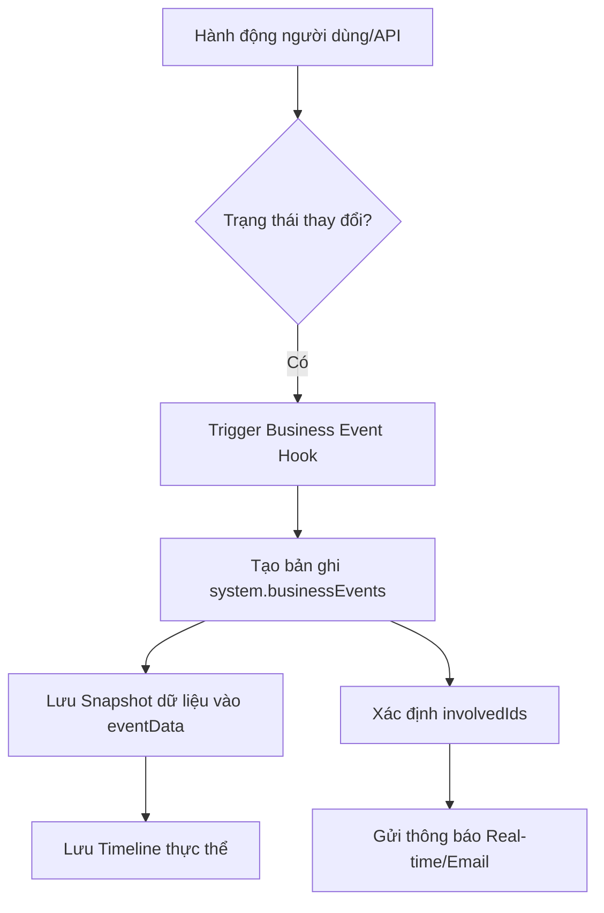

# QUY TRÌNH HỆ THỐNG & GIÁM SÁT (SYSTEM FLOW)

Tài liệu này mô tả cách hệ thống LIMS quản lý các sự kiện nghiệp vụ (Business Events), nhật ký hoạt động (Audit Logs) và quản trị rủi ro.

---

## 1. LUỒNG QUẢN LÝ SỰ KIỆN NGHIỆP VỤ (BUSINESS EVENTS)

Hệ thống sử dụng bảng `system.businessEvents` để ghi lại các "mốc" quan trọng trong vòng đời của các thực thể. Khác với Audit Log (ghi lại mọi thay đổi nhỏ), Business Events tập trung vào các thay đổi trạng thái mang tính quyết định.

### 1.1 Mục tiêu
- **Truy vết lịch sử (Timeline):** Cho phép người dùng xem dòng thời gian của một Đơn hàng hoặc Mẫu thử.
- **Thông báo (Notifications):** Xác định những người liên quan (`involvedIds`) để gửi thông báo real-time.
- **Báo cáo hiệu suất (KPI):** Tính toán thời gian giữa các mốc (VD: từ lúc Nhận mẫu đến lúc Trả kết quả).

### 1.2 Các sự kiện chính được ghi nhận

| Thực thể (EntityType) | Sự kiện (EventStatus) | Mô tả |
| :--- | :--- | :--- |
| **IncomingRequests** | `Paid`, `PartialPaid` | Ghi nhận khi khách hàng thanh toán (từ `paymentStatus`). |
| **Receipts** | `Created`, `Cancelled`, `Completed` | Vòng đời của phiếu tiếp nhận mẫu. |
| **Samples** | `Created`, `Stored`, `Disposed`, `Returned` | Quản lý vòng đời vật lý của mẫu. |
| **Analyses** | `Created`, `HandedOver`, `DataEntered`, `ReTest`, `Complained`, `Reworked`, `Cancelled` | Quản lý quy trình thử nghiệm chuyên sâu. |

### 1.3 Quy trình ghi nhận sự kiện (Event Flow)

---

## 2. QUẢN LÝ RỦI RO (RISK MANAGEMENT)

Phân hệ Risk Register giúp LAB tuân thủ các tiêu chuẩn như ISO/IEC 17025 (yêu cầu quản lý rủi ro và cơ hội).

### 2.1 Quy trình ghi nhận rủi ro
1. **Phát hiện:** Rủi ro có thể được nhập thủ công hoặc phát sinh từ các khiếu nại (`complaints`) hoặc sai lỗi kỹ thuật.
2. **Đánh giá:** Xác định mức độ (`riskLevel`) và mô tả ảnh hưởng.
3. **Giảm thiểu:** Ghi lại các hành động khắc phục/phòng ngừa.
4. **Đóng rủi ro:** Chuyển trạng thái sang `Mitigated` sau khi đã xử lý xong.

---

## 3. NHẬT KÝ HỆ THỐNG (SYSTEM LOGS)

Ngoài Business Events, hệ thống duy trì:
- **Audit Columns:** `createdAt`, `createdById`, `modifiedAt`, ... trên mọi bảng.
- **Valkey Cache Sync:** Nhật ký đồng bộ dữ liệu giữa Database và Memory.
- **OpenAI Logs:** Truy vết các yêu cầu và phản hồi từ trợ lý AI.
