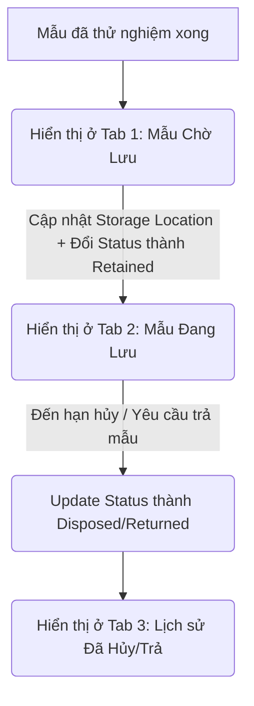

# Phân tích Thiết kế (Specs): Quản lý Lưu Mẫu (Sample Storage)

## 1. Executive Summary

Module quản lý lưu mẫu cho phép phân loại mẫu theo 3 trạng thái: Mẫu chờ lưu, Mẫu đang lưu, Mẫu đã hủy/trả. Bổ sung tính năng kéo thả trực quan (Drag & Drop) để sắp xếp mẫu vào các khu vực lưu trữ, và cập nhật thông tin hàng loạt.

## 2. User Stories

- Là một người quản lý kho, tôi muốn xem các mẫu đã test xong (nhưng chưa lưu kho) để sắp xếp vị trí lưu trữ.
- Là một người quản lý kho, tôi muốn dùng thao tác kéo thả (Drag & Drop) để gán mẫu vào vị trí một cách trực quan, nhanh chóng.
- Là một người quản lý kho, tôi muốn xem các mẫu đã đến hạn hủy để tiến hành tiêu hủy hoặc trả lại cho khách hàng.
- Là một quản trị viên, tôi muốn cập nhật hàng loạt vị trí lưu hoặc trạng thái lưu kho của nhiều mẫu cùng lúc để tiết kiệm thời gian.

## 3. Database Design

Sử dụng bảng `lab.samples` hiện có trong schema:

- `sampleId`: Mã mẫu (PK)
- `sampleName`: Tên mẫu
- `sampleNote`: Ghi chú mẫu
- `productType`: Tính chất (loại sản phẩm)
- `sampleStatus`: Trạng thái (`Received`, `InPrep`, `Distributed`, `Retained`, `Disposed`, `Returned`)
- `samplePreservation`: Điều kiện bảo quản
- `sampleStorageLoc`: Vị trí lưu kho (vùng kéo thả)
- `sampleRetentionDate`: Ngày dự kiến hủy
- `sampleDisposalDate`: Ngày hủy thực tế
- `sampleIsReference`: Mẫu đối chứng (boolean)

## 4. Logic Flowchart

## 5. API Contract

- **Lấy danh sách Mẫu Chờ Lưu:**
    - GET `/api/samples?sampleStorageLoc=["IS NULL"]`
- **Lấy danh sách Mẫu Đang Lưu:**
    - GET `/api/samples?sampleStatus=Retained`
- **Lấy danh sách Mẫu Đã Hủy/Trả:**
    - GET `/api/samples?sampleStatus=Returned,Disposed`
- **Cập nhật Vị trí & Trạng thái Bulk:**
    - PUT `/api/samples/bulk-update`
    - Body: `{ sampleIds: string[], updateData: {sampleStorageLoc?: string, sampleStatus?: string} }`

## 6. UI Components

- **StorageTabs:** Component chuyển đổi giữa 3 view (Chờ lưu, Đang lưu, Đã hủy/trả).
- **SamplesDataTable:** Bảng hiển thị thông tin mẫu với tính năng chọn nhiều (Checkbox) để Bulk Update.
- **StorageDragDropZone:** Giao diện tủ/khay trực quan để ké thả thẻ mẫu vào. Sử dụng `dnd-kit`.
- **Modals:** Bulk Update Modal (xác nhận cập nhật vị trí/trạng thái).
